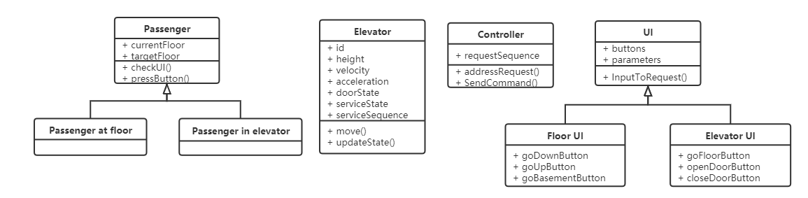
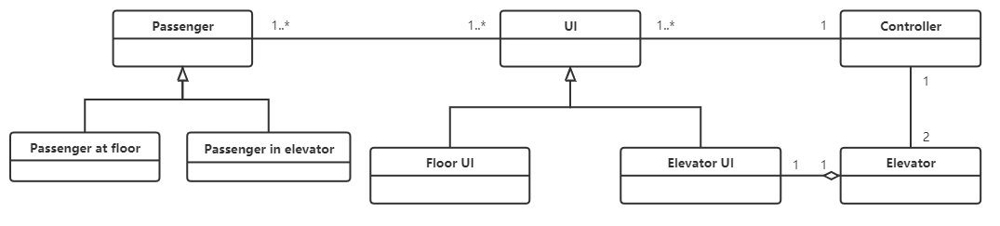
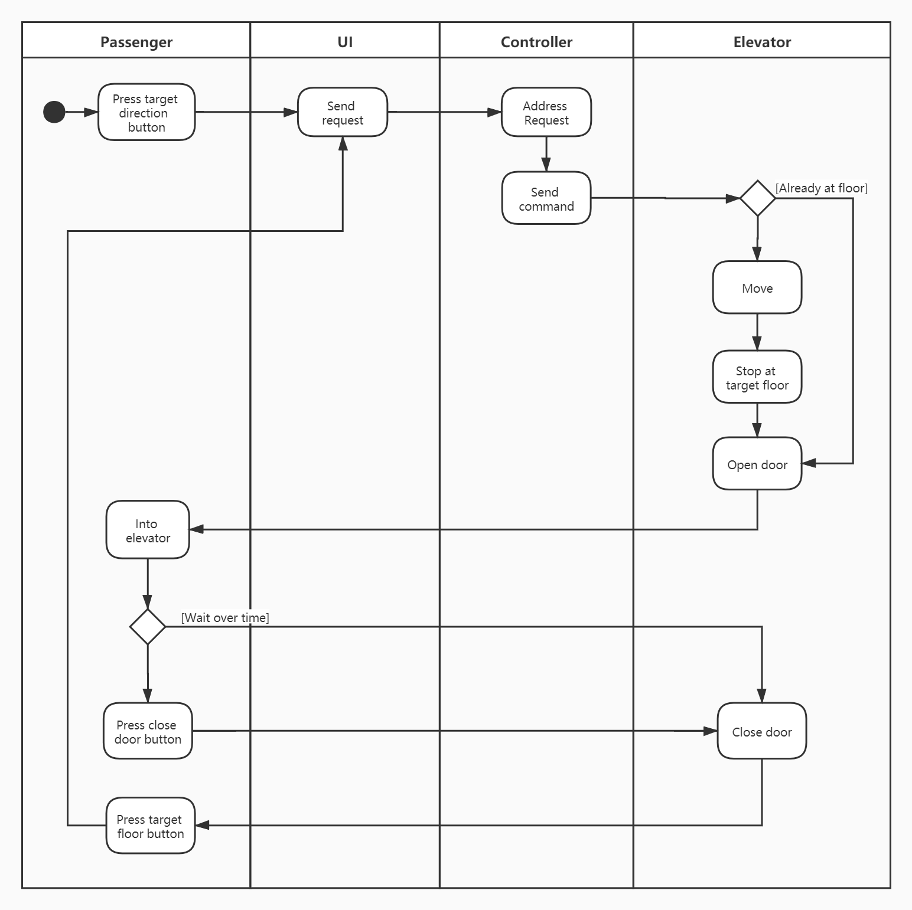
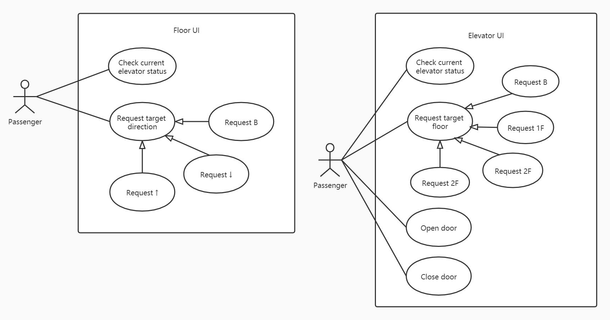
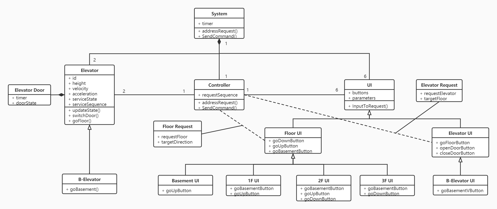

# SOFTWARE REQUIREMENTS

Elevator System

Author: Group 29  Lian Yihang

## Table of Contents 

[TOC]

## System Objective

​	In this project, we are developing a software that simulates 2 elevators in a building with 3 floors and 1 basement and design an automated algorithm to schedule and control them according to user requests. The key difference between two elevators is that only one can reach basement floor when another cannot.

​	The software will take care of the graphic interface, display real-time movements of elevators and determine how to process service direction and order of elevators, which ensures every  passenger to reach target floor promptly. Also a status HUD is provided for maintainers to check physical parameters and service status of elevators.

## Domain Analysis

​	The participants of activities of the system can be categorized into the passengers, 2 elevators, a central controller and user interface at floor doorway and inside elevators.

​	The relationship among different participants are shown as follows:

​	The activity diagram below shows the critical behaviors of passengers and reactions that the system should activate:

## Use Cases

The following use case diagrams show how user interact with System user interface at the floor doorway or in the elevator and achieve targets.

## System Architecture

​	As the class diagram shown below, the whole system architecture is composed of 3 main parts: elevators, user interfaces and the central controller. 

​	In further detail, elevators can be divided to 2 types : one can go to the basement while another cannot; UIs can be categorized to UI at floor doorway and UI inside the elevator. User interfaces can be also categorized to different types according to corresponding elevator type or floor. Meanwhile, from the interaction between UI and controller, we derive a request class, which can be categorized to 2 types - request from floor and request from elevator, for the convenience of algorithm implementation.

## Software Requirements

### R1: Floor UI

- R1.1: The passenger should be able to select the target direction to go.
	- R1.1.1: The passenger in the basement  should be able to go up.
	- R1.1.2:  The passenger on the middle floors should be able to both go up or down.
	- R1.1.3:  The passenger on the top floor should be able to go down.
- R1.2: The passenger should be clear about the current status of both elevators. 
	- R1.2.1: The passenger should be clear about current position of both elevators. 
	- R1.2.2: R1.2.1: The passenger should be clear about current service direction of both elevators. 

### R2: Elevator UI

- R2.1: The passenger in the elevator should be able to request door-open or door-closed.
	- R2.1.1: The passenger in the elevator should be able to request door-open by pressing the door-open button.
	- R2.1.2:  The passenger in the elevator should be able to request door-close by pressing the door-close button.
- R2.2: The passenger should be able to select the target floor to reach.
	- R2.2.1: The passenger in both elevators should be able to reach 1F, 2F and 3F by pressing corresponding buttons.
	- R2.2.2:  The passenger in the elevator that can reach basement should be able to select the basement by pressing the basement button.
- R2.3: The passenger should be clear about the current status of the elevator. 
	- R2.3.1: The passenger should be clear about current position of the elevator. 
	- R2.3.2: The passenger should be clear about current service direction of the elevator. 

### R3: Controller

- R3.1: The door state of elevators should follows the commands from the controller and obeys corresponding physical constraints.
	- R3.1.1: The door should be automatically open as soon as the elevator stopped at the target floor.
	- R3.1.2: The door should be open when passenger request door-open and the elevator is stopped.
	- R3.1.3: The door should be automatically closed if no door-open request interrupts.
	- R3.1.4: The door should be closed when passenger request door-close and the elevator is stopped.
	- R3.1.5: The door should be fully closed when the elevator is moving and the door state should be allowed to switch by the controller only when the elevator is stopped.
- R3.2: The movement of elevators should follows the commands from the controller and obeys corresponding physical constraints.
	- R3.2.1: Once the controller send start command to a stopped elevator, the elevator should be started after the door is fully closed.
	- R3.2.2: Once the controller send stop command to a moving elevator, the elevator should be stopped at the next target floor.
	- R3.2.3: The elevator height should be no larger than height of 3F, no less than height of the basement for the elevator that can reach the basement and no less than height of 1F for one that cannot.
	- R3.2.4: The elevator velocity should be no larger than 1.5m/s and the acceleration should be no larger than 1m/s^2^ .
- R3.3: The controller should be able to receive and process requests from user interfaces promptly.
	- R3.3.1: The controller should be able to receive the floor request as the floor UI sends it and process floor request from floor UI in no more than one service cycle *(Definition:  We say elevators finish one one service cycle when elevators finish one such service state transition cycle: standby->served all up-direction requests -> served all down-direction requests->standby)*.
	- R3.3.2: The controller should be able to receive the elevator request as the elevator UI sends it and process elevator request from elevator UI as soon as the controller receives it.
- R3.4: The request process algorithm of controller should ensure every request will be finished in no more than one service cycle.
	- R3.4.1: Every floor request will be finished in no more than one service cycle.
	- R3.4.2: Every elevator request will be finished in no more than one service cycle. 

