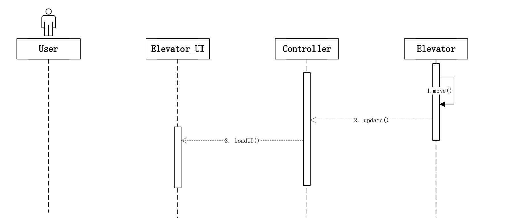
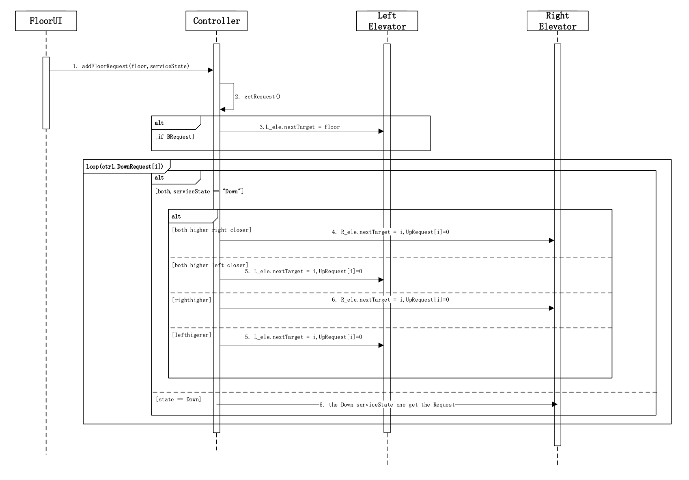

# SOFTWARE SCPECIFICATION

Railway Control Center

Author: Group 29 Yang Fuyi

## Table of Contents

[TOC]

## System Architecture

## Software Specifications

### S1 Floor UI
#### S1.1 Target Direction Button
By pressing **Up/Down/B Button**, Floor UI can send **UpRequest/DownRequest** to controller by **addFloorRequest()** function, then Controller will add the requiement into its UpRequest/DownRequest array by **getRequest()** and **getNextTarget()** .

##### S1.1.1 Basement UI

At Basement, user can only press Up Button to go up, Basement UI will send this request to controller.

##### S1.1.2 MidFloor UI

At Middle Floors, user can press Up or Down Button to go up or go down, Floor UI will send this request to controller.
##### S1.1.3 Top UI

At Top Floor, user can press Down Button to go down, Floor UI will send this request to controller. 

#### S1.2 Floor display

To show the floor and movestate of the elevator, elevator will first use the function move() to renew its position according to its speed(according to the speed and physics formula). Then controller will receive the data, and use function update() to update the data. After that, controller will use loadUI function(print data information on UI displayers) to renew all elevators floor and movestate based on timer. This can have two results: the displayer will show the floor and the movestate.

### S2 Elevator UI
#### S2.1 Open and Close door

In the elevator, users can press the OpenButton to Open the door when the elevator is standby. The elevator UI will change the DoorState to **"Opening"** by controller and then calling the **OpenDoor()** function.

In the elevator, users can press the CloseButton to close the door when the door is Opened. The elevator UI will change the DoorState to **"Closing"** by controller  and then calling the **CloseDoor()** function.

#### S2.2 Target Floor Button

By pressing **Floor Button**, Elevator UI can send **Request** to controller by **addElevatorRequest()** function, then Controller will send the Target to the elevator by calling **getNextTarget()** function and then use **goNextTarget** to change Elevator's move state.

##### S2.2.1 Floor 1,2,3 Button

In the elevator, user can choose the floor he wants to go by pressing Button.
##### S2.2.2 Basement Button

In the Left elevator, user have one more button selection: Basement Button, which let the UI give the Basement Request to Controller.

#### S2.3 Elevator Display

To show the floor and movestate of the elevator, elevator will first use the function move() to renew its position according to its speed(according to the speed and physics formula). Then controller will receive the data, and use function update() to update the data. After that, controller will use loadUI function(print data information on UI displayers) to renew all elevators floor and movestate based on timer. This can have two results: the displayer will show the floor and the movestate.

### S3 Controller
#### S3.1 Door State
##### S3.1.1 automatically open

The door will be automatically open as soon as the elevator stopped at the target floor, after judging its speed and state, the controller will change the doorstate to **Opening** and calling the function **OpenDoor()** to open the door;

##### S3.1.2 automatically close

The door will be automatically open as soon as the elevator stopped and have opened for some moments, the controller will change the doorstate to **Closing** and calling the function **CloseDoor()** to close the door;

#### S3.2 Elevator movement
##### S3.2.1 moved when door closed

At the beginning of every timer function updating, the controller will check if the **doorstate == "Closed"** is true, if true, then the evelator can call the function **move()**, which based on its speed and accerlation and obey the physics formula.
##### S3.2.2 Corresponding physical constraints

When the door is closed, controller have the ability to change the move state of elevators by calculating the distance with the targets floor. Elevator has 4 move states:**Start, Stop, Run and Standby**.

+ **Start**: The elevator begins to accelerate uniformly, and this time its accerlation is **0.5m/s^2**; 
+ **Stop** : The elevator begins to disaccelerate uniformly, and this time its accerlation is **0.5m/s^2** but has a direction **-1**, which means the acceration is in the opposite direction to speed. When the controller finds the **"elevator.v^2 ==dis(elevator,targetfloor)"** is true, it will change the elevator move state to Stop and make sure it will stop at the target floor;
+ **Run**: The elevator begins to move at a constant speed，when the elevator has speeded up to **1m/s**, and will keep on this speed.
+ **Standby**: The elevator don't move and stop at the floors.
##### S3.2.2 Height and Speed
The top Floor is Floor3 and the lowest is Basement, so the elevators heights should no more than 9m and no less than -3m. In our code, we will met the elevator stop at every floor so it won't cross the line.

#### S3.3 Scheduling algorithm
##### S3.3.1 FloorRequests
Every moment the FloorUI send request to controller will send the service direction at the same time. The request will be first saved in controller's array and to find the objected elevator to take the target every moment. We decide to let the elevator who has the same **serviceState** has the priority, then the others.

##### S3.3.2 ElevatorRequests
Every moment the ElevatorUI send request to controller, controller will decide the service direction depends on their heights. Easier than FloorRequests, the request ElevatorUI sends will be immediately turn in to elevators' service array.

##### S3.3.3 Meet Requests in one service cycle
The Elevator has 2 state:**moveState and serviceState**.MoveState is only decide the elevator is speed up/down, constant moving or standby while the serviceState decides how the elevator system scheduling algorithm works.
*(Definition:  We say elevators finish one one service cycle when elevators finish one such service state transition cycle: standby->served all up-direction requests -> served all down-direction requests->standby)*.
Elevators have 2 array to store the targetFloors they need to go, one is **Upservice** and another is **Downservice**. The controller is scanning one of the two elevators' service array every moment to decide whether their serviceState needs to change or not.Like this:

Every moment, if the controller find there is a target in service(direction is the same to elecator's serviceState)array, the elevator's nextTarget will be it and go to it; and when there is no target in the same service direction, controller will change the elevator's serviceState for one more scanning.
So on，the elevator won't miss the same serviceState target floor and will change the state if there is no target. By this way, we can meet all requests in one service cycle.
