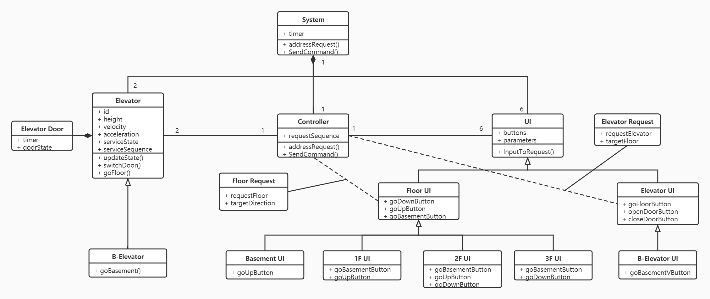

# TRACEABILITY REPORT

Elevator System

Author: Group 29  Lian Yihang

## Table of Contents 

[TOC]

## System Architecture

The system architecture is shown below:

Class diagram at requirement stage

Class diagram for actual implementation

## Software Traceability

| Requirement        | Implemented by | Validated by                       |
| ------------------ | -------------- | ---------------------------------- |
| **R1 Floor UI**    | S1             | T1, T3                             |
| **R1.1**           | S1.1           | T3.3, T1.4, T1.5, T1.6, T1.7       |
| R1.1.1             | S1.1.1         | T3.3, T1.4, T1.5, T1.6, T1.7       |
| R1.1.2             | S1.1.2         | T3.3, T1.4, T1.5, T1.6, T1.7       |
| R1.1.3             | S1.1.3         | T3.3, T1.4, T1.5, T1.6, T1.7       |
| **R1.2**           | S1.2           | T3.1, T1.3                         |
| R1.2.1             | S1.2           | T3.1, T1.3                         |
| R1.2.2             | S1.2           | T3.1, T1.3                         |
| **R2 Elevator UI** | S2             | T3.1, T3.2, T3.4, T3.5, T1.8, T1.9 |
| **R2.1**           | S2.1           | T3.4, T3.5, T1.8, T1.9             |
| R2.1.1             | S2.1           | T3.4, T1.8, T1.9                   |
| R2.1.2             | S2.1           | T3.5, T1.8, T1.9                   |
| **R2.2**           | S2.2           | T3.2, T1.8, T1.9                   |
| R2.2.1             | S2.2.1         | T3.2, T1.8, T1.9                   |
| R2.2.2             | S2.2.2         | T3.2, T1.8, T1.9                   |
| **R2.3**           | S2.3           | T3.1, T1.8, T1.9                   |
| R2.3.1             | S2.3           | T3.1, T1.8, T1.9                   |
| R2.3.2             | S2.3           | T3.1, T1.8, T1.9                   |
| **R3 Controller**  | S3             | T1.1                               |
| **R3.1**           | S2.1, S3.1     | T1.1                               |
| R3.1.1             | S3.1.1         | T1.1                               |
| R3.1.2             | S2.1           | T1.1                               |
| R3.1.3             | S3.1.2         | T1.1                               |
| R3.1.4             | S2.1           | T1.1                               |
| R3.1.5             | S3.2.1         | T1.1                               |
| **R3.2**           | S3.2           | T1.1, T1.2                         |
| R3.2.1             | S3.2.1         | T1.1, T1.2                         |
| R3.2.2             | S3.2.2         | T1.1, T1.2                         |
| R3.2.3             | S3.2.3         | T1.1, T1.2                         |
| R3.2.4             | S3.2.2         | T1.1, T1.2                         |
| **R3.3**           | S3.3           | T1.1                               |
| R3.3.1             | S3.3.1         | T1.1                               |
| R3.3.2             | S3.3.2         | T1.1                               |
| **R3.4**           | S3.3.3         | T1.1                               |
| R3.4.1             | S3.3.3         | T1.1                               |
| R3.4.2             | S3.3.3         | T1.1                               |