# User Manual

**Group 29  Elevator**

Author: Group 29 Yang Fuyi & Lian Yihang

## Table of Content

[TOC]

## System Architecture

The system architecture is shown below:

## User Manual
### Getting Started
​	At first, the elecator system will be shown as below. Both elevators are at Floor1 and standby with closed door:
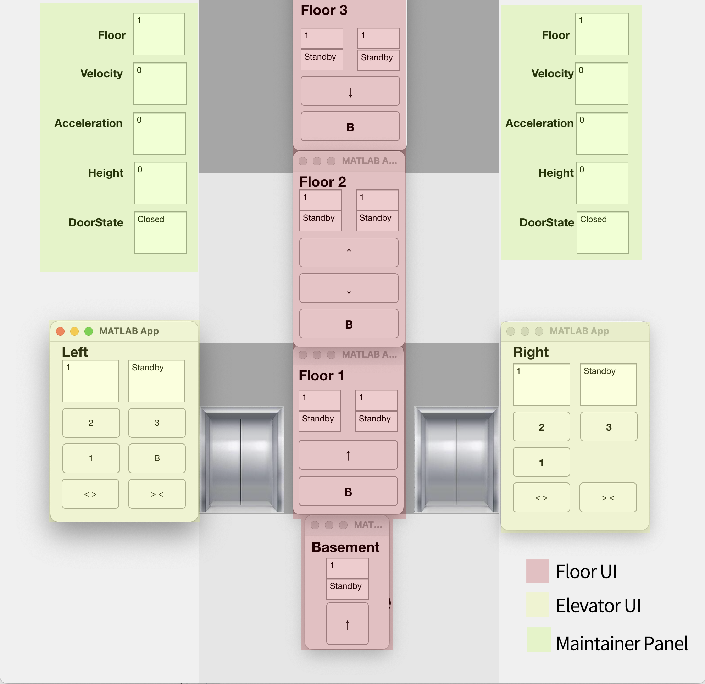

​	Main user interfaces can be categorized to 3 parts: floor UI at floor doorway, elvator UI inside the elevator and parameter panels for maintainers. Users can press the button in the floor UI and elevator UI to request destination, press button in the elevator UI to request door-open or door-close and check information displayed in the panel to have a good knowledge of current elevator status.

### Floor UI

#### Introduction
​	At the beginning, user can choose a direction which he wants to go.We provide 4 Floor UI that can be used by users:

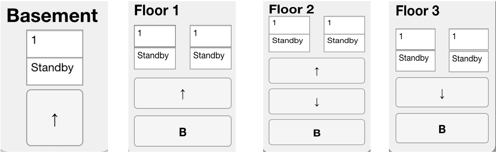

+ **FloorB UI**: One Up Button and a displayer of left elevator;
+ **Floor1 UI**: One Up Button,one B Button and two displayers of both elevators;
+ **Floor2 UI**: One Up Button, one Down Button,one B Button and two displayers of both elevators;
+ **Floor3 UI**: One Down Button,one B Button and two displayers of both elevators;

And these UI contain 4 components:
- **Up Button**: If a person want to go up, press this button, it allows users to send up service request(of this floor)  to controller;

- **Down Button**: If a person want to go down, press this button, it allows users to send down service request(of this floor) to controller;
- **B Button**: If a person want to go to basement, press this button, it allows users to send B service request(of this floor) to controller and to left elevator;*(only the left elevator can reach B)*
- **Display**: Show the elevator's floor and move state(up or down);

#### UP Button
Assume is at **Floor2**, want to **go up**, he can press the **UP Button** of **Floor2**: 

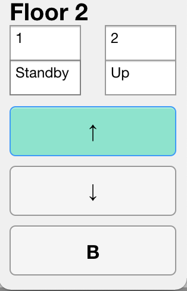

As the png shown, if a Button was pressed, the button led will be on, and if the **request is solved** it will be off:

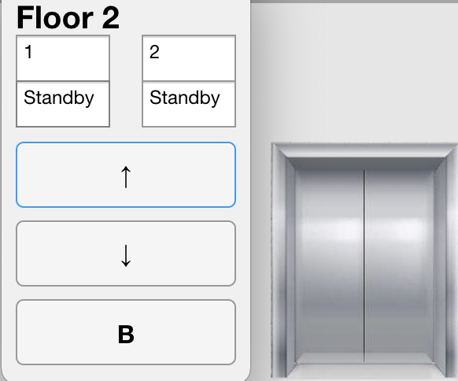

The elevator is at Floor2 and is Upservice, so the Floor2 UP Button is off.

#### Down Button
Assume is at **Floor2**, want to **go down**, he can press the **Down Button** of **Floor2**: 

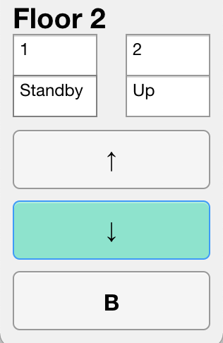

As the png shown, if down Button was pressed, the button led will be on, and if the **request is solved** it will be off:

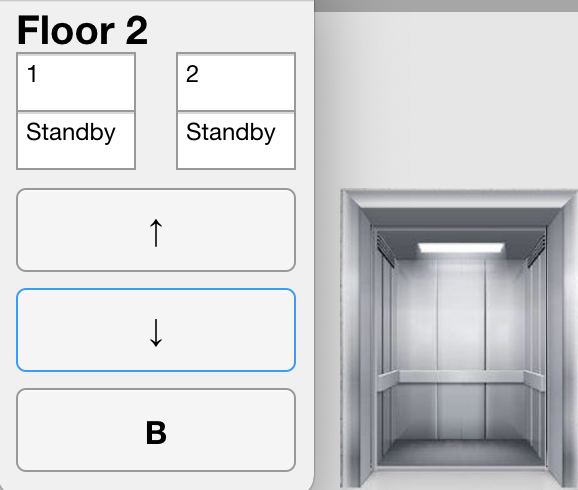

The elevator is at Floor2 and is Downservice, so the Floor2 Down Button is off.

#### B Button
Assume is at **Floor2**, want to **go to Basement**, he can press the ** B Button** of **Floor2**: 

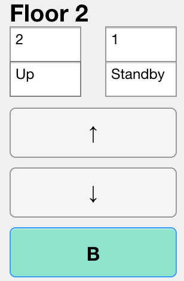

As the png shown, if B Button was pressed, the button led will be on, and if the **request is solved** it will be off:

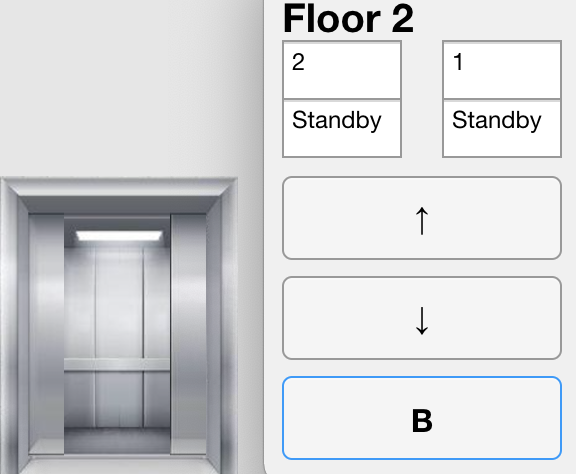

Now the left elevator is at Floor2 and is Downservice(to B), so the Floor2 B Button is off.

### Door

​	The door of Elevator has 4 states:
+ Opened
+ Closed
+ Opening
+ Closing
It's quite obviously to analyze the state:
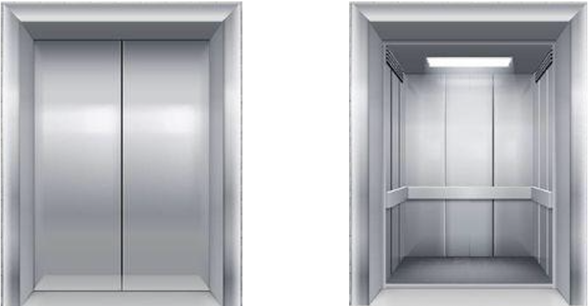
On the left,the picture shows the **Closed** door, and the right shows the **Opened **door.And a door can be obviously saw it's movement at each moment:

### Elevator UI

After door opened, person can go into the elevator and use the elevator to reach the floor they want to go by using **Elevator UI**:

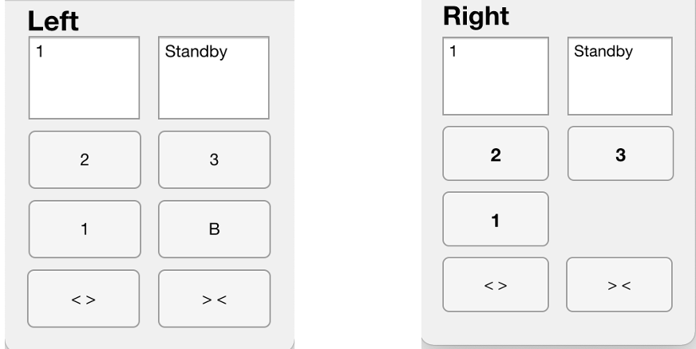

On the left shows the **Left_Elevator_UI**, and on the right shows the **Right_Elevator_UI**.

+ **Left_Elevator_UI**: One Floor1 Button, one Floor2 Button, one Floor3 Button, one B Button, a pair buttons of open and close the door and  a displayer of left elevator;
+ **Rigthr_Elevator_UI**: One Floor1 Button, one Floor2 Button, one Floor3 Button, a pair buttons of open and close the door and  a displayer of right elevator;
Here are functions of these Buttons and displayers
- **Floor1 Button**: If a person want to go to F1, press this button;

- **Floor2 Button**: If a person want to go to F2, press this button;

- **Floor3 Button**: If a person want to go to F3, press this button;

- **B Button**: If a person want to go to basement, press this button;*(Only Left_Elevator_UI has this button for only left elevator can get to Basement)*

- **Open Button**: If a person want to open the door, press this button;*(Only when the elevator is standby)*

- **Close Button**:If a person want to close the door, press this button:*(Only when the door is opened)*

- **Display**: Show the elevator's floor and move state(up or down).

	

#### Request the target floor
In the elevator, we can choose the floor we want to reach:
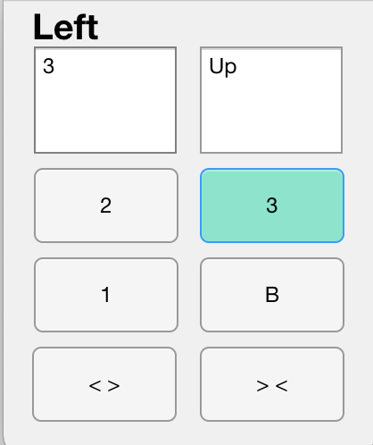

As the picture shows, the person in the left elevator wants to reach Floor3, so he press the **Floor3 Button**, then the Floor3 Button will light on until the elevator reach the target. And person in the elevator also can get the floor information from the left of the displayer and the move state from the right of the displayer. Now the elevator is at **F3** and move state is **UP**. Notice that the floor will be an approximate value not an exact number.

#### Request Door-open
Person can open the door by using the **Open Button** when the elevator is standby and exactly stop at a floor.
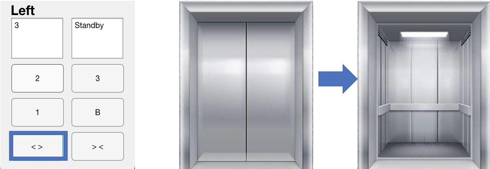

#### Request Door-Close

Person can close the door by using the **Close Button** when the door is open.
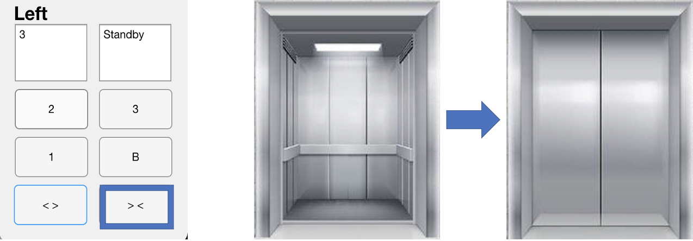

### Maintainer Panel

Maintainer have the ability to supervise the status of elevators by watching the HUD which we provided:
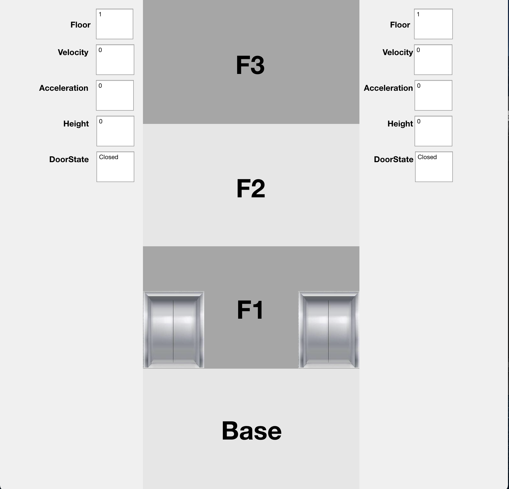

It contains these information:

+ **Floor**: Shows which floor the elevators are; *( Notice that it is an approximate value not an exact number )*
+ **Velocity**: Shows the speed of the elevators; *( Notice that it is always a scalar )*
+ **Accerleration**:Shows the accerleration of the elevators' speed; *(Notice that it is always a vector for easy to know the elevator is speeding up or down)*
+ **Height**： Show the height of the elevators; *{ Notice that it is always an exact vlaue with 2-bit floating. range from -3( Basement ) to 9( Floor3 ) }*;
+ **DoorState**: Shows the door state of the elevators, **Opened**, **Closed**, **Opening** or **Closing**.

There is a quick example:
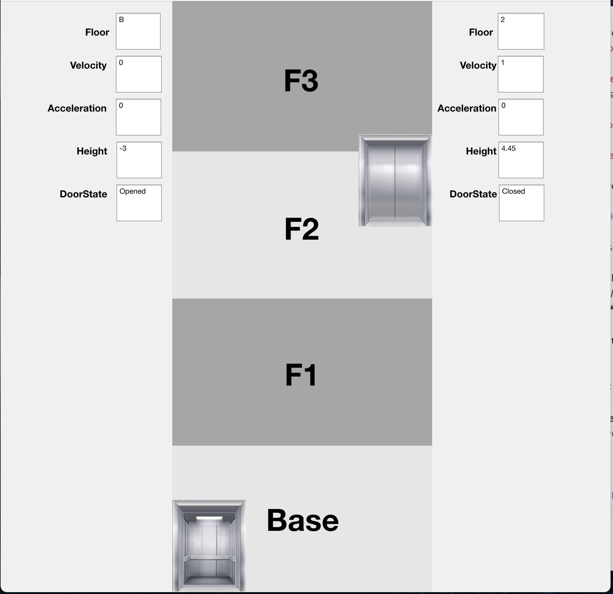
	According to the panel parameters, now the left elevator is at Basement with zero speed and accerlation, its height is -3m, and door state is Opened, while the right elevator ia at Floor2 with 1m/s speed and 0m/s^2^ accerlation, its height is 4.45m and door state is Closed.

