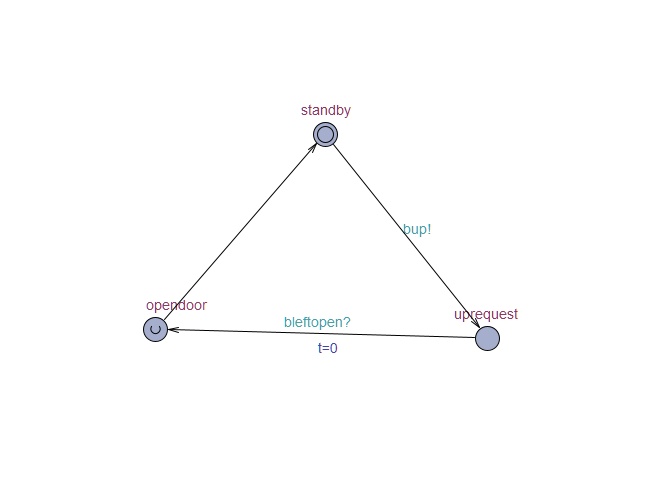
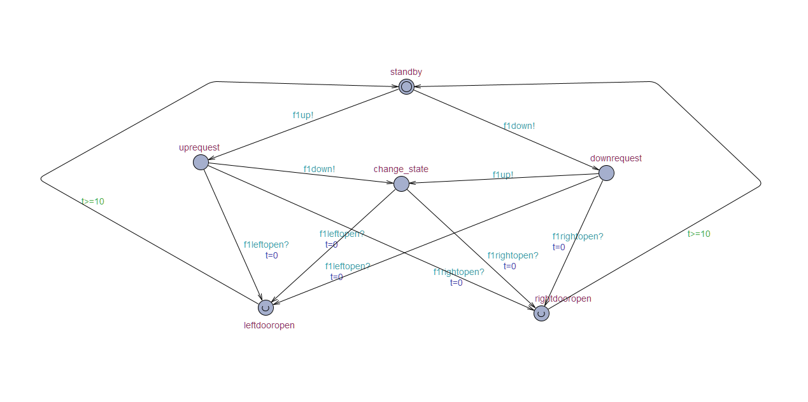
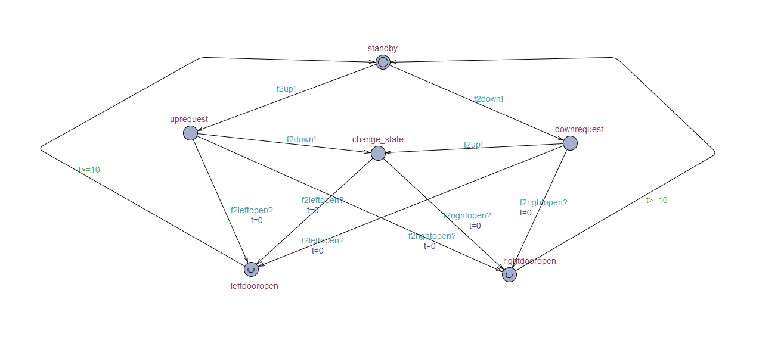
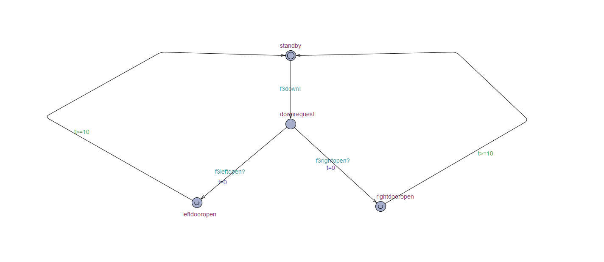
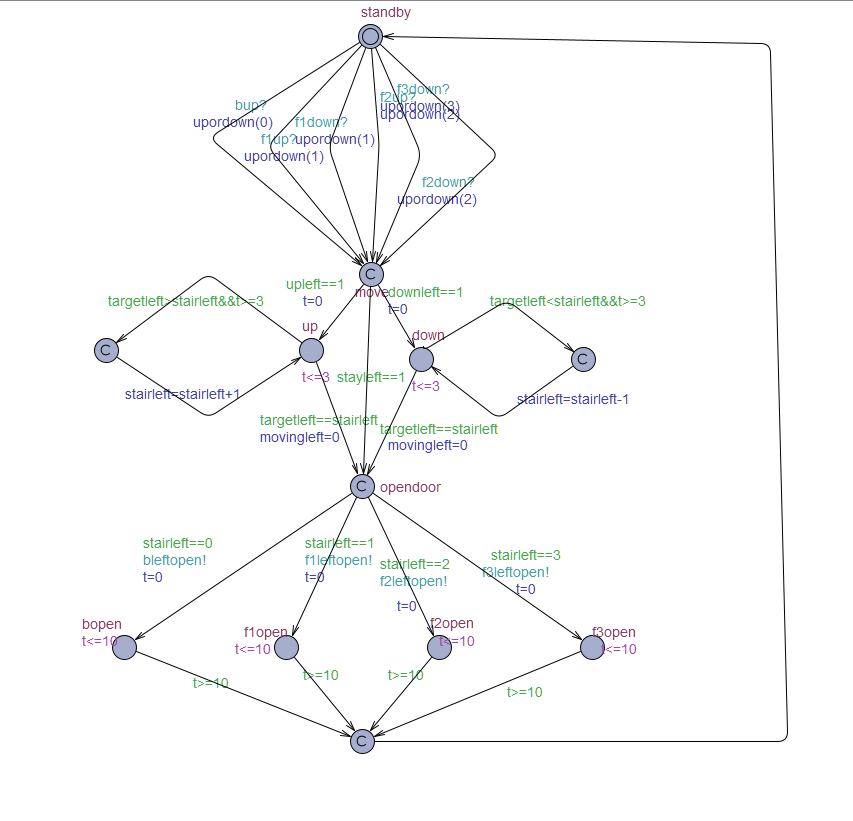
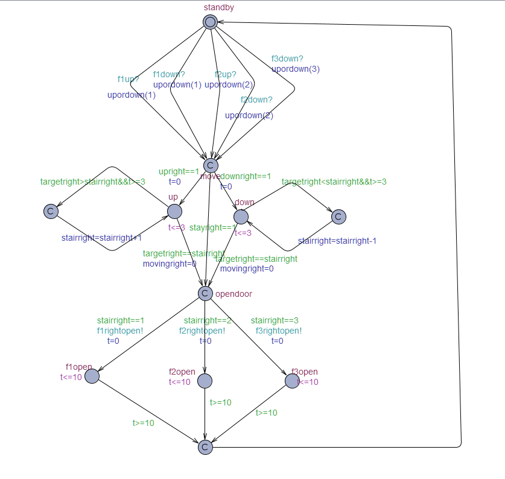
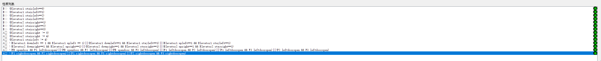

# Software Validation

**Elevator**

group 29

## Table of content

[TOC]


### System Architecture


### T1: Unit Test

#### T1.1 Controller Unit Test

##### T1.1.1 Test delete()

```matlab
function delete(obj)
    stop(obj.timer);
    delete(obj.Lui) ;
    delete(obj.Rui) ;
    delete(obj.F1) ;
    delete(obj.F2) ;
    delete(obj.F3) ;
    delete(obj.FB) ;
    delete(obj.Version);
    delete(obj.timer);
end
```

* Coverage Criteria: Statement Coverage
* Test case

|                 | Test Case T1.1.1                                             |
| --------------- | ------------------------------------------------------------ |
| Coverage Item   | Tcover1.1.1                                                  |
| Input           | ------                                                       |
| State           | Lui = LctrlUI;<br/>Rui = RctrlUI; <br/>F1=F1UI;<br/>F2=F2UI;<br/>F3=F3UI;<br/>FB=FBUI;<br/>Version=EleVersion;<br/>timer=timer |
| Expected Output | All UI closed                                                |

* Test coverage: 1/1=100%
* Test Result: 1 passed

##### T1.1.2 Test Controller()

```matlab
function obj = Controller()
    obj.Lui = LctrlUI;
    obj.Rui = RctrlUI;
    obj.F1 = F1UI;
    obj.F2 = F2UI;
    obj.F3 = F3UI;
    obj.FB = FBUI;
    obj.Lui.Ctrl = obj;
    obj.Rui.Ctrl = obj;
    obj.F1.Ctrl = obj;
    obj.F2.Ctrl = obj;
    obj.F3.Ctrl = obj;
    obj.FB.Ctrl = obj;
    obj.elevators = [Elevator('L'),Elevator('R')];
    obj.timer = timer;
    obj.Version = EleVersion;
    obj.Version.Ctrl = obj;
    obj.upRequest = [0 0 0 0];
    obj.downRequest = [0 0 0 0];
    obj.timer.TimerFcn=@obj.update;
    obj.timer.ExecutionMode='fixedRate';
    obj.timer.Period=obj.dt; 
    start(obj.timer);
end
```

* Coverage Criteria: Statement Coverage
* Test case

|                 | Test Case T1.1.2                                             |
| --------------- | ------------------------------------------------------------ |
| Coverage Item   | Tcover1.1.2                                                  |
| Input           | ------                                                       |
| State           | Lui = LctrlUI;<br/>Rui = RctrlUI;<br/>F1 = F1UI;<br/>F2 = F2UI;<br/>F3 = F3UI;<br/>FB = FBUI;<br/>elevators = [Elevator('L'),Elevator('R')];<br/>timer = timer;<br/>Version = EleVersion;<br/>upRequest = [0 0 0 0];<br/>downRequest = [0 0 0 0]; |
| Expected Output | All UI show up, all things set.                              |

* Test coverage: 1/1=100%
* Test Result: 1 passed

##### T1.1.3 Test update()

```matlab
function update(obj, ~, ~)
            if strcmp(obj.elevators(1).doorState,'Closed') && strcmp(obj.elevators(2).doorState,'Closed')//1.1.3.1
                obj.elevators(1).move;  % elevator move
                obj.elevators(2).move;
                obj.getRequest;         % get and go to service target floor
                obj.getNextTarget(obj.elevators(1));
                obj.getNextTarget(obj.elevators(2));
                obj.goNextTarget(obj.elevators(1));
                obj.goNextTarget(obj.elevators(2));
                obj.elevators(1).update;% elevator update
                obj.elevators(2).update;
            elseif strcmp(obj.elevators(1).doorState,'Closed')//1.1.3.2
                obj.elevators(1).move;
                obj.OpenDoor(obj.elevators(2));
                obj.CloseDoor(obj.elevators(2));
                obj.getRequest;         % get and go to service target floor
                obj.getNextTarget(obj.elevators(1));
                obj.goNextTarget(obj.elevators(1));
                obj.elevators(1).update;% elevator update
            elseif strcmp(obj.elevators(2).doorState,'Closed')//1.1.3.3
                obj.elevators(2).move;
                obj.OpenDoor(obj.elevators(1));
                obj.CloseDoor(obj.elevators(1));
                obj.getRequest;         % get and go to service target floor
                obj.getNextTarget(obj.elevators(2));
                obj.goNextTarget(obj.elevators(2));
                obj.elevators(2).update;% elevator update
            else//1.1.3.4
                obj.OpenDoor(obj.elevators(2));
                obj.CloseDoor(obj.elevators(2));
                obj.OpenDoor(obj.elevators(1));
                obj.CloseDoor(obj.elevators(1));
            end
            
            obj.LoadUI;             % update the ele and loadui
            obj.Version.LoadUI;
        end
```

* Coverage Criteria: Branch Coverage
* Test case

|                 | Test Case T1.1.3.1                                           |
| --------------- | ------------------------------------------------------------ |
| Coverage Item   | Tcover1.1.3.1                                                |
| Input           | ------                                                       |
| State           | elevators(1).doorState='Closed'<br/>elevators(2).doorState='Closed' |
| Expected Output | All UI show up, all things set, door closed                  |
|                 | Test Case T1.1.3.2                                           |
| Coverage Item   | Tcover1.1.3.2                                                |
| Input           | ------                                                       |
| State           | elevators(1).doorState='Closed'                              |
| Expected Output | All UI show up, all things set, door2 open and close         |
|                 | Test Case T1.1.3.3                                           |
| Coverage Item   | Tcover1.1.3.3                                                |
| Input           | ------                                                       |
| State           | elevators(2).doorState='Closed'                              |
| Expected Output | All UI show up, all things set, door1 open and close         |
|                 | Test Case T1.1.3.4                                           |
| Coverage Item   | Tcover1.1.3.4                                                |
| Input           | ------                                                       |
| State           | ------                                                       |
| Expected Output | All UI show up, all things set, door1,2 open and close       |

* Test coverage: 4/4=100%
* Test Result: 4 passed

##### T1.1.4 Test getRequest()

```matlab
function getRequest(obj)                    % from uprequest to elevetor
            cur1 = obj.elevators(1).y/obj.floorHeight;
            cur2 = obj.elevators(2).y/obj.floorHeight;
            for i = 1:2
                if obj.upRequest(i+1)~=0
                    if cur1 < i && cur2 < i && strcmp(obj.elevators(1).serviceState,'Up') && strcmp(obj.elevators(2).serviceState,'Up')
                        if cur1 <=cur2//T1.1.4.1
                            obj.elevators(2).upService(i+1) = true;
                            obj.upRequest(i+1) = false;
                            return;
                        else//T1.1.4.2
                            obj.elevators(1).upService(i+1) = true;
                            obj.upRequest(i+1) = false;
                            return;
                        end
                    elseif cur1 < i && strcmp(obj.elevators(1).serviceState,'Up')//T1.1.4.3
                        obj.elevators(1).upService(i+1) = true;
                        obj.upRequest(i+1) = false;
                        return;
                    elseif cur2 < i && strcmp(obj.elevators(2).serviceState,'Up')//T1.1.4.4
                        obj.elevators(2).upService(i+1) = true;
                        obj.upRequest(i+1) = false;
                        return;
                    elseif sum(obj.elevators(2).upService)==0 && sum(obj.elevators(2).downService)==0 //T1.1.4.5
                        obj.elevators(2).serviceState = 'Up';
                        obj.elevators(2).upService(i+1) = true;
                        obj.upRequest(i+1) = false;
                        return;
                    elseif sum(obj.elevators(1).upService)==0 && sum(obj.elevators(1).downService)==0 //T1.1.4.6
                        obj.elevators(1).serviceState = 'Up';
                        obj.elevators(1).upService(i+1) = true;
                        obj.upRequest(i+1) = false;
                        return;
                    elseif strcmp(obj.elevators(2).serviceState,'Up')//T1.1.4.7
                        obj.elevators(2).upService(i+1) = true;
                        obj.upRequest(i+1) = false;
                        return;
                    end
                end
            end
            for i = 2:-1:1
                if obj.downRequest(i+1)
                    if cur1 > i && cur2 > i && strcmp(obj.elevators(1).serviceState,'Down') && strcmp(obj.elevators(2).serviceState,'Down')
                        if cur1 >= cur2//T1.1.4.8
                            obj.elevators(2).downService(i+1) = true;
                            obj.downRequest(i+1) = false;
                            return;
                        else//1.1.4.9
                            obj.elevators(1).downService(i+1) = true;
                            obj.downRequest(i+1) = false;
                            return;
                        end
                     elseif cur1 > i && strcmp(obj.elevators(1).serviceState,'Down')//1.1.4.10
                        obj.elevators(1).downService(i+1) = true;
                        obj.downRequest(i+1) = false;
                        return;
                    elseif cur2 > i && strcmp(obj.elevators(2).serviceState,'Down')//1.1.4.11
                        obj.elevators(2).downService(i+1) = true;
                        obj.downRequest(i+1) = false;
                        return;
                    elseif sum(obj.elevators(2).upService)==0 && sum(obj.elevators(2).downService)==0 //1.1.4.12
                        obj.elevators(2).serviceState = 'Down';
                        obj.elevators(2).downService(i+1) = true;
                        obj.downRequest(i+1) = false;
                        return;
                    elseif sum(obj.elevators(1).upService)==0 && sum(obj.elevators(1).downService)==0 //1.1.4.13
                        obj.elevators(1).serviceState = 'Down';
                        obj.elevators(1).downService(i+1) = true;
                        obj.downRequest(i+1) = false;
                        return;
                    elseif strcmp(obj.elevators(2).serviceState,'Down')//1.1.4.14
                        obj.elevators(2).downService(i+1) = true;
                        obj.downRequest(i+1) = false;
                        return;
                    end
                end
            end
            
        end 
```

* Coverage Criteria: Branch Coverage
* Test case

|                 | Test Case T1.1.4.1                                           |
| --------------- | ------------------------------------------------------------ |
| Coverage Item   | Tcover1.1.4.1                                                |
| Input           | ------                                                       |
| State           | upRequest()!=0<br/>elevator(1).y = 1 <br>elevator(2).y = 2<br>elevators(1).serviceState='Up'<br>elevators(2).serviceState='Up'<br/>cur1 <=cur2 |
| Expected Output | elevators(2).upService(i+1) = true<br/>upRequest() = false;  |
|                 | Test Case T1.1.4.2                                           |
| Coverage Item   | Tcover1.1.4.2                                                |
| Input           | ------                                                       |
| State           | upRequest()!=0<br/>elevator(1).y = 2 <br/>elevator(2).y = 1<br/>elevators(1).serviceState='Up'<br/>elevators(2).serviceState='Up'<br/>cur1 > cur2 |
| Expected Output | elevators(1).upService(i+1) = true<br/>upRequest() = false;  |
|                 | Test Case T1.1.4.3                                           |
| Coverage Item   | Tcover1.1.4.3                                                |
| Input           | ------                                                       |
| State           | elevators(1).serviceState = 'Up';<br/>upRequest(i+1) = 1;<br/>elevators(1).y = 2; |
| Expected Output | elevators(1).upService(i+1) = true<br/>upRequest() = false;  |
|                 | Test Case T1.1.4.4                                           |
| Coverage Item   | Tcover1.1.4.4                                                |
| Input           | ------                                                       |
| State           | elevators(2).serviceState = 'Up';<br/>upRequest(i+1) = 1;<br/>elevators(2).y = 2; |
| Expected Output | elevators(2).upService(i+1) = true<br/>upRequest() = false;  |
|                 | Test Case  T1.1.4.5                                          |
| Coverage Item   | Tcover1.1.4.5                                                |
| Input           | ------                                                       |
| State           | sum(obj.elevators(2).upService)=0<br>sum(obj.elevators(2).downService)=0 |
| Expected Output | elevators(2).serviceState = 'Up';<br/>elevators(2).upService(i+1) = true;<br/>upRequest(i+1) = false; |
|                 | Test Case  T1.1.4.6                                          |
| Coverage Item   | Tcover1.1.4.6                                                |
| Input           | ------                                                       |
| State           | sum(obj.elevators(1).upService)=0<br>sum(obj.elevators(1).downService)=0 |
| Expected Output | elevators(1).serviceState = 'Up';<br/>elevators(1).upService() = true;<br/>upRequest() = false; |
|                 | Test Case  T1.1.4.7                                          |
| Coverage Item   | Tcover1.1.4.7                                                |
| Input           | ------                                                       |
| State           | elevators(2).serviceState = 'Up';<br/>upRequest() = 1;       |
| Expected Output | elevators(2).upService() = true;<br/>upRequest() = false;    |

|                 | Test Case T1.1.4.8                                           |
| --------------- | ------------------------------------------------------------ |
| Coverage Item   | Tcover1.1.4.8                                                |
| Input           | ------                                                       |
| State           | downRequest()!=0<br/>elevator(1).y = 6 <br>elevator(2).y = 5<br>elevators(1).serviceState='Down'<br>elevators(2).serviceState='Down'<br/>cur1 >=cur2 |
| Expected Output | elevators(2).downService(i+1) = true<br/>downRequest() = false; |
|                 | Test Case T1.1.4.9                                           |
| Coverage Item   | Tcover1.1.4.9                                                |
| Input           | ------                                                       |
| State           | downRequest()!=0<br/>elevator(1).y = 5 <br/>elevator(2).y = 6<br/>elevators(1).serviceState='Down'<br/>elevators(2).serviceState='Down'<br/>cur1 < cur2 |
| Expected Output | elevators(1).downService(i+1) = true<br/>downRequest() = false; |
|                 | Test Case T1.1.4.10                                          |
| Coverage Item   | Tcover1.1.4.10                                               |
| Input           | ------                                                       |
| State           | elevators(1).serviceState = 'Down';<br/>downRequest(i+1) = 1;<br/>elevators(1).y = 6; |
| Expected Output | elevators(1).downService(i+1) = true<br/>downRequest() = false; |
|                 | Test Case T1.1.4.11                                          |
| Coverage Item   | Tcover1.1.4.11                                               |
| Input           | ------                                                       |
| State           | elevators(2).serviceState = 'Up';<br/>downRequest(i+1) = 1;<br/>elevators(2).y = 6; |
| Expected Output | elevators(2).downService(i+1) = true<br/>downRequest() = false; |
|                 | Test Case  T1.1.4.12                                         |
| Coverage Item   | Tcover1.1.4.12                                               |
| Input           | ------                                                       |
| State           | sum(obj.elevators(2).upService)=0<br>sum(obj.elevators(2).downService)=0 |
| Expected Output | elevators(2).serviceState = 'Down';<br/>elevators(2).downService(i+1) = true;<br/>downRequest(i+1) = false; |
|                 | Test Case  T1.1.4.13                                         |
| Coverage Item   | Tcover1.1.4.13                                               |
| Input           | ------                                                       |
| State           | sum(obj.elevators(1).upService)=0<br>sum(obj.elevators(1).downService)=0 |
| Expected Output | elevators(1).serviceState = 'Down';<br/>elevators(1).downService() = true;<br/>downRequest() = false; |
|                 | Test Case  T1.1.4.14                                         |
| Coverage Item   | Tcover1.1.4.14                                               |
| Input           | ------                                                       |
| State           | elevators(2).serviceState = 'Down';<br/>downRequest() = 1;   |
| Expected Output | elevators(2).downService() = true;<br/>downRequest() = false; |

* Test coverage: 14/14=100%
* Test Result: 14 passed


##### T1.1.5 Test getNextTarget()

```matlab
function getNextTarget(obj, elevator)       % how to control the ele
            currentFloor = elevator.y / obj.floorHeight;
            if elevator.v == 0
                
                if strcmp(elevator.serviceState, 'Up') || strcmp(elevator.serviceState, 'Standby')
                    for i = 0 : 3 
                        if elevator.upService(i + 1) && currentFloor < i//T1.1.5.1
                            elevator.moveState = 'Start';
                            elevator.vdir = +1;
                            elevator.nextTarget = i;
                            return;
                        end
                    end
                    elevator.serviceState= 'Down';
                    target = -1;
                    for i = 3 :-1: 0 
                        if elevator.downService(i + 1) 
                            target = i;
                            break;
                        end
                    end
                    if target ~= -1
                        if currentFloor < target//T1.1.5.2
                            elevator.vdir = +1;
                            elevator.moveState = 'Start';
                            elevator.nextTarget = target;
                        elseif currentFloor > target//1.1.5.3
                            elevator.vdir = -1;
                            elevator.moveState = 'Start';
                            elevator.nextTarget = target;
                        else
                            % Open
                        end
                    end
                elseif strcmp(elevator.serviceState, 'Down')
                    for i = 3 :-1: 0 
                        if elevator.downService(i + 1) && currentFloor > i//T1.1.5.4
                            elevator.moveState = 'Start';
                            elevator.vdir = -1;
                            elevator.nextTarget = i;
                            return;
                        end
                    end
                    elevator.serviceState= 'Up';
                    target = -1;
                    for i = 0 : 3
                        if elevator.upService(i + 1) 
                            target = i;
                            break;
                        end
                    end
                    if target ~= -1
                        if currentFloor < target//T1.1.5.5
                            elevator.vdir = +1;
                            elevator.moveState = 'Start';
                            elevator.nextTarget = target;
                        elseif currentFloor > target//T1.1.5.6
                            elevator.vdir = -1;
                            elevator.moveState = 'Start';
                            elevator.nextTarget = target;
                        else
                            % Open
                        end
                    end
                end
                
            elseif elevator.v ~= 0
                if strcmp(elevator.serviceState, 'Up')
                    for i = 0 : 3
                        if elevator.upService(i + 1) && currentFloor < i//T1.1.5.7
                            elevator.moveState = 'Start';
                            elevator.vdir = +1;
                            elevator.nextTarget = i;
                            return;
                        end
                    end
                elseif strcmp(elevator.serviceState, 'Down')
                    for i = 3 :-1: 0 
                        if elevator.downService(i + 1) && currentFloor > i//T1.1.5.8
                            elevator.moveState = 'Start';
                            elevator.vdir = -1;
                            elevator.nextTarget = i;
                            return;
                        end
                    end
                end
            end
        end 
```

* Coverage Criteria: Branch Coverage
* Test case

|                 | Test Case T1.1.5.1                                           |
| --------------- | ------------------------------------------------------------ |
| Coverage Item   | Tcover1.1.5.1                                                |
| Input           | elevator                                                     |
| State           | elevators(1).v = 0;<br/>elevators(1).serviceState = 'Up';<br/>elevators(1).upService(2) = 1;<br/>elevators(1).y = 1; |
| Expected Output | elevator.moveState = 'Start';                            <br/>elevator.vdir = 1;<br/>elevator.nextTarget = 1; |
|                 | Test Case T1.1.5.2                                           |
| Coverage Item   | Tcover1.1.5.2                                                |
| Input           | elevator                                                     |
| State           | elevators(1).v = 0;<br/>elevators(1).serviceState = 'Up';<br/>elevators(1).downService(2) = 1;<br/>elevators(1).y = 1; |
| Expected Output | elevator.vdir = 1;<br/>elevator.moveState = 'Start';<br/>elevator.nextTarget = 1; |
|                 | Test Case T1.1.5.3                                           |
| Coverage Item   | Tcover1.1.5.3                                                |
| Input           | elevator                                                     |
| State           | elevators(1).v = 0;<br>elevators(1).serviceState = 'Up';<br>elevators(1).downService(2) = 1;<br/>elevators(1).y = 6; |
| Expected Output | elevator.vdir = -1;<br/>elevator.moveState = 'Start';<br/>elevator.nextTarget = 1; |
|                 | Test Case T1.1.5.4                                           |
| Coverage Item   | Tcover1.1.5.4                                                |
| Input           | elevator                                                     |
| State           | elevators(1).v = 0;<br/>elevators(1).serviceState = 'Down';<br/>elevators(1).downService(2) = 1;<br/>elevators(1).y = 6; |
| Expected Output | elevator.moveState = 'Start';<br/>elevator.vdir = -1;<br/>elevator.nextTarget = 1; |
|                 | Test Case T1.1.5.5                                           |
| Coverage Item   | Tcover1.1.5.5                                                |
| Input           | elevator                                                     |
| State           | elevators(1).v = 0;<br/>elevators(1).serviceState = 'Down';<br/>elevators(1).downService(2) = 1;<br/>elevators(1).y = 1; |
| Expected Output | elevator.vdir = 1;<br/>elevator.moveState = 'Start';<br/>elevator.nextTarget = 1; |
|                 | Test Case T1.1.5.6                                           |
| Coverage Item   | Tcover1.1.5.6                                                |
| Input           | elevator                                                     |
| State           | elevators(1).v = 0;<br/>elevators(1).serviceState = 'Down';<br/>elevators(1).downService(2) = 6;<br/>elevators(1).y = 1; |
| Expected Output | elevator.vdir = -1;<br/>elevator.moveState = 'Start';<br/>elevator.nextTarget = 1; |
|                 | Test Case T1.1.5.7                                           |
| Coverage Item   | Tcover1.1.5.7                                                |
| Input           | elevator                                                     |
| State           | elevators(1).v = 1;<br/>elevators(1).serviceState = 'Up';<br/>elevators(1).upService(2) = 1;<br/>elevators(1).y = 1; |
| Expected Output | elevator.moveState = 'Start';<br/>elevator.vdir = 1;<br/>elevator.nextTarget = 1; |
|                 | Test Case T1.1.5.8                                           |
| Coverage Item   | Tcover1.1.5.8                                                |
| Input           | elevator                                                     |
| State           | elevators(1).v = 1;<br/>elevators(1).serviceState = 'Down';<br/>elevators(1).downService(2) = 1;<br/>elevators(1).y = 1; |
| Expected Output | elevator.moveState = 'Start';<br/>elevator.vdir = -1;<br/>elevator.nextTarget = 1; |

* Test coverage: 8/8=100%
* Test Result: 8 passed

##### T1.1.6 Test goNextTarget()

```matlab
function goNextTarget(obj, elevator)        % how to start and stop
            if elevator.v > 0 && (abs(elevator.nextTarget*3-elevator.y) <= elevator.v*elevator.v)
                elevator.moveState = 'Stop';
                if abs(elevator.nextTarget*3-elevator.y) <= 0.01
                    if strcmp(elevator.serviceState, 'Down')//T1.1.6.1
                        elevator.downService(elevator.nextTarget+1) = false;
                        obj.downRequest(elevator.nextTarget+1) = false;
                    end
                    if strcmp(elevator.serviceState, 'Up')//T1.1.6.2
                        elevator.upService(elevator.nextTarget+1) = false;
                        obj.upRequest(elevator.nextTarget+1) = false;
                    end
                    switch elevator.nextTarget
                        case 0//T1.1.6.3
                            obj.FB.Up.BackgroundColor = [0.96,0.96,0.96];
                        case 3
                            obj.F3.Down.BackgroundColor = [0.96,0.96,0.96];
                            if strcmp(elevator.id, 'L')//T1.1.6.4
                                obj.F3.B.BackgroundColor = [0.96,0.96,0.96];
                            end
                        case 1
                            if strcmp(elevator.serviceState, 'Up')//T1.1.6.5
                                obj.F1.Up.BackgroundColor = [0.96,0.96,0.96];
                            elseif strcmp(elevator.id, 'L')//T1.1.6.6
                                obj.F1.B.BackgroundColor = [0.96,0.96,0.96];
                            end
                        case 2
                            if strcmp(elevator.serviceState, 'Up')//T1.1.6.7
                                obj.F2.Up.BackgroundColor = [0.96,0.96,0.96];
                            else
                                obj.F2.Down.BackgroundColor = [0.96,0.96,0.96];
                                if strcmp(elevator.id, 'L')//T1.1.6.8
                                    obj.F2.B.BackgroundColor = [0.96,0.96,0.96];
                                end
                            end
                    end
                    obj.lightPowerOff(elevator.id,elevator.nextTarget);
                    elevator.y = elevator.nextTarget*3;
                    elevator.moveState = 'Standby';
                    elevator.update;
                    obj.LoadUI;
                    obj.Version.LoadUI;
                    obj.getNextTarget(elevator);
                    elevator.doorState = 'Opening';
                end
            elseif elevator.v >= 1//T1.1.6.9
                elevator.moveState = 'Run';
            end
        end
```

* Coverage Criteria: Branch Coverage
* Test case

|                 | Test Case T1.1.6.1                                           |
| --------------- | ------------------------------------------------------------ |
| Coverage Item   | Tcover1.1.6.1                                                |
| Input           | elevator                                                     |
| State           | elevators(1).v = 1;<br/> elevators(1).nextTarget = 1;<br/> elevators(1).y = 2.99;<br/> elevators(1).serviceState = 'Down'; |
| Expected Output | elevators(1).downService(2) = 0;<br/>ctrl.downRequest(2) = 0; |
|                 | Test Case T1.1.6.2                                           |
| Coverage Item   | Tcover1.1.6.2                                                |
| Input           | elevator                                                     |
| State           | elevators(1).v = 1;<br/> elevators(1).nextTarget = 1;<br/> elevators(1).y = 2.99;<br/> elevators(1).serviceState = 'Up'; |
| Expected Output | elevators(1).upService(2) = 0;<br/>ctrl.upRequest(2) = 0;    |
|                 | Test Case T1.1.6.3                                           |
| Coverage Item   | Tcover1.1.6.3                                                |
| Input           | elevator                                                     |
| State           | elevators(1).v = 1;<br/>elevators(1).y = 2.99;<br/>elevators(1).nextTarget = 0; |
| Expected Output | ctrl.FB.Up.BackgroundColor = [0.96,0.96,0.96];               |
|                 | Test Case T1.1.6.4                                           |
| Coverage Item   | Tcover1.1.6.4                                                |
| Input           | elevator                                                     |
| State           | elevators(1).v = 1;<br/>elevators(1).y = 2.99;<br/>elevators(1).nextTarget = 3; |
| Expected Output | ctrl.F3.Down.BackgroundColor = [0.96,0.96,0.96]; <br/>  ctrl.F3.B.BackgroundColor = [0.96,0.96,0.96]; |
|                 | Test Case T1.1.6.5                                           |
| Coverage Item   | Tcover1.1.6.5                                                |
| Input           | elevator                                                     |
| State           | elevators(1).v = 1;<br/>elevators(1).nextTarget = 1;<br/>elevators(1).y = 2.99;<br/>elevators(1).serviceState = 'Up'; |
| Expected Output | ctrl.F1.Up.BackgroundColor = [0.96,0.96,0.96];               |
|                 | Test Case T1.1.6.6                                           |
| Coverage Item   | Tcover1.1.6.6                                                |
| Input           | elevator                                                     |
| State           | elevators(1).v = 1;<br/>elevators(1).nextTarget = 1;<br/>elevators(1).y = 2.99;<br/>elevators(1).serviceState = 'Up'; |
| Expected Output | ctrl.F1.B.BackgroundColor = [0.96,0.96,0.96];                |
|                 | Test Case T1.1.6.7                                           |
| Coverage Item   | Tcover1.1.6.7                                                |
| Input           | elevator                                                     |
| State           | elevators(1).v = 1;<br/>elevators(1).nextTarget = 2;<br/>elevators(1).y = 2.99;<br/>elevators(1).serviceState = 'Up'; |
| Expected Output | ctrl.F2.Up.BackgroundColor = [0.96,0.96,0.96];               |
|                 | Test Case T1.1.6.8                                           |
| Coverage Item   | Tcover1.1.6.8                                                |
| Input           | elevator                                                     |
| State           | elevators(1).v = 1;<br/>elevators(1).nextTarget = 2;<br/>elevators(1).y = 2.99;<br/>elevators(1).serviceState = 'Down'; |
| Expected Output | ctrl.F2.Down.BackgroundColor = [0.96,0.96,0.96];<br/>ctrl.F2.B.BackgroundColor = [0.96,0.96,0.96]; |
|                 | Test Case T1.1.6.9                                           |
| Coverage Item   | Tcover1.1.6.9                                                |
| Input           | elevator                                                     |
| State           | elevators(1).v = 2;                                          |
| Expected Output | elevators(1).moveState = 'Run';                              |

* Test coverage: 9/9=100%
* Test Result: 9 passed

##### T1.1.7 Test BRequest()

```matlab
function BRequest(obj,floor)                % B Button pushed
            currentFloor = obj.elevators(1).y / obj.floorHeight;
            if currentFloor ~= floor//T1.1.7.1
                obj.elevators(1).downService(floor+1) = true;
            else//T1.1.7.2
                obj.FloorLightoff(floor,0);
            end
        end
```

* Coverage Criteria: Branch Coverage
* Test case

|                 | Test Case T1.1.7.1                             |
| --------------- | ---------------------------------------------- |
| Coverage Item   | Tcover1.1.7.1                                  |
| Input           | floor                                          |
| State           | elevators(1).y = 1;                            |
| Expected Output | ctrl.elevators(1).downService(2) = true;       |
|                 | Test Case T1.1.3.2                             |
| Coverage Item   | Tcover1.1.3.2                                  |
| Input           | floor                                          |
| State           | elevators(1).y = 3;                            |
| Expected Output | ctrl.FB.Up.BackgroundColor = [0.96,0.96,0.96]; |

* Test coverage: 2/2=100%
* Test Result: 2 passed

##### T1.1.8 Test addFloorRequest()

```matlab
function addFloorRequest(obj,requestFloor,state)% state = 1 means up,-1 means down
            if obj.elevators(1).y/obj.floorHeight == requestFloor || obj.elevators(2).y/obj.floorHeight == requestFloor
                if strcmp(obj.elevators(1).serviceState,'Up') && state == 1 && obj.elevators(1).y/obj.floorHeight == requestFloor//T1.1.8.1
                    obj.FloorLightoff(requestFloor,1);
                    obj.elevators(1).doorState = 'Opening';
                    return;
                elseif strcmp(obj.elevators(2).serviceState,'Up') && state == 1 && obj.elevators(2).y/obj.floorHeight == requestFloor//T1.1.8.2
                    obj.FloorLightoff(requestFloor,1);
                    obj.elevators(2).doorState = 'Opening';
                    return;
                elseif strcmp(obj.elevators(1).serviceState,'Down') && state == -1 && obj.elevators(1).y/obj.floorHeight == requestFloor//T1.1.8.3
                    obj.FloorLightoff(requestFloor,-1);
                    obj.elevators(1).doorState = 'Opening';
                    return;
                elseif strcmp(obj.elevators(2).serviceState,'Down') && state == -1 && obj.elevators(2).y/obj.floorHeight == requestFloor//T1.1.8.4
                    obj.FloorLightoff(requestFloor,-1);
                    obj.elevators(2).doorState = 'Opening';
                    return;
                elseif strcmp(obj.elevators(1).serviceState,'Up') && state == -1 && obj.elevators(1).y/obj.floorHeight == requestFloor
                    if obj.elevators(1).nextTarget == -1//T1.1.8.5
                        obj.elevators(1).serviceState = 'Down';
                        obj.FloorLightoff(requestFloor,-1);
                        obj.elevators(1).doorState = 'Opening';
                        return;
                    elseif obj.elevators(2).nextTarget == -1//T1.1.8.6
                        obj.elevators(2).downService(requestFloor+1) = true;
                        return;
                    end
                elseif strcmp(obj.elevators(2).serviceState,'Up') && state == -1 && obj.elevators(2).y/obj.floorHeight == requestFloor
                    if obj.elevators(2).nextTarget == -1//T1.1.8.7
                        obj.elevators(2).serviceState = 'Down';
                        obj.FloorLightoff(requestFloor,-1);
                        obj.elevators(2).doorState = 'Opening';
                        return;
                    elseif obj.elevators(1).nextTarget == -1//T1.1.8.8
                        obj.elevators(1).downService(requestFloor+1) = true;
                        return;
                    end
                elseif strcmp(obj.elevators(1).serviceState,'Down') && state == 1 && obj.elevators(1).y/obj.floorHeight == requestFloor
                    if obj.elevators(1).nextTarget == -1//T1.1.8.9
                        obj.elevators(1).serviceState = 'Up';
                        obj.FloorLightoff(requestFloor,1);
                        obj.elevators(1).doorState = 'Opening';
                        return;
                    elseif obj.elevators(2).nextTarget == -1//T1.1.8.10
                        obj.elevators(2).upService(requestFloor+1) = true;
                        return;
                    end
                elseif strcmp(obj.elevators(2).serviceState,'Down') && state == 1 && obj.elevators(2).y/obj.floorHeight == requestFloor
                    if obj.elevators(2).nextTarget == -1//T1.1.8.11
                        obj.elevators(2).serviceState = 'Up';
                        obj.FloorLightoff(requestFloor,1);
                        obj.elevators(2).doorState = 'Opening';
                        return;
                    elseif obj.elevators(1).nextTarget == -1//T1.1.8.12
                        obj.elevators(1).upService(requestFloor+1) = true;
                        return;
                    end
                end
            end
            if requestFloor == 0//T1.1.8.13
                obj.elevators(1).upService(1)=true;
                return;
            end
            if requestFloor == 3
                if obj.elevators(1).vdir >= 0 && obj.elevators(2).vdir >= 0
                    if obj.elevators(1).y<=obj.elevators(2).y//T1.1.8.14
                        obj.elevators(2).downService(4) = true;
                        return;
                    else//T1.1.8.15
                        obj.elevators(1).downService(4) = true;
                        return;
                    end
                elseif obj.elevators(1).vdir >= 0//T1.1.8.16
                    obj.elevators(1).downService(4) = true;
                    return;
                elseif obj.elevators(2).vdir >= 0//T1.1.8.17
                    obj.elevators(2).downService(4) = true;
                    return;
                else
                    if obj.elevators(1).y<=obj.elevators(2).y//T1.1.8.18
                        obj.elevators(2).downService(4) = true;
                        return;
                    else//T1.1.8.19
                        obj.elevators(1).downService(4) = true;
                        return;
                    end
                end
            end
            
   
            switch state
                case 1//T1.1.8.20
                    obj.upRequest(requestFloor+1) = true;
                case -1//T1.1.8.21
                    obj.downRequest(requestFloor+1) = true;
            end
        end
```

* Coverage Criteria: Branch Coverage
* Test case

|                 | Test Case T1.1.8.1                                           |
| --------------- | ------------------------------------------------------------ |
| Coverage Item   | Tcover1.1.8.1                                                |
| Input           | requestFloor,state                                           |
| State           | elevators(1).y = 3;<br/>elevators(1).serviceState = 'Up';    |
| Expected Output | elevators(1).doorState = 'Opening';<br/>ctrl.F1.Up.BackgroundColor = [0.96,0.96,0.96]; |
|                 | Test Case T1.1.8.2                                           |
| Coverage Item   | Tcover1.1.8.2                                                |
| Input           | requestFloor,state                                           |
| State           | elevators(2).y = 3;<br/>elevators(2).serviceState = 'Up';    |
| Expected Output | elevators(2).doorState = 'Opening';<br/>ctrl.F1.Up.BackgroundColor = [0.96,0.96,0.96]; |
|                 | Test Case T1.1.8.3                                           |
| Coverage Item   | Tcover1.1.8.3                                                |
| Input           | requestFloor,state                                           |
| State           | elevators(1).y = 6;<br/>elevators(1).serviceState = 'Down';  |
| Expected Output | ctrl.F2.Down.BackgroundColor = [0.96,0.96,0.96];<br>elevators(1).doorState = 'Opening'; |
|                 | Test Case T1.1.8.4                                           |
| Coverage Item   | Tcover1.1.8.4                                                |
| Input           | requestFloor,state                                           |
| State           | elevators(2).y = 6;<br/>elevators(2).serviceState = 'Down';  |
| Expected Output | ctrl.F2.Down.BackgroundColor = [0.96,0.96,0.96];<br/>elevators(2).doorState = 'Opening'; |
|                 | Test Case T1.1.8.5                                           |
| Coverage Item   | Tcover1.1.8.5                                                |
| Input           | requestFloor,state                                           |
| State           | elevators(1).y = 6;<br/>elevators(1).serviceState = 'Up';<br/>elevators(1).nextTarget = -1; |
| Expected Output | ctrl.F2.Down.BackgroundColor = [0.96,0.96,0.96];<br>elevators(1).serviceState = 'Down';<br>elevators(1).doorState = 'Opening'; |
|                 | Test Case T1.1.8.6                                           |
| Coverage Item   | Tcover1.1.8.6                                                |
| Input           | requestFloor,state                                           |
| State           | elevators(1).y = 3;<br/>elevators(1).serviceState = 'Up';<br/>elevators(2).nextTarget = -1; |
| Expected Output | elevators(2).downService(2) = true;                          |
|                 | Test Case T1.1.8.7                                           |
| Coverage Item   | Tcover1.1.8.7                                                |
| Input           | requestFloor,state                                           |
| State           | elevators(2).y = 6;<br/>elevators(2).serviceState = 'Up';<br/>elevators(2).nextTarget = -1; |
| Expected Output | ctrl.F2.Down.BackgroundColor = [0.96,0.96,0.96];<br/>elevators(2).serviceState = 'Down';<br/>elevators(2).doorState = 'Opening'; |
|                 | Test Case T1.1.8.8                                           |
| Coverage Item   | Tcover1.1.8.8                                                |
| Input           | requestFloor,state                                           |
| State           | elevators(2).y = 3;<br/>elevators(2).serviceState = 'Up';<br/>elevators(1).nextTarget = -1; |
| Expected Output | elevators(1).downService(2) = true;                          |
|                 | Test Case T1.1.8.9                                           |
| Coverage Item   | Tcover1.1.8.9                                                |
| Input           | requestFloor,state                                           |
| State           | elevators(1).y = 6;<br/>elevators(1).serviceState = 'Down';<br/>elevators(1).nextTarget = -1; |
| Expected Output | ctrl.F2.Down.BackgroundColor = [0.96,0.96,0.96];<br/>elevators(1).serviceState = 'Up';<br/>elevators(1).doorState = 'Opening'; |
|                 | Test Case T1.1.8.10                                          |
| Coverage Item   | Tcover1.1.8.10                                               |
| Input           | requestFloor,state                                           |
| State           | elevators(1).y = 3;<br/>elevators(1).serviceState = 'Down';<br/>elevators(2).nextTarget = -1; |
| Expected Output | elevators(2).upService(2) = true;                            |

|                 | Test Case T1.1.8.11                                          |
| --------------- | ------------------------------------------------------------ |
| Coverage Item   | Tcover1.1.8.11                                               |
| Input           | requestFloor,state                                           |
| State           | elevators(2).y = 6;<br/>elevators(2).serviceState = 'Down';<br/>elevators(2).nextTarget = -1; |
| Expected Output | elevators(2).serviceState = 'Up';<br/>ctrl.F2.Down.BackgroundColor = [0.96,0.96,0.96];<br/>elevators(2).doorState = 'Opening'; |
|                 | Test Case T1.1.8.12                                          |
| Coverage Item   | Tcover1.1.8.12                                               |
| Input           | requestFloor,state                                           |
| State           | elevators(2).y = 3;<br/>elevators(2).serviceState = 'Down';<br/>elevators(1).nextTarget = -1; |
| Expected Output | elevators(1).upService(2) = true;                            |
|                 | Test Case T1.1.8.13                                          |
| Coverage Item   | Tcover1.1.8.13                                               |
| Input           | requestFloor,state                                           |
| State           | elevators(1).y = 0;                                          |
| Expected Output | elevators(1).upService(1) = true;                            |
|                 | Test Case T1.1.8.14                                          |
| Coverage Item   | Tcover1.1.8.14                                               |
| Input           | requestFloor,state                                           |
| State           | elevators(1).y = 9;<br/>elevators(1).vdir = 2;<br/>elevators(2).vdir = 3; |
| Expected Output | elevators(2).downService(4) = true;                          |
|                 | Test Case T1.1.8.15                                          |
| Coverage Item   | Tcover1.1.8.15                                               |
| Input           | requestFloor,state                                           |
| State           | elevators(1).y = 9;<br/>elevators(1).vdir = 3;<br/>elevators(2).vdir = 2; |
| Expected Output | elevators(1).downService(4) = true;                          |
|                 | Test Case T1.1.8.16                                          |
| Coverage Item   | Tcover1.1.8.16                                               |
| Input           | requestFloor,state                                           |
| State           | elevators(1).y = 9;<br/>elevators(1).vdir = 3;<br/>elevators(2).vdir = -1; |
| Expected Output | elevators(1).downService(4) = true;                          |
|                 | Test Case T1.1.8.17                                          |
| Coverage Item   | Tcover1.1.8.17                                               |
| Input           | requestFloor,state                                           |
| State           | elevators(1).y = 9;<br/>elevators(2).vdir = 3;<br/>elevators(1).vdir = -1; |
| Expected Output | elevators(2).downService(4) = true;                          |
|                 | Test Case T1.1.8.18                                          |
| Coverage Item   | Tcover1.1.8.18                                               |
| Input           | requestFloor,state                                           |
| State           | elevators(1).y = 6;<br/>elevators(2).y = 9;<br/>elevators(2).vdir = -1;<br/>elevators(1).vdir = -1; |
| Expected Output | elevators(2).downService(4) = true;                          |
|                 | Test Case T1.1.8.19                                          |
| Coverage Item   | Tcover1.1.8.19                                               |
| Input           | requestFloor,state                                           |
| State           | elevators(1).y = 9;<br/>elevators(2).y = 6;<br/>elevators(2).vdir = -1;<br/>elevators(1).vdir = -1; |
| Expected Output | elevators(1).downService(4) = true;                          |
|                 | Test Case T1.1.8.20                                          |
| Coverage Item   | Tcover1.1.8.20                                               |
| Input           | requestFloor,state                                           |
| State           | state = 1;<br>requestFloor = 1;                              |
| Expected Output | upRequest(2) = true;                                         |
|                 | Test Case T1.1.8.21                                          |
| Coverage Item   | Tcover1.1.8.21                                               |
| Input           | requestFloor,state                                           |
| State           | state = -1;<br/>requestFloor = 1;                            |
| Expected Output | downRequest(2) = true;                                       |

* Test Coverage: 21/21 = 100%
* Test Result: 21 passed

##### T1.1.9 Test lightPowerOff()

```matlab
function lightPowerOff(obj,id,floor)        % turn the ele light off
            if strcmp(id,'L')
                switch floor
                    case 0//T1.1.9.1
                        obj.Lui.L_B.BackgroundColor = [0.96,0.96,0.96];
                    case 1//T1.1.9.2
                        obj.Lui.L_1.BackgroundColor = [0.96,0.96,0.96];
                    case 2//T1.1.9.3
                        obj.Lui.L_2.BackgroundColor = [0.96,0.96,0.96];
                    case 3//T1.1.9.4
                        obj.Lui.L_3.BackgroundColor = [0.96,0.96,0.96];
                end
            elseif strcmp(id,'R')
                switch floor
                    case 1//T1.1.9.5
                        obj.Rui.R_1.BackgroundColor = [0.96,0.96,0.96];
                    case 2//T1.1.9.6
                        obj.Rui.R_2.BackgroundColor = [0.96,0.96,0.96];
                    case 3//T1.1.9.7
                        obj.Rui.R_3.BackgroundColor = [0.96,0.96,0.96];
                end
            end
        end
```

* Coverage Criteria: Branch Coverage
* Test case

|                 | Test Case T1.1.9.1                               |
| --------------- | ------------------------------------------------ |
| Coverage Item   | Tcover1.1.91                                     |
| Input           | id,floor                                         |
| State           | id='L';<br>floor = 0;                            |
| Expected Output | ctrl.Lui.L_B.BackgroundColor = [0.96,0.96,0.96]; |
|                 | Test Case T1.1.9.2                               |
| Coverage Item   | Tcover1.1.92                                     |
| Input           | id,floor                                         |
| State           | id='L';<br/>floor = 1;                           |
| Expected Output | ctrl.Lui.L_1.BackgroundColor = [0.96,0.96,0.96]; |
|                 | Test Case T1.1.9.3                               |
| Coverage Item   | Tcover1.1.9.3                                    |
| Input           | id,floor                                         |
| State           | id='L';<br/>floor = 2;                           |
| Expected Output | ctrl.Lui.L_2.BackgroundColor = [0.96,0.96,0.96]; |
|                 | Test Case T1.1.9.4                               |
| Coverage Item   | Tcover1.1.9.4                                    |
| Input           | id,floor                                         |
| State           | id='L';<br/>floor = 3;                           |
| Expected Output | ctrl.Lui.L_3.BackgroundColor = [0.96,0.96,0.96]; |
|                 | Test Case T1.1.9.5                               |
| Coverage Item   | Tcover1.1.9.5                                    |
| Input           | id,floor                                         |
| State           | id='R';<br/>floor = 1;                           |
| Expected Output | ctrl.Rui.R_1.BackgroundColor = [0.96,0.96,0.96]; |
|                 | Test Case T1.1.9.6                               |
| Coverage Item   | Tcover1.1.9.6                                    |
| Input           | id,floor                                         |
| State           | id='R';<br/>floor = 2;                           |
| Expected Output | ctrl.Rui.R_2.BackgroundColor = [0.96,0.96,0.96]; |
|                 | Test Case T1.1.9.7                               |
| Coverage Item   | Tcover1.1.9.7                                    |
| Input           | id,floor                                         |
| State           | id='R';<br/>floor = 3;                           |
| Expected Output | ctrl.Rui.R_3.BackgroundColor = [0.96,0.96,0.96]; |

* Test Coverage: 7/7 = 100%
* Test Result: 7 passed

##### T1.1.10 Test FloorLightOff()

```matlab
function FloorLightoff(obj,floor,state)     % turn the floor light off
            switch floor
                case 0//T1.1.10.1
                    obj.FB.Up.BackgroundColor = [0.96,0.96,0.96];
                case 1
                    if state == 1//T1.1.10.2
                        obj.F1.Up.BackgroundColor = [0.96,0.96,0.96];
                    elseif state == 0//T1.1.10.3
                        obj.F1.B.BackgroundColor = [0.96,0.96,0.96];
                    end
               case 2
                    if state == 1//T1.1.10.4
                        obj.F2.Up.BackgroundColor = [0.96,0.96,0.96];
                    elseif state == 0//T1.1.10.5
                        obj.F2.B.BackgroundColor = [0.96,0.96,0.96];
                    elseif state == -1//T1.1.10.6
                        obj.F2.Down.BackgroundColor = [0.96,0.96,0.96];
                    end
               case 3
                    if state == 0//T1.1.10.7
                        obj.F3.B.BackgroundColor = [0.96,0.96,0.96];
                    elseif state == -1//T1.1.10.8
                        obj.F3.Down.BackgroundColor = [0.96,0.96,0.96];
                    end
            end
        end
```

* Coverage Criteria: Branch Coverage
* Test case

|                 | Test Case T1.1.10.1                              |
| --------------- | ------------------------------------------------ |
| Coverage Item   | Tcover1.1.10.1                                   |
| Input           | floor,state                                      |
| State           | state = 1;<br>floor = 0;                         |
| Expected Output | ctrl.FB.Up.BackgroundColor = [0.96,0.96,0.96];   |
|                 | Test Case T1.1.10.2                              |
| Coverage Item   | Tcover1.1.10.2                                   |
| Input           | floor,state                                      |
| State           | state = 1;<br/>floor = 1;                        |
| Expected Output | ctrl.F1.Up.BackgroundColor = [0.96,0.96,0.96];   |
|                 | Test Case T1.1.10.3                              |
| Coverage Item   | Tcover1.1.10.3                                   |
| Input           | floor,state                                      |
| State           | state = 0;<br/>floor = 1;                        |
| Expected Output | ctrl.F1.B.BackgroundColor = [0.96,0.96,0.96];    |
|                 | Test Case T1.1.10.4                              |
| Coverage Item   | Tcover1.1.10.4                                   |
| Input           | floor,state                                      |
| State           | state = 1;<br/>floor = 2;                        |
| Expected Output | ctrl.F2.Up.BackgroundColor = [0.96,0.96,0.96];   |
|                 | Test Case T1.1.10.5                              |
| Coverage Item   | Tcover1.1.10.5                                   |
| Input           | floor,state                                      |
| State           | state = 0;<br/>floor = 2;                        |
| Expected Output | ctrl.F2.B.BackgroundColor = [0.96,0.96,0.96];    |
|                 | Test Case T1.1.10.6                              |
| Coverage Item   | Tcover1.1.10.6                                   |
| Input           | floor,state                                      |
| State           | state = -1;<br/>floor = 2;                       |
| Expected Output | ctrl.F2.Down.BackgroundColor = [0.96,0.96,0.96]; |
|                 | Test Case T1.1.10.7                              |
| Coverage Item   | Tcover1.1.10.7                                   |
| Input           | floor,state                                      |
| State           | state = 0;<br/>floor = 3;                        |
| Expected Output | ctrl.F3.B.BackgroundColor = [0.96,0.96,0.96];    |
|                 | Test Case T1.1.10.8                              |
| Coverage Item   | Tcover1.1.10.8                                   |
| Input           | floor,state                                      |
| State           | state = -1;<br/>floor = 3;                       |
| Expected Output | ctrl.F3.Down.BackgroundColor = [0.96,0.96,0.96]; |

* Test Coverage: 8/8 = 100%
* Test Result: 8 passed

##### T1.1.11 Test addElevatorRequest()

```matlab
function addElevatorRequest(obj, requestElevator, requestFloor) %requestElevator 1-L 2-R
            elevator = obj.elevators(requestElevator);
            if  requestFloor * obj.floorHeight == elevator.y//T1.1.11.1
                obj.lightPowerOff( elevator.id,requestFloor );
                return;
            end
            if  requestFloor * obj.floorHeight > elevator.y//T1.1.11.2
                elevator.upService(requestFloor+1) = true;
            elseif requestFloor * obj.floorHeight < elevator.y//T1.1.11.3
                elevator.downService(requestFloor+1) = true;              
            end
        end
```

* Coverage Criteria: Branch Coverage
* Test case

|                 | Test Case T1.1.11.1                                          |
| --------------- | ------------------------------------------------------------ |
| Coverage Item   | Tcover1.1.11.1                                               |
| Input           | requestelevator, requestfloor                                |
| State           | requestelevator = 1;<br/>requestfloor = 1;<br/>elevators(1).y = 3; |
| Expected Output | ctrl.Lui.L_1.BackgroundColor = [0.96,0.96,0.96];             |
|                 | Test Case T1.1.11.2                                          |
| Coverage Item   | Tcover1.1.11.2                                               |
| Input           | requestelevator, requestfloor                                |
| State           | requestelevator = 1;<br/>requestfloor = 1;<br>elevators(1).y = 2; |
| Expected Output | elevators(1).upService(2)=true;                              |
|                 | Test Case T1.1.11.3                                          |
| Coverage Item   | Tcover1.1.11.3                                               |
| Input           | requestelevator, requestfloor                                |
| State           | requestelevator = 1;<br/>requestfloor = 1;<br/>elevators(1).y = 4; |
| Expected Output | elevators(1).downService(2)=true;                            |

* Test Coverage: 3/3 = 100%
* Test Result: 3 passed

##### T1.1.12 Test OpenDoor()

```matlab
function OpenDoor(~,x) % open the door
            if x.doortimer == 20//T1.1.12.1
                x.doorState = 'Closing';
                return;
            end
            if x.v == 0 && x.doorSize > 0 && strcmp(x.doorState, 'Opening')//T1.1.12.2
                x.doorSize = x.doorSize - 1;
            end
            if x.v == 0 && x.doorSize == 0//T1.1.12.3
                x.doorState = 'Opened';
                x.doortimer = x.doortimer + 1;
            end
        end 
```

* Coverage Criteria: Branch Coverage
* Test case

|                 | Test Case T1.1.12.1                                          |
| --------------- | ------------------------------------------------------------ |
| Coverage Item   | Tcover1.1.12.1                                               |
| Input           | elevator                                                     |
| State           | elevators(1).doortimer = 20;                                 |
| Expected Output | elevators(1).doorState = 'Closing';                          |
|                 | Test Case T1.1.12.2                                          |
| Coverage Item   | Tcover1.1.12.2                                               |
| Input           | elevator                                                     |
| State           | elevators(1).doortimer = 10;<br/>elevators(1).v = 0;<br/>elevators(1).doorSize = 25;<br/>elevators(1).doorState = 'Opening'; |
| Expected Output | elevators(1).doorSize -= 1;                                  |
|                 | Test Case T1.1.12.3                                          |
| Coverage Item   | Tcover1.1.12.3                                               |
| Input           | elevator                                                     |
| State           | elevators(1).doortimer = 10;<br/>elevators(1).v = 0;<br/>elevators(1).doorSize = 0; |
| Expected Output | elevators(1).doorState='Opened''<br/> elevators(1).doortimer+=1; |

* Test Coverage: 3/3 = 100%
* Test Result: 3 passed

##### T1.1.13 Test CloseDoor()

```matlab
function CloseDoor(~,x) % close the door
            if x.v == 0 && x.doorSize < 45 && strcmp(x.doorState, 'Closing')//T1.1.13.1
                x.doorSize = x.doorSize + 1;
            end
            if x.doorSize == 45//T1.1.13.2
                x.doorState = 'Closed';
                x.doortimer = 0;
            end
        end
```

* Coverage Criteria: Branch Coverage
* Test case

|                 | Test Case T1.1.12.1                                          |
| --------------- | ------------------------------------------------------------ |
| Coverage Item   | Tcover1.1.12.1                                               |
| Input           | elevator                                                     |
| State           | elevators(1).doorState = 'Closing';<br/>elevators(1).v = 0;<br/>elevators(1).doorSize = 25; |
| Expected Output | elevators(1).doorSize += 1;                                  |
|                 | Test Case T1.1.12.2                                          |
| Coverage Item   | Tcover1.1.12.2                                               |
| Input           | elevator                                                     |
| State           | elevators(1).doorSize = 45;                                  |
| Expected Output | elevators(1).doortimer = 0;<br>elevators(1).doorState = 'Closed'; |

* Test Coverage: 2/2 = 100%
* Test Result: 2 passed

##### T1.1.14 Test LoadUI()

```matlab
function LoadUI(obj)	% update the version
            if obj.elevators(1).v == 0 //T1.1.14.1
                obj.FB.State.Value ='Standby';
                obj.F1.L_State.Value ='Standby';
                obj.F2.L_State.Value ='Standby';
                obj.F3.L_State.Value ='Standby';
                obj.Lui.State.Value = 'Standby';
            elseif obj.elevators(1).vdir > 0 //T1.1.14.2
                obj.FB.State.Value ='Up';
                obj.F1.L_State.Value ='Up';
                obj.F2.L_State.Value ='Up';
                obj.F3.L_State.Value ='Up';
                obj.Lui.State.Value = 'Up';
            elseif obj.elevators(1).vdir < 0//T1.1.14.3
                obj.FB.State.Value ='Down';
                obj.F1.L_State.Value ='Down';
                obj.F2.L_State.Value ='Down';
                obj.F3.L_State.Value ='Down';
                obj.Lui.State.Value = 'Down';
            end
            if obj.elevators(2).v == 0 //T1.1.14.4
                obj.Rui.State.Value = 'Standby';
                obj.F1.R_State.Value ='Standby';
                obj.F2.R_State.Value ='Standby';
                obj.F3.R_State.Value ='Standby';
            elseif obj.elevators(2).vdir > 0 //T1.1.14.5
                obj.Rui.State.Value = 'Up';
                obj.F1.R_State.Value ='Up';
                obj.F2.R_State.Value ='Up';
                obj.F3.R_State.Value ='Up';
            elseif obj.elevators(2).vdir < 0//T1.1.14.6
                obj.Rui.State.Value = 'Down';
                obj.F1.R_State.Value ='Down';
                obj.F2.R_State.Value ='Down';
                obj.F3.R_State.Value ='Down';
            end
            if obj.elevators(1).y>=0 && obj.elevators(1).y < 1.5//T1.1.14.7
                obj.F3.LD.Value ='B';
                obj.F2.LD.Value ='B';
                obj.F1.LD.Value ='B';
                obj.FB.LD.Value ='B';
                obj.Lui.LeftDisplayer.Value = 'B';
            elseif obj.elevators(1).y>= 1.5 && obj.elevators(1).y < 4.5//T1.1.14.8
                obj.F3.LD.Value ='1';
                obj.F2.LD.Value ='1';
                obj.F1.LD.Value ='1';
                obj.FB.LD.Value ='1';
                obj.Lui.LeftDisplayer.Value = '1';
            elseif obj.elevators(1).y>= 4.5 && obj.elevators(1).y < 7.5//T1.1.14.9
                obj.F3.LD.Value ='2';
                obj.F2.LD.Value ='2';
                obj.F1.LD.Value ='2';
                obj.FB.LD.Value ='2';
                obj.Lui.LeftDisplayer.Value = '2';
            elseif obj.elevators(1).y>=7.5 && obj.elevators(1).y <=9//T1.1.14.10
                obj.F3.LD.Value ='3';
                obj.F2.LD.Value ='3';
                obj.F1.LD.Value ='3';
                obj.FB.LD.Value ='3';
                obj.Lui.LeftDisplayer.Value = '3';
            end
            if obj.elevators(2).y>= 3 && obj.elevators(2).y < 4.5//T1.1.14.11
                obj.F3.RD.Value ='1';
                obj.F2.RD.Value ='1';
                obj.F1.RD.Value ='1';
                obj.Rui.RightDisplayer.Value = '1';
            elseif obj.elevators(2).y>= 4.5 && obj.elevators(2).y < 7.5//T1.1.14.12
                obj.F3.RD.Value ='2';
                obj.F2.RD.Value ='2';
                obj.F1.RD.Value ='2';
                obj.Rui.RightDisplayer.Value = '2';
            elseif obj.elevators(2).y>=7.5 && obj.elevators(2).y <=9//T1.1.14.13
                obj.F3.RD.Value ='3';
                obj.F2.RD.Value ='3';
                obj.F1.RD.Value ='3';
                obj.Rui.RightDisplayer.Value = '3';
            end
        end      
```

* Coverage Criteria: Branch Coverage
* Test case

|                 | Test Case T1.1.14.1                                          |
| --------------- | ------------------------------------------------------------ |
| Coverage Item   | Tcover1.1.14.1                                               |
| Input           | ------                                                       |
| State           | elevators(1).v = 0;                                          |
| Expected Output | ctrl.FB.State.Value='Standby';<br/>ctrl.F1.L_State.Value='Standby';<br/>ctrl.F2.L_State.Value='Standby';<br/>ctrl.F3.L_State.Value='Standby';<br/>ctrl.Lui.State.Value='Standby'; |
|                 | Test Case T1.1.14.2                                          |
| Coverage Item   | Tcover1.1.14.2                                               |
| Input           | ------                                                       |
| State           | elevators(1).v = 1;<br/>elevators(1).vdir = 2;               |
| Expected Output | ctrl.FB.State.Value='Up';<br/>ctrl.F1.L_State.Value='Up';<br/>ctrl.F2.L_State.Value='Up';<br/>ctrl.F3.L_State.Value='Up';<br/>ctrl.Lui.State.Value='Up'; |
|                 | Test Case T1.1.14.3                                          |
| Coverage Item   | Tcover1.1.14.3                                               |
| Input           | ------                                                       |
| State           | elevators(1).v = 1;<br/>elevators(1).vdir = -2;              |
| Expected Output | ctrl.FB.State.Value='Down'<br/>ctrl.F1.L_State.Value='Down';<br/>ctrl.F2.L_State.Value='Down'';<br/>ctrl.F3.L_State.Value='Down';<br/>ctrl.Lui.State.Value='Down'; |
|                 | Test Case T1.1.14.4                                          |
| Coverage Item   | Tcover1.1.14.4                                               |
| Input           | ------                                                       |
| State           | elevators(2).v = 0;                                          |
| Expected Output | ctrl.FB.State.Value='Standby';<br/>ctrl.F1.R_State.Value='Standby';<br/>ctrl.F2.R_State.Value='Standby';<br/>ctrl.F3.R_State.Value='Standby';<br/>ctrl.Rui.State.Value='Standby'; |
|                 | Test Case  T1.1.14.5                                         |
| Coverage Item   | Tcover1.1.14.5                                               |
| Input           | ------                                                       |
| State           | elevators(2).v = 1;<br/>elevators(2).vdir = 2;               |
| Expected Output | ctrl.FB.State.Value='Up';<br/>ctrl.F1.R_State.Value='Up';<br/>ctrl.F2.R_State.Value='Up';<br/>ctrl.F3.R_State.Value='Up';<br/>ctrl.Rui.State.Value='Up'; |
|                 | Test Case  T1.1.14.6                                         |
| Coverage Item   | Tcover1.1.14.6                                               |
| Input           | ------                                                       |
| State           | elevators(2).v = 1;<br/>elevators(2).vdir = -2;              |
| Expected Output | ctrl.FB.State.Value='Down'<br/>ctrl.F1.R_State.Value='Down';<br/>ctrl.F2.R_State.Value='Down'';<br/>ctrl.F3.R_State.Value='Down';<br/>ctrl.Rui.State.Value='Down'; |
|                 | Test Case  T1.1.14.7                                         |
| Coverage Item   | Tcover1.1.14.7                                               |
| Input           | ------                                                       |
| State           | elevators(1).y = 1;                                          |
| Expected Output | ctrl.F3.LD.Value='B';<br/>ctrl.F2.LD.Value='B';<br/>ctrl.F1.LD.Value='B';<br/>ctrl.FB.LD.Value='B';<br/>ctrl.Lui.LeftDisplayer.Value='B'; |

|                 | Test Case T1.1.14.8                                          |
| --------------- | ------------------------------------------------------------ |
| Coverage Item   | Tcover1.1.14.8                                               |
| Input           | ------                                                       |
| State           | elevators(1).y = 2;                                          |
| Expected Output | ctrl.F3.LD.Value='1';<br/>ctrl.F2.LD.Value='1';<br/>ctrl.F1.LD.Value='1';<br/>ctrl.FB.LD.Value='1';<br/>ctrl.Lui.LeftDisplayer.Value='1'; |
|                 | Test Case T1.1.14.9                                          |
| Coverage Item   | Tcover1.1.14.9                                               |
| Input           | ------                                                       |
| State           | elevators(1).y = 6;                                          |
| Expected Output | ctrl.F3.LD.Value='2';<br/>ctrl.F2.LD.Value='2';<br/>ctrl.F1.LD.Value='2';<br/>ctrl.FB.LD.Value='2';<br/>ctrl.Lui.LeftDisplayer.Value='2'; |
|                 | Test Case T1.1.14.10                                         |
| Coverage Item   | Tcover1.1.14.10                                              |
| Input           | ------                                                       |
| State           | elevators(1).y = 8;                                          |
| Expected Output | ctrl.F3.LD.Value='3';<br/>ctrl.F2.LD.Value='3';<br/>ctrl.F1.LD.Value='3';<br/>ctrl.FB.LD.Value='3';<br/>ctrl.Lui.LeftDisplayer.Value='3'; |
|                 | Test Case T1.1.14.11                                         |
| Coverage Item   | Tcover1.1.14.11                                              |
| Input           | ------                                                       |
| State           | elevators(2).y = 4;                                          |
| Expected Output | ctrl.F3.RD.Value='1';<br/>ctrl.F2.RD.Value='1';<br/>ctrl.F1.RD.Value='1';<br/>ctrl.Rui.RightDisplayer.Value='1'; |
|                 | Test Case  T1.1.14.12                                        |
| Coverage Item   | Tcover1.1.14.12                                              |
| Input           | ------                                                       |
| State           | elevators(2).y = 6;                                          |
| Expected Output | ctrl.F3.RD.Value='2';<br/>ctrl.F2.RD.Value='2';<br/>ctrl.F1.RD.Value='2';<br/>ctrl.Rui.RightDisplayer.Value='2'; |
|                 | Test Case  T1.1.14.13                                        |
| Coverage Item   | Tcover1.1.14.13                                              |
| Input           | ------                                                       |
| State           | elevators(2).y = 8;                                          |
| Expected Output | ctrl.F3.RD.Value='3';<br/>ctrl.F2.RD.Value='3';<br/>ctrl.F1.RD.Value='3';<br/>ctrl.Rui.RightDisplayer.Value='3'; |

* Test coverage: 13/13=100%
* Test Result: 13 passed

#### T1.2 Elevator Unit Test

##### T1.2.1 Test Elevator()

```matlab
 function obj = Elevator(id)
            obj.id = id;
            obj.y = 3; % at 1F initially
            obj.v = 0;
            obj.vdir = 0;
            obj.adir = 0;
            obj.a = 0;
            obj.floor = 0;
            obj.nextTarget = -1;
            obj.moveState = 'Standby';
            obj.serviceState = 'Up';
            obj.upService = [false false false false];
            obj.downService = [false false false false];
            obj.doorState = 'Closed';
            obj.doorSize = 45;
            obj.doortimer = 0;
        end
```

* Coverage Criteria: State Coverage
* Test case

|                 | Test Case  T1.2.1                                            |
| --------------- | ------------------------------------------------------------ |
| Coverage Item   | Tcover1.2.1                                                  |
| Input           | ----                                                         |
| State           | -----                                                        |
| Expected Output | id = id;<br/>y = 3;<br/>v = 0;<br/>vdir = 0;<br/>adir = 0;<br/>a = 0;<br/>floor = 0;<br/>nextTarget = -1;<br/>moveState = 'Standby';<br/>serviceState = 'Up';<br/>upService = [false false false false];<br/>downService = [false false false false];<br/>doorState = 'Closed';<br/>doorSize = 45;<br/>doortimer = 0; |

* Test coverage: 1/1=100%
* Test Result: 1 passed

##### T1.2.2 Test move()

```matlab
function move(obj)
            obj.y = obj.y + obj.vdir * obj.v * obj.dt;
            obj.v = obj.v + obj.adir * obj.a * obj.dt;
        end
```

* Coverage Criteria: State Coverage
* Test case

|                 | Test Case  T1.2.2                                            |
| --------------- | ------------------------------------------------------------ |
| Coverage Item   | Tcover1.2.2                                                  |
| Input           | ----                                                         |
| State           | elevators(2).y = 3;<br/>elevators(2).vdir = 1;<br/>elevators(2).v = 1;<br/>elevators(2).adir = 2;<br/>elevators(2).a = 0.5; |
| Expected Output | elevators(2).y = 5.91<br/>elevators(2).v = 1                 |

* Test coverage: 1/1=100%
* Test Result: 1 passed

##### T1.2.3 Test update()

```matlab
function update(obj)
            switch obj.moveState
                case 'Start'//T1.2.3.1
                    obj.adir = obj.vdir;
                    obj.a = 0.5;
                    obj.adir = 1;
                case 'Stop'//T1.2.3.2
                    obj.adir = -obj.vdir;
                    obj.a = 0.5;
                    obj.adir = -1;
                case 'Run'//T1.2.3.3
                    obj.a = 0;
                    obj.v = 1;
                case 'Standby'//T1.2.3.4
                    obj.a = 0;
                    obj.v = 0;
            end
        end
```

* Coverage Criteria: Branch Coverage
* Test case

| Test Case T1.2.3.1 |
| ------------------ | --------------------------------------------- |
| Coverage Item      | Tcover1.2.3.1                                 |
| Input              | ------                                        |
| State              | elevators(2).moveState = 'Start';             |
| Expected Output    | elevator(2).a = 0.5;<br>elevator(2).adir = 1; |
|                    | Test Case T1.2.3.2                            |
| Coverage Item      | Tcover1.2.3.2                                 |
| Input              | ------                                        |
| State              | elevators(2).moveState = 'Stop';              |
| Expected Output    | elevator.a = 0.5;<br/>elevator.adir = -1;     |
|                    | Test Case T1.1.14.11                          |
| Coverage Item      | Tcover1.1.14.11                               |
| Input              | ------                                        |
| State              | elevators(2).moveState = 'Run';               |
| Expected Output    | elevator.a = 0;<br/>elevator.v = 1;           |
|                    | Test Case  T1.1.14.12                         |
| Coverage Item      | Tcover1.1.14.12                               |
| Input              | ------                                        |
| State              | elevators(2).moveState = 'Standby';           |
| Expected Output    | elevator.a = 0;<br/>elevator.v = 0;           |

* Test coverage: 4/4=100%
* Test Result: 4 passed

#### T1.3 EleVersion Unit Test

##### T1.3.1 Test LoadUI()

```matlab
function LoadUI(app)
            app.LeftElevator.Position(2) = app.Ctrl.elevators(1).y*80;
            app.LLD.Position(2) = app.LeftElevator.Position(2)+12;
            app.LRD.Position(2) = app.LeftElevator.Position(2)+12;
            app.LLD.Position(3) = app.Ctrl.elevators(1).doorSize;
            app.LRD.Position(3) = app.Ctrl.elevators(1).doorSize;
            app.LRD.Position(1) = 385-app.Ctrl.elevators(1).doorSize;
            app.RightElevator.Position(2) = app.Ctrl.elevators(2).y*80;
            app.RLD.Position(2) = app.RightElevator.Position(2)+12;
            app.RRD.Position(2) = app.RightElevator.Position(2)+12;
            app.RLD.Position(3) = app.Ctrl.elevators(2).doorSize;
            app.RRD.Position(3) = app.Ctrl.elevators(2).doorSize;
            app.RRD.Position(1) = 689-app.Ctrl.elevators(2).doorSize;
            app.R_a.Value = sprintf('%s',string(app.Ctrl.elevators(2).adir*app.Ctrl.elevators(2).a));
            app.R_v.Value = sprintf('%s',string(app.Ctrl.elevators(2).v));
            app.R_height.Value = sprintf('%s',string(app.Ctrl.elevators(2).y-3));
            app.R_DoorState.Value = sprintf('%s',string(app.Ctrl.elevators(2).doorState));
            app.L_a.Value = sprintf('%s',string(app.Ctrl.elevators(1).adir*app.Ctrl.elevators(1).a));
            app.L_v.Value = sprintf('%s',string(app.Ctrl.elevators(1).v));
            app.L_height.Value = sprintf('%s',string(app.Ctrl.elevators(1).y-3));
            app.L_DoorState.Value = sprintf('%s',string(app.Ctrl.elevators(1).doorState));
            if app.Ctrl.elevators(1).y>=0 && app.Ctrl.elevators(1).y < 1.5//T1.3.1.1
                app.LeftDisplayer.Value = 'B';
                
            elseif app.Ctrl.elevators(1).y>= 1.5 && app.Ctrl.elevators(1).y < 4.5//T1.3.1.2
                app.LeftDisplayer.Value = '1';
                
            elseif app.Ctrl.elevators(1).y>= 4.5 && app.Ctrl.elevators(1).y < 7.5//T1.3.1.3
                app.LeftDisplayer.Value = '2';
                
            elseif app.Ctrl.elevators(1).y>=7.5 && app.Ctrl.elevators(1).y <=9//T1.3.1.4
                app.LeftDisplayer.Value = '3';
                
            end
            if app.Ctrl.elevators(2).y>= 3 && app.Ctrl.elevators(2).y < 4.5//T1.3.1.5
                app.RightDisplayer.Value = '1';
                
            elseif app.Ctrl.elevators(2).y>= 4.5 && app.Ctrl.elevators(2).y < 7.5//T1.3.1.6
                app.RightDisplayer.Value = '2';
               
            elseif app.Ctrl.elevators(2).y>=7.5 && app.Ctrl.elevators(2).y <=9//T1.3.1.7
                app.RightDisplayer.Value = '3';
                
            end
        end
```

* Coverage Criteria: Branch Coverage
* Test case

|                 | Test Case T1.3.1.1                      |
| --------------- | --------------------------------------- |
| Coverage Item   | Tcover1.3.1.1                           |
| Input           | ------                                  |
| State           | elevators(1).y = 1;                     |
| Expected Output | ctrl.Version.LeftDisplayer.Value = 'B'  |
|                 | Test Case T1.3.1.2                      |
| Coverage Item   | Tcover1.3.1.2                           |
| Input           | ------                                  |
| State           | ctrl.Version.LeftDisplayer.Value = '1'  |
| Expected Output | elevators(1).y = 3;                     |
|                 | Test Case T1.3.1.3                      |
| Coverage Item   | Tcover1.3.1.3                           |
| Input           | ------                                  |
| State           | elevators(1).y = 6;                     |
| Expected Output | ctrl.Version.LeftDisplayer.Value = '2'  |
|                 | Test Case T1.3.1.4                      |
| Coverage Item   | Tcover1.3.1.4                           |
| Input           | ------                                  |
| State           | elevators(1).y = 8;                     |
| Expected Output | ctrl.Version.LeftDisplayer.Value = '3'  |
|                 | Test Case T1.3.1.5                      |
| Coverage Item   | Tcover1.3.1.5                           |
| Input           | ------                                  |
| State           | elevators(2).y = 4;                     |
| Expected Output | ctrl.Version.RightDisplayer.Value = '1' |
|                 | Test Case T1.3.1.6                      |
| Coverage Item   | Tcover1.3.1.6                           |
| Input           | ------                                  |
| State           | elevators(2).y = 6;                     |
| Expected Output | ctrl.Version.RightDisplayer.Value = '2' |
|                 | Test Case T1.3.1.7                      |
| Coverage Item   | Tcover1.3.1.7                           |
| Input           | ------                                  |
| State           | elevators(2).y = 8;                     |
| Expected Output | ctrl.Version.RightDisplayer.Value = '3' |

* Test Coverage: 7/7 = 100%
* Test Result: 7 passed

##### T1.3.2 Test UIFigureCloseRequest()

```matlab
function UIFigureCloseRequest(app, event)
            app.Ctrl.delete();
            delete(app);
            
        end
```

* Coverage Criteria: State Coverage
* Test case

|                 | Test Case  T1.2.2 |
| --------------- | ----------------- |
| Coverage Item   | Tcover1.2.2       |
| Input           | ----              |
| State           | ------            |
| Expected Output | All apps closed   |

* Test coverage: 1/1=100%
* Test Result: 1 passed

#### T1.4 F1UI Unit Test

##### T1.4.1 Test BButtonPushed()

```matlab
function BButtonPushed(app, event)
            app.B.BackgroundColor = [0.44,0.9,0.8];
            app.Ctrl.BRequest(1);
        end
```

* Coverage Criteria: State Coverage
* Test case

|                 | Test Case  T1.4.1                        |
| --------------- | ---------------------------------------- |
| Coverage Item   | Tcover1.4.1                              |
| Input           | ----                                     |
| State           | ------                                   |
| Expected Output | F1UI.B.BackgroundColor = [0.44,0.9,0.8]; |

* Test coverage: 1/1=100%
* Test Result: 1 passed

##### T1.4.2 Test UpButtonPushed()

```matlab
function UpButtonPushed(app, event)
            app.Up.BackgroundColor = [0.44,0.9,0.8];
            app.Ctrl.addFloorRequest(1,1);
        end
```

* Coverage Criteria: State Coverage
* Test case

|                 | Test Case  T1.4.2                         |
| --------------- | ----------------------------------------- |
| Coverage Item   | Tcover1.4.2                               |
| Input           | ----                                      |
| State           | ------                                    |
| Expected Output | F1UI.Up.BackgroundColor = [0.44,0.9,0.8]; |

* Test coverage: 1/1=100%
* Test Result: 1 passed

#### T1.5 F2UI Unit Test

##### T1.5.1 Test BButtonPushed()

```matlab
function BButtonPushed(app, event)
            app.B.BackgroundColor = [0.44,0.9,0.8];
            app.Ctrl.BRequest(2);
        end
```

* Coverage Criteria: State Coverage
* Test case

|                 | Test Case  T1.5.1                        |
| --------------- | ---------------------------------------- |
| Coverage Item   | Tcover1.5.1                              |
| Input           | ----                                     |
| State           | ------                                   |
| Expected Output | F2UI.B.BackgroundColor = [0.44,0.9,0.8]; |

* Test coverage: 1/1=100%
* Test Result: 1 passed

##### T1.5.2 Test UpButtonPushed()

```matlab
function UpButtonPushed(app, event)
            app.Up.BackgroundColor = [0.44,0.9,0.8];
            app.Ctrl.addFloorRequest(2,1);
        end
```

* Coverage Criteria: State Coverage
* Test case

|                 | Test Case  T1.5.2                         |
| --------------- | ----------------------------------------- |
| Coverage Item   | Tcover1.5.2                               |
| Input           | ----                                      |
| State           | ------                                    |
| Expected Output | F2UI.Up.BackgroundColor = [0.44,0.9,0.8]; |

* Test coverage: 1/1=100%
* Test Result: 1 passed

##### T1.5.3 Test DownButtonPushed()

```matlab
function DownButtonPushed(app, event)
            app.Down.BackgroundColor = [0.44,0.9,0.8];
            app.Ctrl.addFloorRequest(2,-1);
        end
```

* Coverage Criteria: State Coverage
* Test case

|                 | Test Case  T1.5.3                           |
| --------------- | ------------------------------------------- |
| Coverage Item   | Tcover1.5.3                                 |
| Input           | ----                                        |
| State           | ------                                      |
| Expected Output | F2UI.Down.BackgroundColor = [0.44,0.9,0.8]; |

* Test coverage: 1/1=100%
* Test Result: 1 passed

#### T1.6 F3UI Unit Test

##### T1.6.1 Test BButtonPushed()

```matlab
function BButtonPushed(app, event)
            app.B.BackgroundColor = [0.44,0.9,0.8];
            app.Ctrl.BRequest(3);
        end
```

* Coverage Criteria: State Coverage
* Test case

|                 | Test Case  T1.6.1                        |
| --------------- | ---------------------------------------- |
| Coverage Item   | Tcover1.6.1                              |
| Input           | ----                                     |
| State           | ------                                   |
| Expected Output | F3UI.B.BackgroundColor = [0.44,0.9,0.8]; |

* Test coverage: 1/1=100%
* Test Result: 1 passed

##### T1.6.2 Test DownButtonPushed()

```matlab
function DownButtonPushed(app, event)
            app.Down.BackgroundColor = [0.44,0.9,0.8];
            app.Ctrl.addFloorRequest(3,-1);
        end
```

* Coverage Criteria: State Coverage
* Test case

|                 | Test Case  T1.6.2                           |
| --------------- | ------------------------------------------- |
| Coverage Item   | Tcover1.6.2                                 |
| Input           | ----                                        |
| State           | ------                                      |
| Expected Output | F3UI.Down.BackgroundColor = [0.44,0.9,0.8]; |

* Test coverage: 1/1=100%
* Test Result: 1 passed

#### T1.7 FBUI Unit Test

##### T1.7.1 Test UpButtonPushed()

```matlab
function UpButtonPushed(app, event)
            app.Up.BackgroundColor = [0.44,0.9,0.8];
            app.Ctrl.addFloorRequest(0,1);
        end
```

* Coverage Criteria: State Coverage
* Test case

|                 | Test Case  T1.7.1                         |
| --------------- | ----------------------------------------- |
| Coverage Item   | Tcover1.7.1                               |
| Input           | ----                                      |
| State           | ------                                    |
| Expected Output | FBUI.Up.BackgroundColor = [0.44,0.9,0.8]; |

* Test coverage: 1/1=100%
* Test Result: 1 passed

#### T1.8 LctrlUI Unit Test

##### T1.8.1 Test L_0ButtonPushed()

```matlab
function L_OButtonPushed(app, event)
            if app.Ctrl.elevators(1).v == 0
                app.Ctrl.elevators(1).doorState = 'Opening';
            end
        end
```

* Coverage Criteria: Branch Coverage
* Test case

|                 | Test Case  T1.8.1                   |
| --------------- | ----------------------------------- |
| Coverage Item   | Tcover1.8.1                         |
| Input           | ----                                |
| State           | elevators(1).v = 0;                 |
| Expected Output | elevators(1).doorState = 'Opening'; |

* Test coverage: 1/1=100%
* Test Result: 1 passed

##### T1.8.2 Test L_CButtonPushed()

```matlab
function L_CButtonPushed(app, event)
            if strcmp(app.Ctrl.elevators(1).doorState,'Opened')
                app.Ctrl.elevators(1).doorState = 'Closing';
            end
        end
```

* Coverage Criteria: Branch Coverage
* Test case

|                 | Test Case  T1.8.2                   |
| --------------- | ----------------------------------- |
| Coverage Item   | Tcover1.8.2                         |
| Input           | ----                                |
| State           | elevators(1).doorState == 'Opened'; |
| Expected Output | elevators(1).doorState = 'Closing'; |

* Test coverage: 1/1=100%
* Test Result: 1 passed

##### T1.8.3 Test L_1ButtonPushed()

```matlab
function L_1ButtonPushed(app, event)
            app.L_1.BackgroundColor = [0.44,0.9,0.8];
            app.Ctrl.addElevatorRequest(1, 1);
        end
```

* Coverage Criteria: State Coverage
* Test case

|                 | Test Case  T1.8.3                             |
| --------------- | --------------------------------------------- |
| Coverage Item   | Tcover1.8.3                                   |
| Input           | ----                                          |
| State           | ----                                          |
| Expected Output | LctrlUI.L_1.BackgroundColor = [0.44,0.9,0.8]; |

* Test coverage: 1/1=100%
* Test Result: 1 passed

##### T1.8.4 Test L_2ButtonPushed()

```matlab
function L_2ButtonPushed(app, event)
            app.L_2.BackgroundColor = [0.44,0.9,0.8];
            app.Ctrl.addElevatorRequest(1, 2);
        end
```

* Coverage Criteria: State Coverage
* Test case

|                 | Test Case  T1.8.4                             |
| --------------- | --------------------------------------------- |
| Coverage Item   | Tcover1.8.4                                   |
| Input           | ----                                          |
| State           | ----                                          |
| Expected Output | LctrlUI.L_2.BackgroundColor = [0.44,0.9,0.8]; |

* Test coverage: 1/1=100%
* Test Result: 1 passed

##### T1.8.5 Test L_3ButtonPushed()

```matlab
function L_3ButtonPushed(app, event)
           app.L_3.BackgroundColor = [0.44,0.9,0.8];
            app.Ctrl.addElevatorRequest(1, 3);
        end
```

* Coverage Criteria: State Coverage
* Test case

|                 | Test Case  T1.8.5                             |
| --------------- | --------------------------------------------- |
| Coverage Item   | Tcover1.8.5                                   |
| Input           | ----                                          |
| State           | ----                                          |
| Expected Output | LctrlUI.L_3.BackgroundColor = [0.44,0.9,0.8]; |

* Test coverage: 1/1=100%
* Test Result: 1 passed

##### T1.8.6 Test L_BButtonPushed()

```matlab
function L_BButtonPushed(app, event)
            app.L_B.BackgroundColor = [0.44,0.9,0.8];
            app.Ctrl.addElevatorRequest(1, 0);
        end
```

* Coverage Criteria: State Coverage
* Test case

|                 | Test Case  T1.8.6                             |
| --------------- | --------------------------------------------- |
| Coverage Item   | Tcover1.8.6                                   |
| Input           | ----                                          |
| State           | ----                                          |
| Expected Output | LctrlUI.L_B.BackgroundColor = [0.44,0.9,0.8]; |

* Test coverage: 1/1=100%
* Test Result: 1 passed

#### T1.9 RctrlUI Unit Test

##### T1.9.1 Test R_3ButtonPushed()

```matlab
function R_3ButtonPushed(app, event)
            app.R_3.BackgroundColor = [0.44,0.9,0.8];
            app.Ctrl.addElevatorRequest(2, 3);
        end
```

* Coverage Criteria: State Coverage
* Test case

|                 | Test Case  T1.9.1                             |
| --------------- | --------------------------------------------- |
| Coverage Item   | Tcover1.9.1                                   |
| Input           | ----                                          |
| State           | ----                                          |
| Expected Output | RctrlUI.R_3.BackgroundColor = [0.44,0.9,0.8]; |

* Test coverage: 1/1=100%
* Test Result: 1 passed

##### T1.9.2 Test R_2ButtonPushed()

```matlab
function R_2ButtonPushed(app, event)
            app.R_2.BackgroundColor = [0.44,0.9,0.8];
            app.Ctrl.addElevatorRequest(2, 2);
        end
```

* Coverage Criteria: State Coverage
* Test case

|                 | Test Case  T1.9.2                             |
| --------------- | --------------------------------------------- |
| Coverage Item   | Tcover1.9.2                                   |
| Input           | ----                                          |
| State           | ----                                          |
| Expected Output | RctrlUI.R_2.BackgroundColor = [0.44,0.9,0.8]; |

* Test coverage: 1/1=100%
* Test Result: 1 passed

##### T1.9.3 Test R_1ButtonPushed()

```matlab
function R_1ButtonPushed(app, event)
            app.R_1.BackgroundColor = [0.44,0.9,0.8];
            app.Ctrl.addElevatorRequest(2, 1);
        end
```

* Coverage Criteria: State Coverage
* Test case

|                 | Test Case  T1.9.3                             |
| --------------- | --------------------------------------------- |
| Coverage Item   | Tcover1.9.3                                   |
| Input           | ----                                          |
| State           | ----                                          |
| Expected Output | RctrlUI.R_1.BackgroundColor = [0.44,0.9,0.8]; |

* Test coverage: 1/1=100%
* Test Result: 1 passed

##### T1.9.4 Test R_0ButtonPushed()

```matlab
function R_OButtonPushed(app, event)
           if app.Ctrl.elevators(2).v == 0
                app.Ctrl.elevators(2).doorState = 'Opening';
           end
        end
```

* Coverage Criteria: Branch Coverage
* Test case

|                 | Test Case  T1.9.4                   |
| --------------- | ----------------------------------- |
| Coverage Item   | Tcover1.9.4                         |
| Input           | ----                                |
| State           | elevators(2).v == 0';               |
| Expected Output | elevators(2).doorState = 'Closing'; |

* Test coverage: 1/1=100%
* Test Result: 1 passed

##### T1.9.5 Test R_CButtonPushed()

```matlab
function R_CButtonPushed(app, event)
           if strcmp(app.Ctrl.elevators(2).doorState,'Opened')
                app.Ctrl.elevators(2).doorState = 'Closing';
           end
        end
```

* Coverage Criteria: Branch Coverage
* Test case

|                 | Test Case  T1.9.5                   |
| --------------- | ----------------------------------- |
| Coverage Item   | Tcover1.9.5                         |
| Input           | ----                                |
| State           | elevators(2).doorState == 'Opened'; |
| Expected Output | elevators(2).doorState = 'Closing'; |

* Test coverage: 1/1=100%
* Test Result: 1 passed

### T2 Integration Test

#### T2.1 Manual Control Test

* FloorG press ‘up’ -> Floor3 press ‘down ’ -> Floor1 press ‘up’ and ‘down’ -> Floor2 press ‘up’
* Test case

|                 | Test Case  T2.1                                              |
| --------------- | ------------------------------------------------------------ |
| Coverage Item   | Tcover2.1                                                    |
| Input           | press ctrl.FB.Up<br>press ctrl.F3.Down<br>press ctrl.F1.Down and Up<br>press ctrl.F2.Up |
| State           | ------                                                       |
| Expected Output | F1 Left and Right door open-> Left to B and Right to F2<br>->Left B and Right F2 door open -> Right to F3 door open |

* Test coverage: 1/1=100%
* Test Result: 1 passed

### T3 Function Test

#### T3.1 Use Case "Check current elevator status"

* Test case

|                 | Test Case  T3.1                       |
| --------------- | ------------------------------------- |
| Coverage Item   | Tcover3.1                             |
| Input           | ------                                |
| State           | ------                                |
| Expected Output | Elevator left and right status showed |

* Test coverage: 1/1=100%
* Test Result: 1 passed

#### T3.2 Use Case "Request target direction"

* Test case

|                 | Test Case  T3.2.1                          |
| --------------- | ------------------------------------------ |
| Coverage Item   | Tcover3.2.1                                |
| Input           | press ctrl.F2UI.B                          |
| State           | ------                                     |
| Expected Output | B Button flash and elevator left comes     |
|                 | Test Case  T3.2.2                          |
| Coverage Item   | Tcover3.2.2                                |
| Input           | press ctrl.F2UI.Up                         |
| State           | ------                                     |
| Expected Output | Up Button flash and elevator right comes   |
|                 | Test Case  T3.2.3                          |
| Coverage Item   | Tcover3.2.3                                |
| Input           | press ctrl.F2UI.Down                       |
| State           | ------                                     |
| Expected Output | Down Button flash and elevator right comes |

* Test coverage: 3/3=100%
* Test Result: 3 passed

#### T3.3 Use Case  "Request target floor"

* Test case

|                 | Test Case  T3.3.1                        |
| --------------- | ---------------------------------------- |
| Coverage Item   | Tcover3.3.1                              |
| Input           | press ctrl.Lui.B                         |
| State           | ------                                   |
| Expected Output | take passenger to B floor                |
|                 | Test Case  T3.3.2                        |
| Coverage Item   | Tcover3.3.2                              |
| Input           | press ctrl.Lui.L_1<br>elevator(1).y = 6; |
| State           | ------                                   |
| Expected Output | take passenger to 1 floor                |
|                 | Test Case  T3.3.3                        |
| Coverage Item   | Tcover3.3.3                              |
| Input           | press ctrl.Lui.L_2                       |
| State           | ------                                   |
| Expected Output | take passenger to 2 floor                |
|                 | Test Case  T3.3.4                        |
| Coverage Item   | Tcover3.3.4                              |
| Input           | press ctrl.Lui.L_3                       |
| State           | ------                                   |
| Expected Output | take passenger to 3 floor                |

* Test coverage: 4/4=100%
* Test Result: 4 passed

#### T3.4 Use Case "Open Door"

* Test case

|                 | Test Case  T3.4         |
| --------------- | ----------------------- |
| Coverage Item   | Tcover3.4               |
| Input           | press ctrl.Lui.L_O      |
| State           | ------                  |
| Expected Output | Elevator left door open |

* Test coverage: 1/1=100%
* Test Result: 1 passed

#### T3.5 Use Case "Close Door"

* Test case

|                 | Test Case  T3.4                          |
| --------------- | ---------------------------------------- |
| Coverage Item   | Tcover3.4                                |
| Input           | press ctrl.Lui.L_O<br>press ctrl.Lui.L_C |
| State           | ------                                   |
| Expected Output | Elevator left door close                 |

* Test coverage: 1/1=100%
* Test Result: 1 passed

### T4 Uppaal Model

* FB Floor Model:



* F1 Floor Model:



* F2 Floor Model:



* F3 Floor Model:



* Left Elevator Model:



* Right Elevator Model:



* Property Test
  * Elevator 1 can arrive Floor 0,1,2,3.
  * Elevator 2 can arrive Floor 1,2,3.
  * Elevator 1 cannot arrive Floor 4(out of range).
  * Elevator 2 cannot arrive Floor 0 and 4.
  * When Elevator1 is in mode "up", it cannot be in "standby" or "down".
  * When Elevator1 is in mode "down", it cannot be in "standby" or "up".
  * When Elevator1 is in mode "standby", it cannot be in "up" or "down".
  * When Elevator2 is in mode "up", it cannot be in "standby" or "down".
  * When Elevator2 is in mode "down", it cannot be in "standby" or "up".
  * When Elevator2 is in mode "standby", it cannot be in "up" or "down".
  * When Floor B left door opens, other floors' left floor cannot open.
  * When Floor 1 left door opens, other floors' left floor cannot open.
  * When Floor 2 left door opens, other floors' left floor cannot open.
  * When Floor 3 left door opens, other floors' left floor cannot open.
  * When Floor 1 right door opens, other floors' left floor cannot open.
  * When Floor 2 right door opens, other floors' left floor cannot open.
  * When Floor 3 right door opens, other floors' left floor cannot open.



