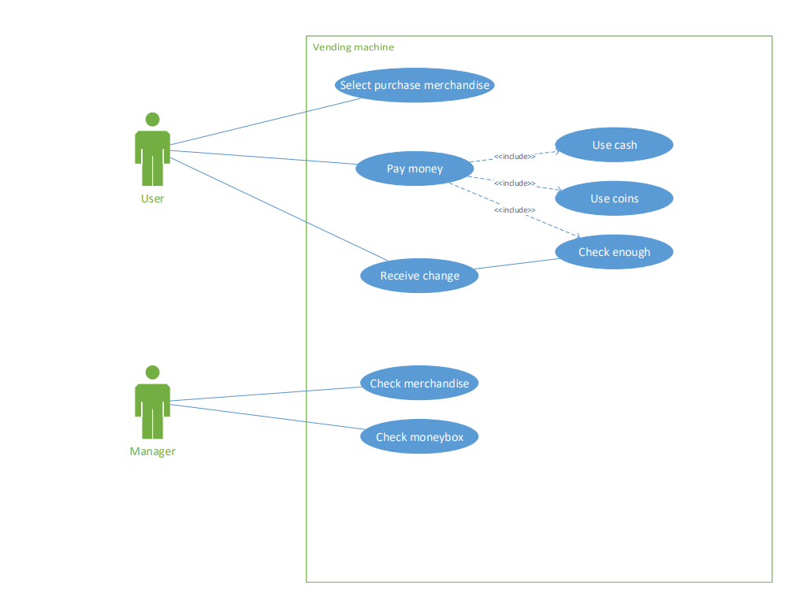

# Software Requirements

Vending Machine

Author: Group 29  Geng Zi'ang

 

## Table of Contents

[TOC]

## System Objective

In this project, we are developing a software that simulates a normal and classical vending machine. The software will take care of the User Interface, ensure every merchandise can be sold correctly and the user can get correct change. Also, a manager will check all merchandise for its stock and the money box to ensure the machine’s normal operation. A UPPAAL model will be provided to check whether the machine works correctly.

 

## Domain Analysis

The participants of activities of the game can be categorized into the user, the manager and the machine.

 

The relationships among different participants are shown as follows:

Here is the sequence of events for purchase a merchandise:

 

 

 

 

 

 

## System Architecture

From the information above, we will design a software system that simulates the process. The system architecture is shown below:

 

 

 

## Use cases

The vending machine can achieve the following use cases from the user’s and manager’s perspectives:

 

 

 

 

## Software Requirements

R1: User UI

 * R1.1: The users should be able to choose which merchandise they want to purchase.
    * R1.1.1: The screen should show all merchandise status.
    * R1.1.2: A choosing bar should show only the available merchandise.
* R1.2: The users should be able to choose how much they want to input in the form of coins or cash.
  * R1.2.1: Coins and cash should be a set number.
  * R1.2.2: Fake coins and cash should be detected and it should not be able to calculated in the money box.
* R1.3: A message screen should show the content.
  * R1.3.1: Welcome message should be showed at first.
  * R1.3.2: Which merchandise will be bought should be showed to the user.
  * R1.3.3: The rest time of paying the bill should be showed to the user.
  * R1.3.4: The money user has input should be showed and money need to input should be showed to the user.
  * R1.3.5: Success message should be showed if the payment is successful.
  * R1.3.6: Time-out message should be showed if the payment is time out.
  * R1.3.7: The message of reminding user of getting the change should be showed.
* R1.4: The users should get change if they press a button.

R2: Maintainer UI

 * R2.1: Merchandise status should be showed correctly.
	* R2.1.1: Merchandise name should be showed correctly.
	* R2.1.2: Merchandise number should be showed correctly.
* R2.2: Money box status should be showed correctly.
	* R2.2.1: All kinds of coins or cash should be showed correctly.
	* R2.2.2: The amount of each kind of money should be showed correctly, and according to reality, the message box should remind the maintainer of collecting them and show the "nearly full" message.
* R2.3: Payment record should be showed correctly.
	* R2.3.1: The payment record should be showed correctly, including the create time, merchandise name, price and its status.
	* R2.3.2: The status should contain "Success" and "Time out".
* R2.4: New merchandise should be able to added to the machine correctly and should follow the reality.
	* R2.4.1: The machine should show the name of the merchandise correctly.
	* R2.4.2: The price of the new merchandise should be changed by the maintainer correctly, and the price should be bigger than 0.5 and should be the integral multiple of 0.5.
	* R2.4.3: The quantity of the new merchandise should be changed by the maintainer correctly, and the quantity should be in the range of [0, 30].
* R2.5: Message box should show something correctly.
	* R2.5.1: The message box should show that the machine is running normally.
	* R2.5.2: The message box should show out of stock message if there is/are merchandises out of stock.
	* R2.5.3: The message box should show message if a merchandise is added.
	* R2.5.4: The message box should show an error message if the quantity of a merchandise is added illegally.
	* R2.5.5: The message box should show an error message if the price of a merchandise is set illegally.

R3: Controller

 * R3.1: If user select a merchandise, a payment should be created.
   * R3.1.1: The count down should be calculated and showed to the user correctly.
   * R3.1.2: The merchandise name should be showed to the user correctly.
   * R3.1.3: A payment record should be added, which contains the create time, merchandise name, price and its status.
* R3.2: If user insert a solid amount of money, coins/cash should be added.
  * R3.2.1: The money inserted should be calculated correctly, no matter in what kind.
  * R3.2.2: If the money inserted reaches the need of the merchandise, users should be reminded of getting the merchandise and getting the change.
  * R3.2.3: The change should be calculated correctly.
* R3.3: If user wants to get change, the "Return Money" button should be pressed.
  * R3.3.1: Users should be reminded of getting the change.
  * R3.3.2: The money box should reduce the corresponding amount of coins or cash.

