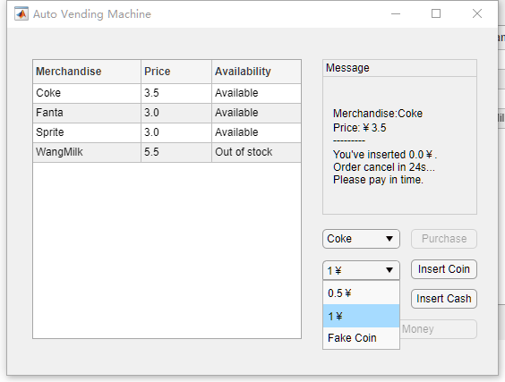
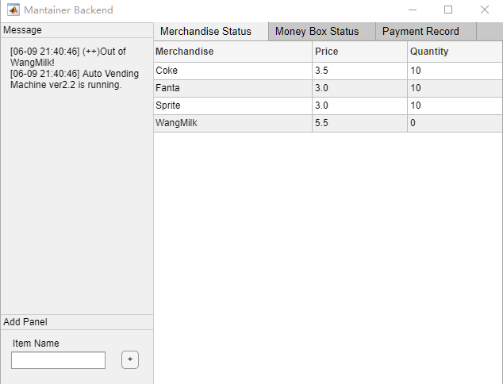
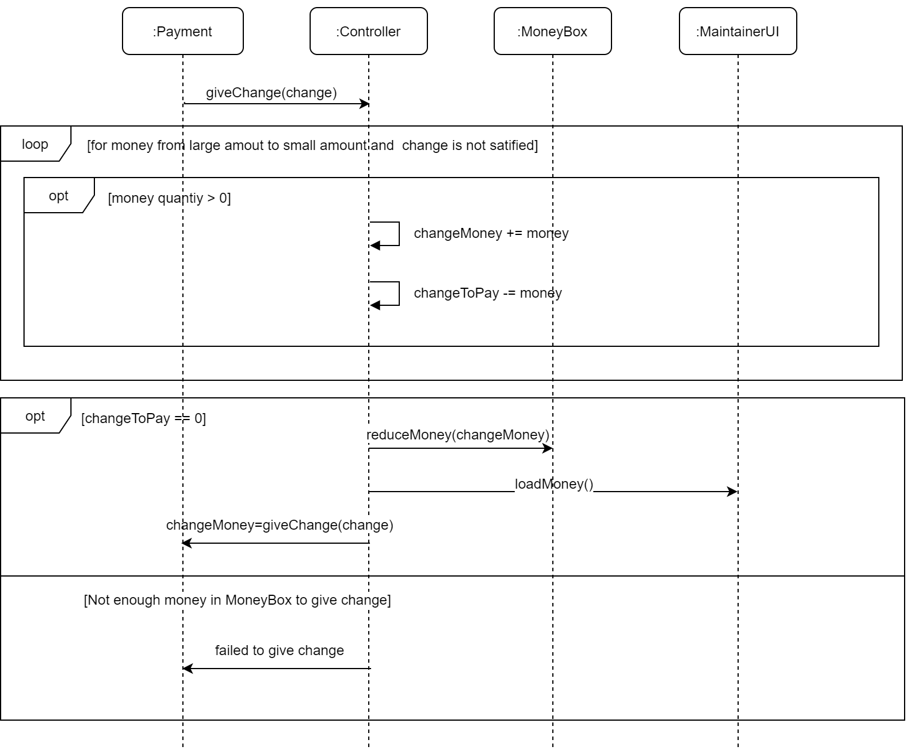

# SOFTWARE SPECIFICATION

Vending Machine

Author: Group 29  Lian Yihang

## Table of Contents 

[TOC]

## System Architecture

The system architecture is shown below:

## Software Specifications

### S1: Customer Function Implementation

#### S1.1: Select target merchandise and create payment

1. When the target merchandise is selected in the dropdown menu, display selected merchandise information.

2. If a payment already exists

	- cancel the old one
	- add the payment record to Maintainer UI, set the status 'Success'

3. When the confirm purchase button is pressed, create a new payment.

4. Display payment message for the selected merchandise to pay for.

	

#### S1.2: Inset coin and cash to pay

1. When the insert button is pressed, get the coin or cash inserted from the sensor (In this project, this is simplified to get the value in the dropdown box).
2. If the inserted money is fake or unrecognized by the sensor or the money box is full,
	- display message to alert
	- break
3. Update the amount of inserted money.
4. If the inserted money exceeds or equals to the required amount,
	- calculate change to give back.
	- If  there is no enough money in the money box to give change
		- display message to alert 
		- cancel payment
		- add the payment record to Maintainer UI, set the status 'Out of Money'
		- return inserted money to User UI return money cache
		- break
	- display payment success information about merchandise and change  in User UI
	- reduce the sold merchandise quantity by 1 in Merchandise Database
	- update the money in Money Box
	- add the payment record to Maintainer UI, set the status 'Success'
	- delete the payment 
	- break
5. Display payment status message  in User UI, including paid money and rest time to pay.

#### S1.3: Detect Timeout Payment 

1. Check if the rest time to pay exceeds time limit during payment.
2. If there is no rest time,
	- display time out message in User UI
	- add the payment record to Maintainer UI, set the status 'Time Out'
	- return inserted money to User UI return money cache
	- delete the payment
3. Reduce the rest time by 1

#### S1.4: Return money

1. When the return money button is pressed, get the accumulated change in User UI return money cache.
2. If the payment still exists,
	- add the payment record to Maintainer UI
	- cancel the payment
3. Display return money message, including type and quantity of money.
4. Clear the money in the User UI return money cache.

### S2:Maintainer Function Implementation

#### S2.1: Display merhcandise status

1. Get the merchandise list from merchandise database.

2. Load the merchandise table in Maintainer UI.

3. Get merchandise status alert message and display.

	

#### S2.2: Display money box status

1. Get the money box list from money box.

2. Load the money table in Maintainer UI.

3. Get money box status alert message and display.

	

#### S2.3: Import a new merchandise

1. When the add button is pressed, get the item name inputted in add panel.

2. Check if merchandise name is illegal. If it is illegal,

	- do nothing to merchandise database
	- display alert message in Maintainer UI
	- break

3. Add the new item into merchandise database.

4. Reload merchandise list display in Maintainer UI and User UI.

	

#### S2.4: Modify merchandise price and quantity

1. When the merchandise table cell is edited, get the target merchandise and modified value.
2. Check if the inputted data is illegal. If it is illegal,
	- do nothing to merchandise database
	- display alert message in Maintainer UI
	- break
3. Modify the target merchandise in the merchandise database.
4. Reload merchandise list display in Maintainer UI and User UI.

#### S2.5: Modify coin and cash quantity

1. When the merchandise table cell is edited, get the target money and modified value.

2. Check if the inputted quantity is illegal. If it is illegal,

	- do nothing to money box
	- display alert message in Maintainer UI
	- break

3. Modify the target money quantity in the money box.

4. Reload money table display in Maintainer UI.

	

#### S2.6: System status alert message display

1. When merchandise or money quantity change in the system are detected, controller will get alert message from merchandise database and money box.

2. For each mearchandise in mearchandise database, if its quantity is less than 10% of merchandise capacity,

	- send alert message to controller
	- display alert message in Maintainer UI
	- update merchandise availability status in User UI

3.  For each item in money box, if its quantity is less than 10% of money box capacity or more than 80% of money box capacity,

	 - send alert message to controller

	 - display alert message in Maintainer UI

		

### S3: Controller Implementation

#### S3.1 Calculate change to give back

1. Get the change amount to give back from payment.

2. For each type of money, from larger amount to smaller, If the rest amount to give back is larger than the amount of this type of money, and this type of money is not empty in the money box

	- Add this type of money to change money
	- Reduce the rest change to give back by the amount of this type of money

3. If the rest change to give back is 0 i.e. the target change amount is satisfied, 

  - update the money box (reduce the amount of change money)
  - reload maintainer UI money display
  - return the change money to give

4. Else return the failure message.

	

#### S3.2 Add payment record

1. Get payment information including created time, merchandise to pay for, payment amount from the payment.
2. Add the payment record to the controller record list.
3. Append the record to the Maintainer UI record board display.

