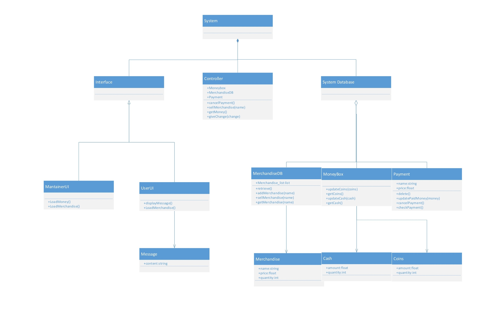

# TRACEABILITY REPORT

Vending Machine

Author: Group 29  Geng Zi'ang

## Table of Contents 

[TOC]

## System Architecture

The system architecture is shown below:

Class diagram at requirement stage

Class diagram for actual implementation

## Software Traceability

| Requirement          | Implemented by | Validated by                                                 |
| -------------------- | -------------- | ------------------------------------------------------------ |
| **R1 User UI**       | S1             | T1, T2                                                       |
| **R1.1**             | S1.1           | T1.4,  T1.5, T1.6, T2.1, T3,1                                |
| R1.1.1               | S1.1           | T1.4.1, T1.5.1, T1.6.1, T2,1, T3,1                           |
| R1.1.2               | S1.1           | T1.4.1, T1.5.1, T1.5.2, T2.1, T3.1                           |
| **R1.2**             | S1.2           | T1.3, T1.5, T1.6                                             |
| R1.2.1               | S1.2           | T1.3.2, T1.5.7, T1.5.8, T1.6.3, T2.1, T3.2                   |
| R1.2.2               | S1.2           | T1.3.2, T1.5.9, T1.5.10, T1.6.4, T2.1, T3.2                  |
| **R1.3**             | S1             | T1, T2                                                       |
| R1.3.1               | S1.1           | T1.4,  T1.5, T1.6, T2.1, T3,1                                |
| R1.3.2               | S1.1           | T1.4.1, T1.5.1, T1.6.1, T2,1, T3,1                           |
| R1.3.3               | S1.3           | T1.5.1, T1.5.2, T3                                           |
| R1.3.4               | S1.2           | T1.3.2, T1.5.7, T1.5.8, T1.6.3, T2.1, T3.2                   |
| R1.3.5               | S1.2           | T1.3.2, T1.5.9, T1.5.10, T1.6.4, T2.1, T3.2                  |
| R1.3.6               | S1.3           | T1.5.1, T1.5.2, T3.1                                         |
| R1.3.7               | S1.4           | T1.3.2, T1.3.3, T1.5.7, T1.5.8, T1.5.9, T1.5.10, T1.5.11, T1.6.5, T2.1, T3.2 |
| **R1.4**             | S1.4           | T1.3.2, T1.3.3, T1.5.7, T1.5.8, T1.5.9, T1.5.10, T1.5.11, T1.6.5, T2.1, T3.2 |
| **R2 Maintainer UI** | S2             | T1, T2, T3                                                   |
| **R2.1**             | S2.1           | T1.7, T2.2, T3.3,T3.4                                        |
| R2.1.1               | S2.1           | T1.7.1, T1.7.2, T2.2, T3.3, T3.4                             |
| R2.1.2               | S2.1           | T1.7.1, T1.7.2, T2.2, T3.3, T3.4                             |
| **R2.2**             | S2.2 S2.5 S2.6 | T1.7.1, T1.7.2, T2.2, T3.3, T3.4                             |
| R2.2.1               | S2.2           | T1.3.2, T1.3.3, T1.5.7-10, T1.7.1, T1.7.2, T2.2, T3.3, T3.4  |
| R2.2.2               | S2.5 S2.6      | T1.5.7-11, T1.7.1, T1.7.2, T2.2, T3.3, T3.4                  |
| **R2.3**             | S1.2 S1.3 S3.2 | T1.3.2, T1.3.3, T1.5.7-10, T1.7.1, T1.7.2, T2.2, T3.3, T3.4  |
| R2.3.1               | S3.2           | T1.5.3, T2.1, T3.1, T3.2                                     |
| R2.3.2               | S1.2 S1.3      |                                                              |
| **R2.4**             | S2.3 S2.4      | T1.7.1, T1.7.2, T2.2, T3.3, T3.4                             |
| R2.4.1               | S2.3           | T1.7.1, T1.7.2, T2.2, T3.3, T3.4                             |
| R2.4.2               | S2.4           | T1.7.1, T1.7.2, T2.2, T3.3, T3.4                             |
| R2.4.3               | S2.4           | T1.7.1, T1.7.2, T2.2, T3.3, T3.4                             |
| **R2.5**             | S2.6           | T1.3.2, T1.5.1, T1.5.2, T1.5.7, T1.5.8, T1.6.3, T2.1, T3.1, T3.2 |
| R2.5.1               | S2.6           | T1.3.2, T1.5.1, T1.5.2, T1.5.7, T1.5.8, T1.6.3, T2.1, T3.1, T3.2 |
| R2.5.2               | S2.6           | T1.3.2, T1.5.1, T1.5.2, T1.5.7, T1.5.8, T1.6.3, T2.1, T3.1, T3.2 |
| R2.5.3               | S2.6           | T1.3.2, T1.5.1, T1.5.2, T1.5.7, T1.5.8, T1.6.3, T2.1, T3.1, T3.2 |
| R2.5.4               | S2.6           | T1.3.2, T1.5.1, T1.5.2, T1.5.7, T1.5.8, T1.6.3, T2.1, T3.1, T3.2 |
| R2.5.5               | S2.6           | T1.3.2, T1.5.1, T1.5.2, T1.5.7, T1.5.8, T1.6.3, T2.1, T3.1, T3.2 |
| **R3 Controller**    | S3             | T1.5                                                         |
| **R3.1**             | S1.1 S3.2      | T1.5                                                         |
| R3.1.1               | S1.1           | T1.2,T1.5.1-11                                               |
| R3.1.2               | S1.1           | T1.2,T1.5.1-11                                               |
| R3.1.3               | S1.1 S3.2      | T1.2,T1.5.1-11, T1.7.2, T2.2, T3.3, T3.4                     |
| **R3.2**             | S1.2 S3.1      | T1.2, T1.5.1-11, T1.7.2, T2.1, T3.3, T3.4                    |
| R3.2.1               | S1.2           | T1.3.2,  T1.5.1-11, T1.6.4, T2.1, T3.2                       |
| R3.2.2               | S1.2           | T1.3.2,  T1.5.1-11, T1.6.4, T2.1, T3.2                       |
| R3.2.3               | S3.1           | T1.2, T1.5.1-11, T1.7.2, T2.1, T3.3, T3.4                    |
| **R3.3**             | S1.4 S3.1      | T1.2, T1.5.1-11, T1.7.2, T2.1, T3.3, T3.4                    |
| R3.3.1               | S3.1           | T1.2, T1.5.1-11, T1.7.2, T2.1, T3.3, T3.4                    |
| R3.3.2               | S1.4 S3.1      | T1.2, T1.5.1-11, T1.7.2, T2.1, T3.3, T3.4                    |