# User Manual

Vending Machine

**Author: Group 29  Geng Zi'ang**

## Table of Content

[TOC]

## System Architecture

The system architecture is shown below:

## User Manual

### User menu

#### Beginning

The user will be shown with a vending machine operating menu(Figure 1):

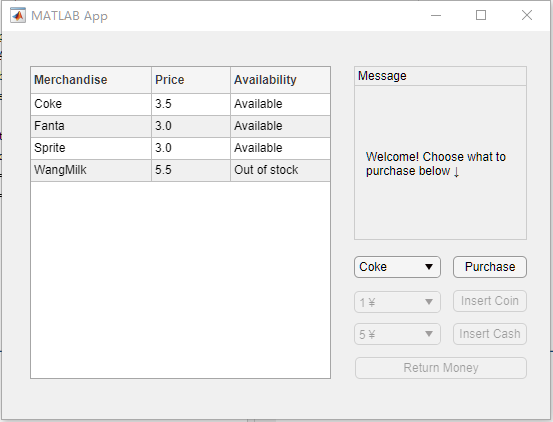

​																			**Figure 1**

1. Merchandise list: In the left part of the screen, you can see all merchandise name, price and you can also know whether it is available. For example, we can see Coke for 3.5yuan is available, but WangMilk for 5.5 yuan out of stock. 
2. Message box: Display message. At the beginning, a welcome message will show to you.
3. Purchase bar: In this bar, you can choose which merchandise you want to buy. You can see from figure 2 that the available choice will be shown to the users.

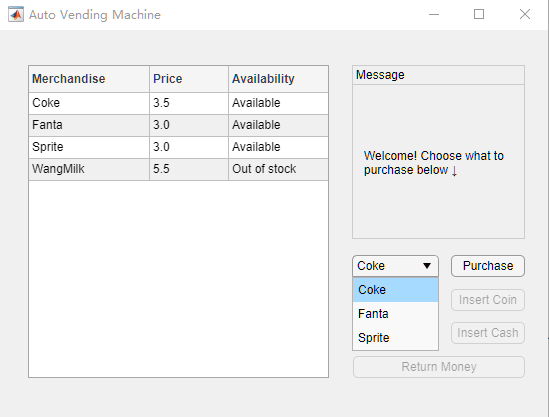

​																			**Figure 2**

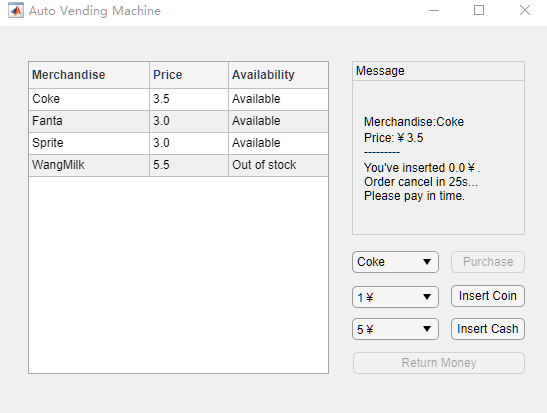

​																			**Figure 3**

#### Select Merchandise

As you can see from figure 3, if you select a merchandise and press the purchase button, you need to insert coin then. There will be several choices for you to insert: different kinds of coins and cash, and also fake money. The figure 4 and 5 show the amount users can insert once at a time.	

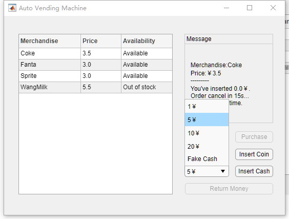

​																			**Figure 4**

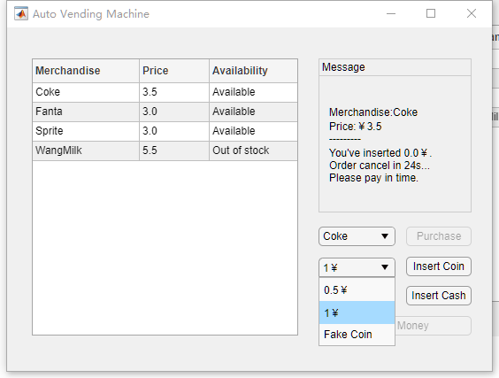

​																			**Figure 5**

By the way, the message box will change. It will show the merchandise's name, price, the money user has inserted and the time remains for user to pay.(Please see Figure 3).

#### Payment Time Out

If you do not pay the bill on time, the message box will show the time-out message(Figure 6), so please! Please pay the bill on time!!

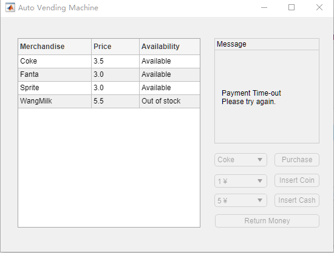

​																			**Figure 6**

#### Payment Fake Money

If you use the fake money, our machine will detect it and it won't add it to the paid money list.

#### Payment Success

If you successfully pay the bill, the message box will show the successful payment and remind you of getting your change.(Figure 7)

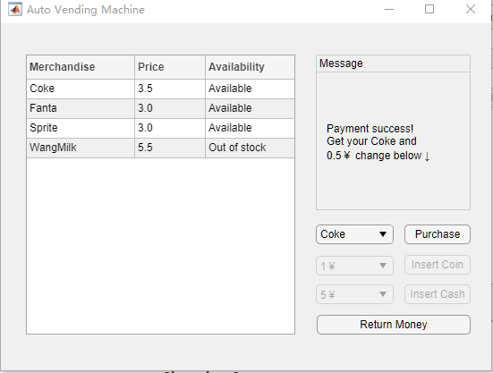

​																			**Figure 7**

#### Getting the change

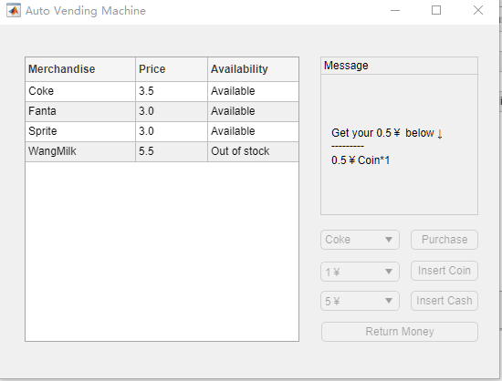

​																			**Figure 8**

1. If you need to get your change, please press "Return Money" button.(Figure 8)

**If you want to change the merchandise, please first press "Return Money" button to get your paid money back, then follow the standard flow.**

### Maintainer UI

#### Beginning

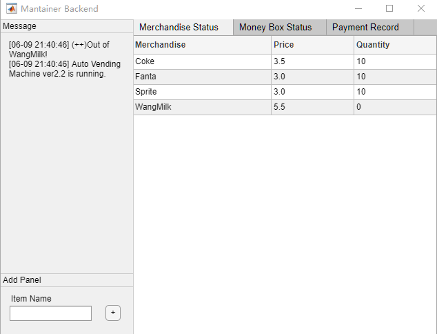

​																			**Figure 9**

At the beginning, the maintainer board will show like this.

Left part is the message box, and all message will be shown. For example, at this time, WangMilk has been out of stock, so an error message shows in the message box.

#### Merchandise Status

In figure 9, maintainer can see all merchandise status, including the name, price and quantity.

#### Money Box Status

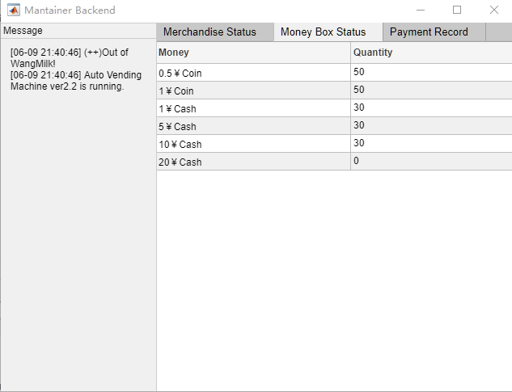

​																			**Figure 10**

In figure 10, maintainer can see the money box. It shows how many coins and cash remain. No matter the insert coin/cash operation and give change to customer operation will cost the coins/cash in the money box. 

#### Payment Record

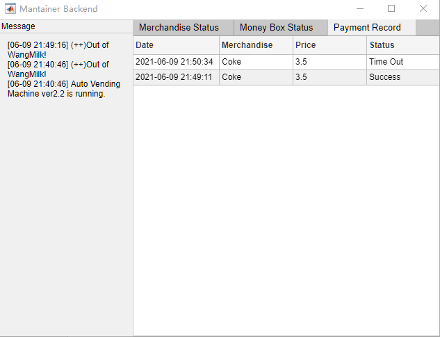

​																			**Figure 11**

In figure 11, maintainer can see the payment record. It shows each payment, including the create time, merchandise name, merchandise price and the payment status, including success and time-out.

#### Create New Merchandise

Back to figure 9, an adding panel shows up in the left down corner. Please input the merchandise name and press "+" button. Figure 12 should be the result(for example).

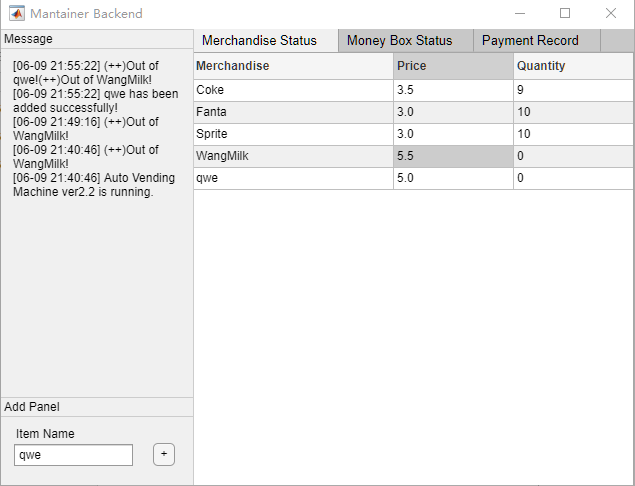

​																			**Figure 12**

#### Change Price or Supply for Merchandise

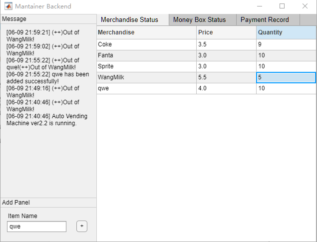

​																			**Figure 13**

If maintainer would like to change the price or supply, please double click the area (the blue rectangle shown in figure 13) that needs to change and input other numbers. **Pay attention: the quantity number input should be numeric and in the range of [0, 30]; the Price number input should be at least 0.5yuan and must be the integral multiple of 0.5.**

#### Message box Display

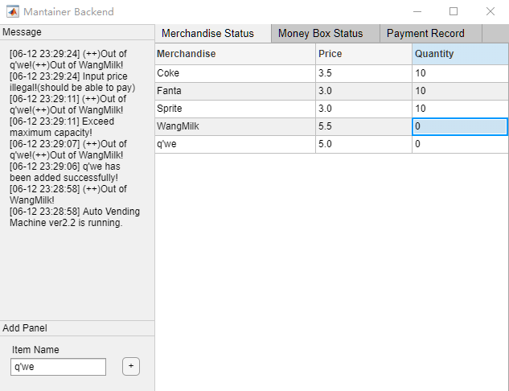

1. "Auto Vending Machine ver2.2 is running." This means the vending machine is working normally.
2. "(++)Out of XXXX!" This means one merchandise names XXXX is out of stock and need supply.
3.  "XXXX has been added successfully!" This means a merchandise names XXXX is added to the vending machine.
4.  "Exceed maximum capacity!" This means you need to input a legal Quantity number.
5. "Input price illegal!(should be able to pay)" This means you need to input a legal Price number.

