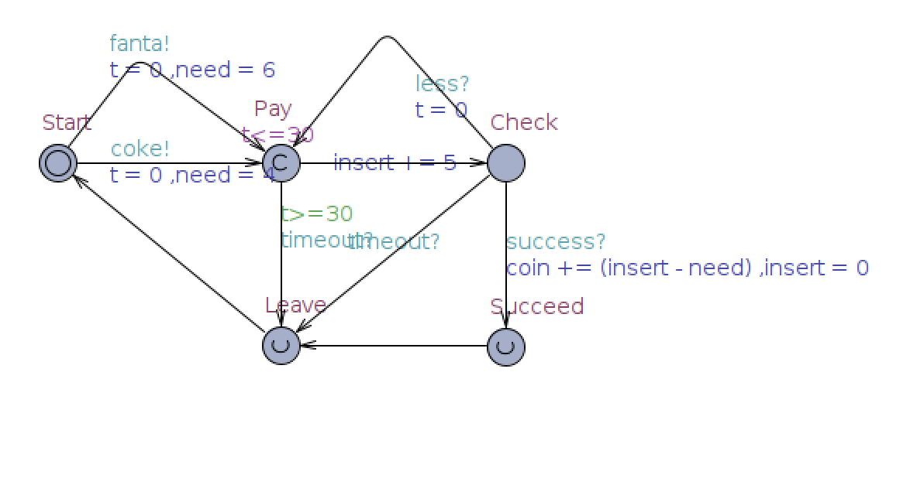
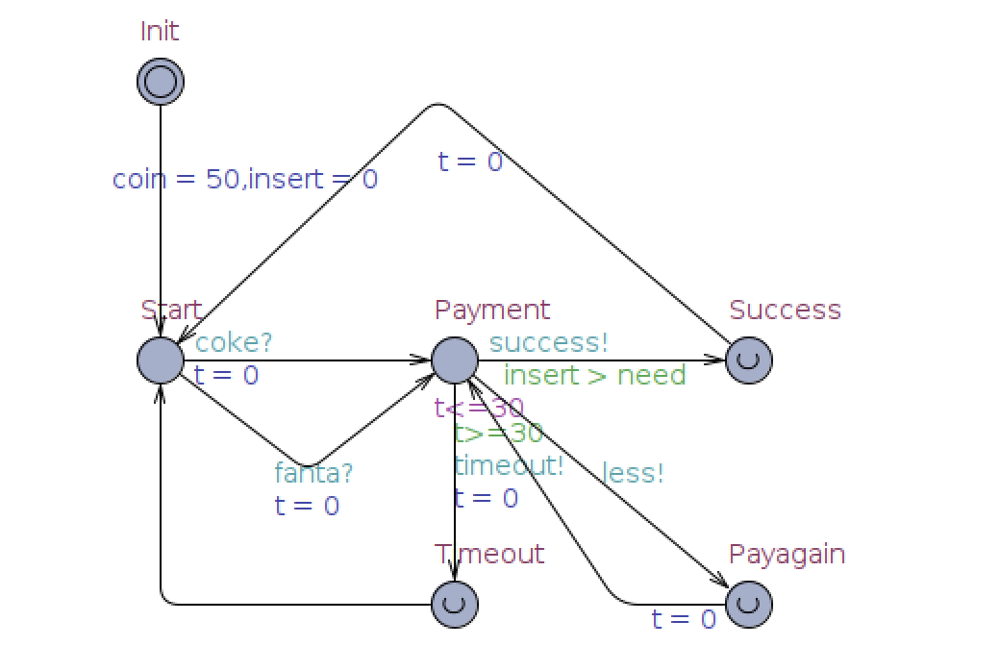

# VALIDATION REPORT

Vending

Author: Group 29  Yang Fuyi


## Table of Contents 

[TOC]

## System Architecture

The system architecture is shown below:


## T1: Unit Test

### T1.1: Merchandise Unit Test
#### T1.1.1 Test obj=Merchandise(name, price, quantity)

```matlab
function obj=Merchandise(name, price, quantity)
    obj.name = name;
    obj.price = price;
    obj.quantity = quantity;
end
```

* Coverage Criteria: Statement Coverage
* Test case

|                 | Test Case T1.1.1                                             |
| --------------- | ------------------------------------------------------------ |
| Coverage Item   | Tcover1.1.1                                                  |
| Input           | ['coke',3,20]                                                |
| State           | Mer = Merchandise('coke',3,20)                               |
| Expected Output | testCase.Mer.name =='coke' <br>testCase.Mer.price ==3<br>testCase.Mer.quantity ==20 |

* Test coverage: 1/1=100%
* Test Result: 1 passed

### T1.2: MerchandiseDB Unit Test

#### T1.2.1 Test obj=MerchandiseDB()

```matlab
function obj=MerchandiseDB()
  obj.merchandiseList = [Merchandise('Coke', 3.5, 10)         Merchandise('Fanta', 3, 10) Merchandise('Sprite', 3, 10)     Merchandise('WangMilk', 5.5, 0)];
end

```

* Coverage Criteria: Statement Coverage
* Test case

|                 | Test Case T1.2.1                                             |
| --------------- | ------------------------------------------------------------ |
| Coverage Item   | Tcover1.2.1                                                  |
| Input           | ------                                                       |
| State           | testCase.MDB = MerchandiseDB;<br/>list = retrieve(testCase.MDB); |
| Expected Output | list(1).name == 'Coke'<br>list(2).name == 'Fanta'  <br/>list(3).name == 'Spirit'  <br>list(4).name == 'WangMilk' <br>list(1).price == 3.5 <br/>list(2).price == 3 <br/>list(3).price == 3<br/>list(4).price == 5.5 <br/>list(1).quantity == 10 <br/>list(2).quantity == 10<br/>list(3).quantity == 10<br/>list(4).quantity == 0 |

* Test coverage: 1/1=100%
* Test Result: 1 passed

#### T1.2.2 Test_addMerchandise()

```matlab
function addMerchandise(obj, name)
    merchandise = Merchandise(name, 5, 0);
    obj.merchandiseList(end+1) = merchandise;
end

```

* Coverage Criteria: Statement Coverage
* Test case

|                 | Test Case T1.2.2                                             |
| --------------- | ------------------------------------------------------------ |
| Coverage Item   | Tcover1.2.2                                                  |
| Input           | 'tea'                                                        |
| State           | testCase.MDB = MerchandiseDB;<br/>testCase.MDB.addMerchandise('tea');<br/>list = retrieve(testCase.MDB); |
| Expected Output | testCase.verifyEqual(list(5).name , 'tea')== true;<br/>testCase.verifyEqual(list(5).price , 5== true);<br/>testCase.verifyEqual(list(5).quantity , 0)== true; |

* Test coverage: 1/1=100%
* Test Result: 1 passed

#### T1.2.3 Test_updateMerchandise()

```matlab
function updateMerchandise(obj, name, price, quantity)
    for i=1:length(obj.merchandiseList)
        if strcmp(name, obj.merchandiseList(i).name)
            obj.merchandiseList(i).price = price;
            obj.merchandiseList(i).quantity = quantity;
            break;
        end
    end
end
```

* Coverage Criteria: Branch Coverage
* Test case

|                 | Test Case T1.2.3.1                                           | Test Case T1.2.3.1                                           |
| --------------- | ------------------------------------------------------------ | ------------------------------------------------------------ |
| Coverage Item   | Tcover1.2.3.1                                                | Test Case T1.2.3.1                                           |
| Input           | ('Coke',8,20);                                               | ('Tea',8,20);                                                |
| State           | testCase.MDB = MerchandiseDB;<br/>testCase.MDB.updateMerchandise('Coke',8,20);<br/>list = retrieve(testCase.MDB); | testCase.MDB = MerchandiseDB;<br/>testCase.MDB.updateMerchandise('Tea',8,20);<br/>list = retrieve(testCase.MDB); |
| Expected Output | testCase.verifyEqual(list(1).price , 8)== true<br/>testCase.verifyEqual(list(1).quantity , 20)== true | No output                                                    |

* Test coverage: 2/2=100%
* Test Result: 2 passed

#### T1.2.4 Test_sellMerchandise()

```matlab
function sellMerchandise(obj, name)
    for i=1:length(obj.merchandiseList)
        if strcmp(name, obj.merchandiseList(i).name) && obj.merchandiseList(i).quantity > 0
            obj.merchandiseList(i).quantity = obj.merchandiseList(i).quantity - 1;
            break;
        end
    end
end
```

* Coverage Criteria: Statement Coverage
* Test case

|                 | Test Case T1.2.4                                             |
| --------------- | ------------------------------------------------------------ |
| Coverage Item   | Tcover1.2.4                                                  |
| Input           | 'Coke';                                                      |
| State           | testCase.MDB = MerchandiseDB;<br/>testCase.MDB.sellMerchandise('Coke');<br/>list = retrieve(testCase.MDB); |
| Expected Output | testCase.verifyEqual(list(1).quantity, 9) == true;           |

* Test coverage: 1/1=100%
* Test Result: 1 passed

#### T1.2.5 Test_getMerchandise()

```matlab
function merchandise=getMerchandise(obj, name)
    merchandise = [];
    for i=1:length(obj.merchandiseList)
        if strcmp(name, obj.merchandiseList(i).name)
            merchandise = obj.merchandiseList(i);
            break;
        end
    end
end
```

* Coverage Criteria: Statement Coverage
* Test case

|                 | Test Case T1.2.5                                             |
| --------------- | ------------------------------------------------------------ |
| Coverage Item   | Tcover1.2.5                                                  |
| Input           | 'Coke';                                                      |
| State           | testCase.MDB = MerchandiseDB;<br/>merchandise=testCase.MDB.getMerchandise('Coke');<br/>list = retrieve(testCase.MDB); |
| Expected Output | testCase.verifyEqual(list(1), merchandise)== true;           |

* Test coverage: 1/1=100%
* Test Result: 1 passed

#### T1.2.6 Test_alertMessage()

```matlab
function merchandise=getMerchandise(obj, name)
    merchandise = [];
    for i=1:length(obj.merchandiseList)
        if strcmp(name, obj.merchandiseList(i).name)
            merchandise = obj.merchandiseList(i);
            break;
        end
    end
end
```

* Coverage Criteria: Statement Coverage
* Test case

|                 | Test Case T1.2.6                                             |
| --------------- | ------------------------------------------------------------ |
| Coverage Item   | Tcover1.2.6                                                  |
| Input           | 'Coke';                                                      |
| State           | testCase.MDB = MerchandiseDB;<br/>testCase.MDB.updateMerchandise('Coke',8,0);<br/>testCase.MDB.updateMerchandise('WangMilk',8,3);<br/>msg = alertMessage(testCase.MDB); |
| Expected Output | testCase.verifyEqual(msg, '(+)Nearly out of WangMilk!(++)Out of Coke!') == true; |

* Test coverage: 1/1=100%
* Test Result: 1 passed

### T1.3: MoneyBox Unit Test

#### T1.3.1 Test_struct()

```matlab
properties(Access = private)
		coins = [50 50]; % [￥0.5, ￥1]
		cash = [30 30 30 0]; % [￥1, ￥5, ￥10, ￥20]
end
```

* Coverage Criteria: Statement Coverage
* Test case

|                 | Test Case T1.3.1                                             |
| --------------- | ------------------------------------------------------------ |
| Coverage Item   | Tcover1.3.1                                                  |
| Input           | None                                                         |
| State           | testCase.MB = MoneyBox;                                      |
| Expected Output | testCase.verifyEqual(testCase.MB.getCoins , [50 50]) == true;<br/>testCase.verifyEqual(testCase.MB.getCash , [30 30 30 0]) == true; |

* Test coverage: 1/1=100%
* Test Result: 1 passed

#### T1.3.2 Test_updateCoins()

```matlab
function updateCoins(obj, coins) 
    obj.coins = coins;
end
```

* Coverage Criteria: Statement Coverage
* Test case

|                 | Test Case T1.3.2                                             |
| --------------- | ------------------------------------------------------------ |
| Coverage Item   | Tcover1.3.2                                                  |
| Input           | [40 40]                                                      |
| State           | testCase.MB = MoneyBox;                                      |
| Expected Output | testCase.verifyEqual(testCase.MB.getCoins , [40 40]) == true; |

* Test coverage: 1/1=100%
* Test Result: 1 passed

#### T1.3.3 Test_updateCash()

```matlab
function coins=getCoins(obj)
    coins = obj.coins;
end
```

* Coverage Criteria: Statement Coverage
* Test case

|                 | Test Case T1.3.3                                             |
| --------------- | ------------------------------------------------------------ |
| Coverage Item   | Tcover1.3.3                                                  |
| Input           | [20 31 25 0]                                                 |
| State           | testCase.MB = MoneyBox;                                      |
| Expected Output | testCase.verifyEqual(testCase.MB.getCash , [20 31 25 0])== true; |

* Test coverage: 1/1=100%
* Test Result: 1 passed

#### T1.3.4 Test_alertMessage()

```matlab
function msg=alertMessage(obj)
    msg = '';
    if obj.coins(1)/obj.coinCapacity >= 0.8
        msg = [msg '(-)￥0.5 Coin nearly FULL!'];
    end
    if obj.coins(1)/obj.coinCapacity < 0.2
        msg = [msg '(+)Nearly out of ￥0.5 Coin!'];
    end
    if obj.coins(2)/obj.coinCapacity >= 0.8
        msg = [msg '(-)￥1 Coin nearly FULL!'];
    end
    if obj.coins(2)/obj.coinCapacity < 0.15
        msg = [msg '(+)Nearly out of￥1 Coin!'];
    end
    if obj.cash(1)/obj.cashCapacity >= 0.8
        msg = [msg '(-)￥1 Cash nearly FULL!'];
    end
    if obj.cash(1)/obj.cashCapacity < 0.15
        msg = [msg '(+)Nearly out of ￥1 Cash!'];
    end
    if obj.cash(2)/obj.cashCapacity >= 0.8
        msg = [msg '(-)￥5 Cash nearly FULL!'];
    end
    if obj.cash(2)/obj.cashCapacity < 0.1
        msg = [msg '(+)Nearly out of ￥5 Cash!'];
    end
    if obj.cash(3)/obj.cashCapacity >= 0.8
        msg = [msg '(-)￥10 Cash nearly FULL!'];
    end
    if obj.cash(3)/obj.cashCapacity < 0.1
        msg = [msg '(+)Nearly out of ￥10 Cash!'];
    end
    if obj.cash(4)/obj.cashCapacity >= 0.8
        msg = [msg '(-)￥20 Cash nearly FULL!'];
    end
end
```

* Coverage Criteria: Branch Coverage
* Test case

|                 | Test Case T1.3.4.1                                           | Test Case T1.3.4.2                                           |
| --------------- | ------------------------------------------------------------ | ------------------------------------------------------------ |
| Coverage Item   | Tcover1.3.4.1                                                | Tcover1.3.4.2                                                |
| Input           | testCase.MB.updateCoins([79 1])                              | testCase.MB.updateCash([60 55 5 0])                          |
| State           | testCase.MB = MoneyBox;                                      | testCase.MB = MoneyBox;                                      |
| Expected Output | testCase.verifyEqual(msg , '(-)¥0.5 Coin nearly FULL!(+)Nearly out off ¥1 Coin!')== true; | testCase.verifyEqual(msg , '(-)¥1 Cash nearly FULL!(-)¥5 Cash nearly FULL!(+)Nearly out of ï¿¥10 Cash!') == true); |

* Test coverage: 7/8=87.5%
* Test Result: 2 passed
### T1.4: Payment Unit Test

#### T1.4.1 Test_struct()

```matlab
function obj = Payment(controller)
    obj.controller = controller;
    obj.status = 'Created';
    obj.paidMoney = 0;
    obj.createdTime = datestr(now,'YYYY-mm-dd HH:MM:SS');
    obj.restTime = 30;
    obj.timer = timer;
    obj.timer.TimerFcn=@obj.checkPayment;
    obj.timer.ExecutionMode='fixedRate';
    obj.timer.Period=1; 
    start(obj.timer);
end

```

* Coverage Criteria: Statement Coverage
* Test case

|                 | Test Case T1.4.1                                             |
| --------------- | ------------------------------------------------------------ |
| Coverage Item   | Tcover1.4.1                                                  |
| Input           | None                                                         |
| State           | testCase.ctrl = VenderController;<br/>testCase.pm = Payment(testCase.ctrl);<br/>testCase.pm.price = 3; |
| Expected Output | testCase.verifyEqual(testCase.pm.status , 'Created') == true; |

* Test coverage: 1/1=100%
* Test Result: 1 passed

### T1.5 VenderController Unit Test

#### T1.5.1 Test_createPayment()

```matlab
function createPayment(ctrl, merchandise)
    ctrl.payment = Payment(ctrl);
    ctrl.payment.name = merchandise.name;
    ctrl.payment.price = merchandise.price;
end
```

* Coverage Criteria: Statement Coverage
* Test case

|                 | Test Case T1.5.1                                             |
| --------------- | ------------------------------------------------------------ |
| Coverage Item   | Tcover1.1.1, 1.4.1, 1.5.1                                    |
| Input           | 'Tea', 5, 10                                                 |
| State           | testCase.ctrl = VenderController;<br/>testCase.mb=MoneyBox;<br/>testCase.mdb=MerchandiseDB;<br/>testCase.uapp=UserUI;<br/>testCase.mapp=MaintainerUI;<br/>testCase.ctrl.userApp=testCase.uapp;<br/>testCase.ctrl.maintainerApp=testCase.mapp;<br/>testCase.ctrl.moneyBox=testCase.mb;<br/>testCase.ctrl.merchandiseDB=testCase.mdb;<br/>testCase.mb.controller=testCase.ctrl;<br/>testCase.mdb.controller=testCase.ctrl;<br/>testCase.uapp.Controller=testCase.ctrl;<br/>testCase.mapp.Controller=testCase.ctrl;<br/>mer = Merchandise('Tea', 5, 10);<br/>testCase.ctrl.createPayment(mer); |
| Expected Output | testCase.verifyEqual(testCase.ctrl.payment.name , 'Tea'); == true;<br/>testCase.verifyEqual(testCase.ctrl.payment.price , 5) == true;<br/>testCase.verifyEqual(testCase.ctrl.payment.status , 'Created') == true; |

* Test coverage: 1/1=100%

* Test Result: 1 passed

#### T1.5.2 Test_cancelPayment()

```matlab
function cancelPayment(ctrl)
    if isempty(ctrl.payment)
        return;
    end
    if strcmp(ctrl.payment.status, 'Created')
        ctrl.payment.cancelPayment;
    end
end
```

* Coverage Criteria: Branch Coverage
* Test case

|                 | Test Case T1.5.2.1                                           | Test Case T1.5.2.2                                           |
| --------------- | ------------------------------------------------------------ | ------------------------------------------------------------ |
| Coverage Item   | Tcover1.1.1, 1.5.1, 1.5.2.1                                  | Tcover1.1.1, 1.5.1, 1.5.2.2                                  |
| Input           | None                                                         | None                                                         |
| State           | testCase.ctrl = VenderController;<br/>testCase.mb=MoneyBox;<br/>testCase.mdb=MerchandiseDB;<br/>testCase.uapp=UserUI;<br/>testCase.mapp=MaintainerUI;<br/>testCase.ctrl.userApp=testCase.uapp;<br/>testCase.ctrl.maintainerApp=testCase.mapp;<br/>testCase.ctrl.moneyBox=testCase.mb;<br/>testCase.ctrl.merchandiseDB=testCase.mdb;<br/>testCase.mb.controller=testCase.ctrl;<br/>testCase.mdb.controller=testCase.ctrl;<br/>testCase.uapp.Controller=testCase.ctrl;<br/>testCase.mapp.Controller=testCase.ctrl;<br/>testCase.ctrl.cancelPayment; | testCase.ctrl = VenderController;<br/>testCase.mb=MoneyBox;<br/>testCase.mdb=MerchandiseDB;<br/>testCase.uapp=UserUI;<br/>testCase.mapp=MaintainerUI;<br/>testCase.ctrl.userApp=testCase.uapp;<br/>testCase.ctrl.maintainerApp=testCase.mapp;<br/>testCase.ctrl.moneyBox=testCase.mb;<br/>testCase.ctrl.merchandiseDB=testCase.mdb;<br/>testCase.mb.controller=testCase.ctrl;<br/>testCase.mdb.controller=testCase.ctrl;<br/>testCase.uapp.Controller=testCase.ctrl;<br/>testCase.mapp.Controller=testCase.ctrl;<br/>mer = Merchandise('Tea', 5, 10);<br/>testCase.ctrl.createPayment(mer);<br/>testCase.ctrl.cancelPayment; |
| Expected Output | Return                                                       | None                                                         |

* Test coverage: 2/2=100%

* Test Result: 1 passed

#### T1.5.3 Test_addPaymentRecord()

```matlab
function addPaymentRecord(ctrl)
    date = ctrl.payment.createdTime;
    merchandise = ctrl.payment.name;
    price = sprintf('%.1f',ctrl.payment.price);
    status = ctrl.payment.status;
    tempdata = ctrl.maintainerApp.OrderRecordTable.Data;
    tempdata = [{date, merchandise, price, status}; tempdata];
    ctrl.maintainerApp.OrderRecordTable.Data = tempdata;
end
```

* Coverage Criteria: Statement Coverage
* Test case

|                 | Test Case T1.5.3                                             |
| --------------- | ------------------------------------------------------------ |
| Coverage Item   | Tcover1.1.1, 1.4.1, 1.5.1,1.5.3                              |
| Input           | None                                                         |
| State           | testCase.ctrl = VenderController;<br/>testCase.mb=MoneyBox;<br/>testCase.mdb=MerchandiseDB;<br/>testCase.uapp=UserUI;<br/>testCase.mapp=MaintainerUI;<br/>testCase.ctrl.userApp=testCase.uapp;<br/>testCase.ctrl.maintainerApp=testCase.mapp;<br/>testCase.ctrl.moneyBox=testCase.mb;<br/>testCase.ctrl.merchandiseDB=testCase.mdb;<br/>testCase.mb.controller=testCase.ctrl;<br/>testCase.mdb.controller=testCase.ctrl;<br/>testCase.uapp.Controller=testCase.ctrl;<br/>testCase.mapp.Controller=testCase.ctrl;<br/>mer = Merchandise('Tea', 5, 10);<br/>testCase.ctrl.createPayment(mer);<br/> |
| Expected Output | 'YYYY-mm-dd HH:MM:SS'<br/>testCase.verifyEqual(testCase.ctrl.maintainerApp.OrderRecordTable.Data(2), {'Tea'}) == true;<br/>testCase.verifyEqual(testCase.ctrl.maintainerApp.OrderRecordTable.Data(3), {'5.0'}) == true<br/>testCase.verifyEqual(testCase.ctrl.maintainerApp.OrderRecordTable.Data(4), {'Created'}) == true |

* Test coverage: 1/1=100%

* Test Result: 1 passed

#### T1.5.4 Test_addMerchandise()

```matlab
function addMerchandise(ctrl, merchandise)
    if isempty(merchandise)
        return;
    end
    ctrl.merchandiseDB.addMerchandise(merchandise);
    ctrl.userApp.LoadMerchandise;
    ctrl.maintainerApp.LoadMerchandise;
end
```

* Coverage Criteria: Branch Coverage
* Test case

|                 | Test Case T1.5.4.1                                           | Test Case T1.5.4.2                                           |
| --------------- | ------------------------------------------------------------ | ------------------------------------------------------------ |
| Coverage Item   | Tcover1.1.1, 1.2.2, 1.4.1, 1.5.1, 1.5.4.1                    | Tcover1.1.1, 1.2.2, 1.4.1, 1.5.1, 1.5.4.2                    |
| Input           | ''(can't found merchandise)                                  | 'Tea'                                                        |
| State           | testCase.ctrl = VenderController;<br/>testCase.mb=MoneyBox;<br/>testCase.mdb=MerchandiseDB;<br/>testCase.uapp=UserUI;<br/>testCase.mapp=MaintainerUI;<br/>testCase.ctrl.userApp=testCase.uapp;<br/>testCase.ctrl.maintainerApp=testCase.mapp;<br/>testCase.ctrl.moneyBox=testCase.mb;<br/>testCase.ctrl.merchandiseDB=testCase.mdb;<br/>testCase.mb.controller=testCase.ctrl;<br/>testCase.mdb.controller=testCase.ctrl;<br/>testCase.uapp.Controller=testCase.ctrl;<br/>testCase.mapp.Controller=testCase.ctrl;<br/>mer = '';<br/>testCase.ctrl.addMerchandise(mer);<br/> | testCase.ctrl = VenderController;<br/>testCase.mb=MoneyBox;<br/>testCase.mdb=MerchandiseDB;<br/>testCase.uapp=UserUI;<br/>testCase.mapp=MaintainerUI;<br/>testCase.ctrl.userApp=testCase.uapp;<br/>testCase.ctrl.maintainerApp=testCase.mapp;<br/>testCase.ctrl.moneyBox=testCase.mb;<br/>testCase.ctrl.merchandiseDB=testCase.mdb;<br/>testCase.mb.controller=testCase.ctrl;<br/>testCase.mdb.controller=testCase.ctrl;<br/>testCase.uapp.Controller=testCase.ctrl;<br/>testCase.mapp.Controller=testCase.ctrl;<br/>mer = 'Tea';<br/>testCase.ctrl.addMerchandise(mer);<br/>list =retrieve(testCase.ctrl.merchandiseDB); |
| Expected Output | Return                                                       | testCase.verifyEqual(list(5).name,'Tea') == true             |

* Test coverage: 2/2=100%
* Test Result: 1 passed

#### T1.5.5 Test_updateMerchandise()

```matlab
function updateMerchandise(ctrl, merchandise, price, quantity)
    ctrl.merchandiseDB.updateMerchandise(merchandise, price, quantity);
    ctrl.userApp.LoadMerchandise;
    ctrl.maintainerApp.LoadMerchandise;
end
```

* Coverage Criteria: Statement Coverage
* Test case

|                 | Test Case T1.5.5                                             |
| --------------- | ------------------------------------------------------------ |
| Coverage Item   | Tcover1.1.1, 1.2.2, 1.2.3, 1.4.1, 1.5.1, 1.5.5               |
| Input           | 'Tea'<br/>(mer,15,10)                                        |
| State           | testCase.ctrl = VenderController;<br/>testCase.mb=MoneyBox;<br/>testCase.mdb=MerchandiseDB;<br/>testCase.uapp=UserUI;<br/>testCase.mapp=MaintainerUI;<br/>testCase.ctrl.userApp=testCase.uapp;<br/>testCase.ctrl.maintainerApp=testCase.mapp;<br/>testCase.ctrl.moneyBox=testCase.mb;<br/>testCase.ctrl.merchandiseDB=testCase.mdb;<br/>testCase.mb.controller=testCase.ctrl;<br/>testCase.mdb.controller=testCase.ctrl;<br/>testCase.uapp.Controller=testCase.ctrl;<br/>testCase.mapp.Controller=testCase.ctrl;<br/>mer = 'Tea';<br/>testCase.ctrl.addMerchandise(mer);<br/>testCase.ctrl.updateMerchandise(mer, 15, 10);<br/>list =retrieve(testCase.ctrl.merchandiseDB); |
| Expected Output | testCase.verifyEqual(list(5).name,'Tea')== true;<br/> testCase.verifyEqual(list(5).price,15)== true<br/>testCase.verifyEqual(list(5).quantity,10) == true |

* Test coverage: 1/1=100%

* Test Result: 1 passed

#### T1.5.6 Test_sellMerchandise()

```matlab
function sellMerchandise(ctrl, merchandise)
    ctrl.merchandiseDB.sellMerchandise(merchandise);
    ctrl.userApp.LoadMerchandise;
    ctrl.maintainerApp.LoadMerchandise;
end
```

* Coverage Criteria: Statement Coverage
* Test case

|                 | Test Case T1.5.6                                             |
| --------------- | ------------------------------------------------------------ |
| Coverage Item   | Tcover1.1.1, 1.2.2, 1.2.3, 1.2.4, 1.4.1, 1.5.1, 1.5.6        |
| Input           | 'Tea'                                                        |
| State           | testCase.ctrl = VenderController;<br/>testCase.mb=MoneyBox;<br/>testCase.mdb=MerchandiseDB;<br/>testCase.uapp=UserUI;<br/>testCase.mapp=MaintainerUI;<br/>testCase.ctrl.userApp=testCase.uapp;<br/>testCase.ctrl.maintainerApp=testCase.mapp;<br/>testCase.ctrl.moneyBox=testCase.mb;<br/>testCase.ctrl.merchandiseDB=testCase.mdb;<br/>testCase.mb.controller=testCase.ctrl;<br/>testCase.mdb.controller=testCase.ctrl;<br/>testCase.uapp.Controller=testCase.ctrl;<br/>testCase.mapp.Controller=testCase.ctrl;<br/>mer = 'Tea';<br/>testCase.ctrl.addMerchandise(mer);<br/>testCase.ctrl.updateMerchandise(mer, 15, 10);<br/>testCase.ctrl.sellMerchandise(mer);<br/>list =retrieve(testCase.ctrl.merchandiseDB); |
| Expected Output | testCase.verifyEqual(list(5).name,'Tea')== true;<br/> testCase.verifyEqual(list(5).price,15)== true<br/>testCase.verifyEqual(list(5).quantity,10) == true |

* Test coverage: 1/1=100%
* Test Result: 1 passed

#### T1.5.7 Test_updateCoins()

```matlab
function updateCoins(ctrl, coins)
    ctrl.moneyBox.updateCoins(coins);
    ctrl.maintainerApp.LoadMoney;
end
```

* Coverage Criteria: Statement Coverage
* Test case

|                 | Test Case T1.5.7                                             |
| --------------- | ------------------------------------------------------------ |
| Coverage Item   | Tcover1.1.1, 1.3.2, 1.5.1, 1.5.7                             |
| Input           | [10 30]                                                      |
| State           | testCase.ctrl = VenderController;<br/>testCase.mb=MoneyBox;<br/>testCase.mdb=MerchandiseDB;<br/>testCase.uapp=UserUI;<br/>testCase.mapp=MaintainerUI;<br/>testCase.ctrl.userApp=testCase.uapp;<br/>testCase.ctrl.maintainerApp=testCase.mapp;<br/>testCase.ctrl.moneyBox=testCase.mb;<br/>testCase.ctrl.merchandiseDB=testCase.mdb;<br/>testCase.mb.controller=testCase.ctrl;<br/>testCase.mdb.controller=testCase.ctrl;<br/>testCase.uapp.Controller=testCase.ctrl;<br/>testCase.mapp.Controller=testCase.ctrl;<br/>testCase.ctrl.updateCoins([10 30]); |
| Expected Output | testCase.verifyEqual(testCase.ctrl.moneyBox.getCoins,[10 30]) == true |

* Test coverage: 1/1=100%
* Test Result: 1 passed

#### T1.5.8 Test_addCoins()

```matlab
function res=addCoins(ctrl, coins)
    tempcoins = ctrl.moneyBox.getCoins;
    tempcoins = tempcoins + coins;
    for i=1:length(tempcoins)
        if tempcoins(i) > ctrl.moneyBox.coinCapacity
            res = 0;
            return;
        end
    end
    res = 1;
    ctrl.updateCoins(tempcoins);
end
```

* Coverage Criteria: Statement Coverage
* Test case

|                 | Test Case T1.5.8                                             |
| --------------- | ------------------------------------------------------------ |
| Coverage Item   | Tcover1.1.1, 1.3.2, 1.5.1, 1.5.7, 1.5.8                      |
| Input           | [0 10]                                                       |
| State           | testCase.ctrl = VenderController;<br/>testCase.mb=MoneyBox;<br/>testCase.mdb=MerchandiseDB;<br/>testCase.uapp=UserUI;<br/>testCase.mapp=MaintainerUI;<br/>testCase.ctrl.userApp=testCase.uapp;<br/>testCase.ctrl.maintainerApp=testCase.mapp;<br/>testCase.ctrl.moneyBox=testCase.mb;<br/>testCase.ctrl.merchandiseDB=testCase.mdb;<br/>testCase.mb.controller=testCase.ctrl;<br/>testCase.mdb.controller=testCase.ctrl;<br/>testCase.uapp.Controller=testCase.ctrl;<br/>testCase.mapp.Controller=testCase.ctrl;<br/>testCase.ctrl.addCoins([0 10]); |
| Expected Output | testCase.verifyEqual(testCase.ctrl.moneyBox.getCoins,[50 60]) == true |

* Test coverage: 1/1=100%
* Test Result: 1 passed

#### T1.5.9 Test_updateCash()

```matlab
function updateCash(ctrl, cash)
    ctrl.moneyBox.updateCash(cash);
    ctrl.maintainerApp.LoadMoney;
end
```

* Coverage Criteria: Statement Coverage
* Test case

|                 | Test Case T1.5.9                                             |
| --------------- | ------------------------------------------------------------ |
| Coverage Item   | Tcover1.1.1, 1.3.3, 1.5.1, 1.5.9                             |
| Input           | [10 30 20 0]                                                 |
| State           | testCase.ctrl = VenderController;<br/>testCase.mb=MoneyBox;<br/>testCase.mdb=MerchandiseDB;<br/>testCase.uapp=UserUI;<br/>testCase.mapp=MaintainerUI;<br/>testCase.ctrl.userApp=testCase.uapp;<br/>testCase.ctrl.maintainerApp=testCase.mapp;<br/>testCase.ctrl.moneyBox=testCase.mb;<br/>testCase.ctrl.merchandiseDB=testCase.mdb;<br/>testCase.mb.controller=testCase.ctrl;<br/>testCase.mdb.controller=testCase.ctrl;<br/>testCase.uapp.Controller=testCase.ctrl;<br/>testCase.mapp.Controller=testCase.ctrl;<br/>testCase.ctrl.updateCash([10 30 20 0]) |
| Expected Output | testCase.verifyEqual(testCase.ctrl.moneyBox.getCash,[10 30 20 0]) == true; |

* Test coverage: 1/1=100%
* Test Result: 1 passed

#### T1.5.10 Test_addCash()

```matlab
function res=addCash(ctrl, cash)
    tempcash = ctrl.moneyBox.getCash;
    tempcash = tempcash + cash;
    for i=1:length(tempcash)
        if tempcash(i) > ctrl.moneyBox.cashCapacity
            res = 0;
            return;
        end
    end
    res = 1;
    ctrl.updateCash(tempcash);
end
```

* Coverage Criteria: Statement Coverage
* Test case

|                 | Test Case T1.5.10                                            |
| --------------- | ------------------------------------------------------------ |
| Coverage Item   | Tcover1.1.1, 1.3.3, 1.5.1, 1.5.9, 1.5.10                     |
| Input           | [10 10 5 5]                                                  |
| State           | testCase.ctrl = VenderController;<br/>testCase.mb=MoneyBox;<br/>testCase.mdb=MerchandiseDB;<br/>testCase.uapp=UserUI;<br/>testCase.mapp=MaintainerUI;<br/>testCase.ctrl.userApp=testCase.uapp;<br/>testCase.ctrl.maintainerApp=testCase.mapp;<br/>testCase.ctrl.moneyBox=testCase.mb;<br/>testCase.ctrl.merchandiseDB=testCase.mdb;<br/>testCase.mb.controller=testCase.ctrl;<br/>testCase.mdb.controller=testCase.ctrl;<br/>testCase.uapp.Controller=testCase.ctrl;<br/>testCase.mapp.Controller=testCase.ctrl;<br/>testCase.ctrl.updateCash([10 30 20 0]); |
| Expected Output | testCase.verifyEqual(testCase.ctrl.moneyBox.getCash,[10 30 20 0]) == true |

* Test coverage: 1/1=100%
* Test Result: 1 passed

#### T1.5.11 Test_giveChange()

```matlab
function changeMoney=giveChange(ctrl, change)
    tempMoney = ctrl.getMoney;
    tempCoins = tempMoney(1:2);
    tempCash = tempMoney(3:6);
    while change >= 10 && tempCash(3) > 0
        change = change - 10;
        tempCash(3) = tempCash(3) - 1;
    end
    while change >= 5 && tempCash(2) > 0
        change = change - 5;
        tempCash(2) = tempCash(2) - 1;
    end
    while tempCoins(2) >= tempCash(1) && change >= 1 && tempCoins(2) > 0
        change = change - 1;
        tempCoins(2) = tempCoins(2) - 1;
    end
    while change >= 1 && tempCash(1) > 0
        change = change - 1;
        tempCash(1) = tempCash(1) - 1;
    end
    while change >= 0.5 && tempCoins(1) > 0
        change = change - 0.5;
        tempCoins(1) = tempCoins(1) - 1;
    end
    changeMoney = tempMoney - [tempCoins tempCash];
    if change > 0
        changeMoney = [];
    else
        ctrl.moneyBox.updateCoins(tempCoins);
        ctrl.moneyBox.updateCash(tempCash);
        ctrl.maintainerApp.LoadMoney;
    end
end
```

* Coverage Criteria:Branch Coverage
* Test case

|                 | Test Case T1.5.11.1                                          | Test Case T1.5.11.2                                          | Test Case T1.5.11.3                                          | Test Case T1.5.11.4                                          | Test Case T1.5.11.5                                          | Test Case T1.5.11.6                                          |
| --------------- | ------------------------------------------------------------ | ------------------------------------------------------------ | ------------------------------------------------------------ | ------------------------------------------------------------ | ------------------------------------------------------------ | ------------------------------------------------------------ |
| Coverage Item   | Tcover1.1.1, 1.3.3, 1.5.1, 1.5.7 ,1.5.8, 1.5.9, 1.5.10, 1.5.11.1 | Tcover1.1.1, 1.3.3, 1.5.1, 1.5.7 ,1.5.8, 1.5.9, 1.5.10, 1.5.11.2 | Tcover1.1.1, 1.3.3, 1.5.1, 1.5.7 ,1.5.8, 1.5.9, 1.5.10, 1.5.11.3 | Tcover1.1.1, 1.3.3, 1.5.1, 1.5.7 ,1.5.8, 1.5.9, 1.5.10, 1.5.11.4 | Tcover1.1.1, 1.3.3, 1.5.1, 1.5.7 ,1.5.8, 1.5.9, 1.5.10, 1.5.11.5 | Tcover1.1.1, 1.3.3, 1.5.1, 1.5.7 ,1.5.8, 1.5.9, 1.5.10, 1.5.11.6 |
| Input           | 2                                                            | 7.5                                                          | 18.5                                                         | 12.5                                                         | 15                                                           | 3.5                                                          |
| State           | testCase.ctrl = VenderController;<br/>testCase.mb=MoneyBox;<br/>testCase.mdb=MerchandiseDB;<br/>testCase.uapp=UserUI;<br/>testCase.mapp=MaintainerUI;<br/>testCase.ctrl.userApp=testCase.uapp;<br/>testCase.ctrl.maintainerApp=testCase.mapp;<br/>testCase.ctrl.moneyBox=testCase.mb;<br/>testCase.ctrl.merchandiseDB=testCase.mdb;<br/>testCase.mb.controller=testCase.ctrl;<br/>testCase.mdb.controller=testCase.ctrl;<br/>testCase.uapp.Controller=testCase.ctrl;<br/>testCase.mapp.Controller=testCase.ctrl;<br/>changeMoney = testCase.ctrl.giveChange(2); | testCase.ctrl = VenderController;<br/>testCase.mb=MoneyBox;<br/>testCase.mdb=MerchandiseDB;<br/>testCase.uapp=UserUI;<br/>testCase.mapp=MaintainerUI;<br/>testCase.ctrl.userApp=testCase.uapp;<br/>testCase.ctrl.maintainerApp=testCase.mapp;<br/>testCase.ctrl.moneyBox=testCase.mb;<br/>testCase.ctrl.merchandiseDB=testCase.mdb;<br/>testCase.mb.controller=testCase.ctrl;<br/>testCase.mdb.controller=testCase.ctrl;<br/>testCase.uapp.Controller=testCase.ctrl;<br/>testCase.mapp.Controller=testCase.ctrl;<br/>changeMoney = testCase.ctrl.giveChange(7.5); | testCase.ctrl = VenderController;<br/>testCase.mb=MoneyBox;<br/>testCase.mdb=MerchandiseDB;<br/>testCase.uapp=UserUI;<br/>testCase.mapp=MaintainerUI;<br/>testCase.ctrl.userApp=testCase.uapp;<br/>testCase.ctrl.maintainerApp=testCase.mapp;<br/>testCase.ctrl.moneyBox=testCase.mb;<br/>testCase.ctrl.merchandiseDB=testCase.mdb;<br/>testCase.mb.controller=testCase.ctrl;<br/>testCase.mdb.controller=testCase.ctrl;<br/>testCase.uapp.Controller=testCase.ctrl;<br/>testCase.mapp.Controller=testCase.ctrl;<br/>changeMoney = testCase.ctrl.giveChange(18.5); | testCase.ctrl = VenderController;<br/>testCase.mb=MoneyBox;<br/>testCase.mdb=MerchandiseDB;<br/>testCase.uapp=UserUI;<br/>testCase.mapp=MaintainerUI;<br/>testCase.ctrl.userApp=testCase.uapp;<br/>testCase.ctrl.maintainerApp=testCase.mapp;<br/>testCase.ctrl.moneyBox=testCase.mb;<br/>testCase.ctrl.merchandiseDB=testCase.mdb;<br/>testCase.mb.controller=testCase.ctrl;<br/>testCase.mdb.controller=testCase.ctrl;<br/>testCase.uapp.Controller=testCase.ctrl;<br/>testCase.mapp.Controller=testCase.ctrl;<br/>changeMoney = testCase.ctrl.giveChange(12.5); | testCase.ctrl = VenderController;<br/>testCase.mb=MoneyBox;<br/>testCase.mdb=MerchandiseDB;<br/>testCase.uapp=UserUI;<br/>testCase.mapp=MaintainerUI;<br/>testCase.ctrl.userApp=testCase.uapp;<br/>testCase.ctrl.maintainerApp=testCase.mapp;<br/>testCase.ctrl.moneyBox=testCase.mb;<br/>testCase.ctrl.merchandiseDB=testCase.mdb;<br/>testCase.mb.controller=testCase.ctrl;<br/>testCase.mdb.controller=testCase.ctrl;<br/>testCase.uapp.Controller=testCase.ctrl;<br/>testCase.mapp.Controller=testCase.ctrl;<br/>changeMoney = testCase.ctrl.giveChange(15); | testCase.ctrl = VenderController;<br/>testCase.mb=MoneyBox;<br/>testCase.mdb=MerchandiseDB;<br/>testCase.uapp=UserUI;<br/>testCase.mapp=MaintainerUI;<br/>testCase.ctrl.userApp=testCase.uapp;<br/>testCase.ctrl.maintainerApp=testCase.mapp;<br/>testCase.ctrl.moneyBox=testCase.mb;<br/>testCase.ctrl.merchandiseDB=testCase.mdb;<br/>testCase.mb.controller=testCase.ctrl;<br/>testCase.mdb.controller=testCase.ctrl;<br/>testCase.uapp.Controller=testCase.ctrl;<br/>testCase.mapp.Controller=testCase.ctrl;<br/>testCase.ctrl.addCash([0 0 5 20]);<br/>changeMoney = testCase.ctrl.giveChange(3.5); |
| Expected Output | testCase.verifyEqual(changeMoney,[0   2   0   0   0   0])==true; | testCase.verifyEqual(changeMoney,[1   2   0   1   0   0]);   | testCase.verifyEqual(changeMoney,[1   3   0   1   1   0]) == true; | testCase.verifyEqual(changeMoney,[1   2   0   0   1   0]);   | testCase.verifyEqual(changeMoney,[0   0   0   1   1  0])==true | testCase.verifyEqual(changeMoney,[1   3   0   0   0  0]) == true |

* Test coverage: 6/6=100%
* Test Result: 6 passed

### T1.6 User UI Unit Test

#### T1.6.1 Test_MerchandiseSelectionValueChanged()

```matlab
function MerchandiseSelectionValueChanged(app, event)
            app.Controller.cancelPayment;
            app.ConfirmButton.Enable=1;
            app.CoinSelection.Enable=0;
            app.CoinInsertButton.Enable=0;
            app.CashSelection.Enable=0;
            app.CashInsertButton.Enable=0;
            merchandise =                app.Controller.merchandiseDB.getMerchandise(app.MerchandiseSelection.Value);
            app.MerchandiseSelection.UserData = merchandise;
            app.displayMessage(sprintf('Merchandise:%s', merchandise.name));
            app.appendMessage(sprintf('Price:￥%.1f', merchandise.price));
            app.appendMessage('---------');
            app.appendMessage('Waiting for payment...');
end
```

* Coverage Criteria:Branch Coverage
* Test case

|                 | Test Case T1.6.1                                             |
| --------------- | ------------------------------------------------------------ |
| Coverage Item   | Tcover1.2.5, 1.6.1                                           |
| Input           | None                                                         |
| State           | testCase.ctrl = VenderController;<br/>testCase.mb=MoneyBox;<br/>testCase.mdb=MerchandiseDB;<br/>testCase.uapp=UserUI;<br/>testCase.mapp=MaintainerUI;<br/>testCase.ctrl.userApp=testCase.uapp;<br/>testCase.ctrl.maintainerApp=testCase.mapp;<br/>testCase.ctrl.moneyBox=testCase.mb;<br/>testCase.ctrl.merchandiseDB=testCase.mdb;<br/>testCase.mb.controller=testCase.ctrl;<br/>testCase.mdb.controller=testCase.ctrl;<br/>testCase.uapp.Controller=testCase.ctrl;<br/>testCase.mapp.Controller=testCase.ctrl;<br/>testCase.choose(testCase.ctrl.userApp.MerchandiseSelection,'Fanta');<br/>testCase.press(testCase.ctrl.userApp.ConfirmButton); |
| Expected Output | testCase.verifyEqual(testCase.ctrl.payment.name,'Fanta')==true; |

* Test coverage: 1/1=100%
* Test Result: 1 passed

#### T1.6.2 Test_ConfirmButtonPushed()

```matlab
function ConfirmButtonPushed(app, event)
            
            app.paymentMessage = '';
            name = app.MerchandiseSelection.Value;
            merchandise = app.Controller.merchandiseDB.getMerchandise(name);
            app.Controller.createPayment(merchandise);
            app.Controller.payment.updatePaidMoney(sum([0.5 1 1 5 10 20].*[app.CoinInsertButton.UserData app.CashInsertButton.UserData]));
            app.ConfirmButton.Enable=0;
            app.CoinSelection.Enable=1;
            app.CashSelection.Enable=1;
            app.CoinInsertButton.Enable=1;
            app.CashInsertButton.Enable=1;
end
```

* Coverage Criteria:Branch Coverage
* Test case

|                 | Test Case T1.6.2                                             |
| --------------- | ------------------------------------------------------------ |
| Coverage Item   | Tcover1.2.5, 1.6.1, 1.6.2                                    |
| Input           | None                                                         |
| State           | testCase.ctrl = VenderController;<br/>testCase.mb=MoneyBox;<br/>testCase.mdb=MerchandiseDB;<br/>testCase.uapp=UserUI;<br/>testCase.mapp=MaintainerUI;<br/>testCase.ctrl.userApp=testCase.uapp;<br/>testCase.ctrl.maintainerApp=testCase.mapp;<br/>testCase.ctrl.moneyBox=testCase.mb;<br/>testCase.ctrl.merchandiseDB=testCase.mdb;<br/>testCase.mb.controller=testCase.ctrl;<br/>testCase.mdb.controller=testCase.ctrl;<br/>testCase.uapp.Controller=testCase.ctrl;<br/>testCase.mapp.Controller=testCase.ctrl;<br/>testCase.choose(testCase.ctrl.userApp.MerchandiseSelection,'Fanta');<br/>testCase.press(testCase.ctrl.userApp.ConfirmButton); |
| Expected Output | testCase.verifyEqual(testCase.ctrl.payment.name,'Fanta')==true; |

* Test coverage: 1/1=100%
* Test Result: 1 passed

#### T1.6.3 Test_CoinInsertButtonPushed()

```matlab
function CoinInsertButtonPushed(app, event)
           app.ReturnButton.Enable=1;
           if strcmp(app.CoinSelection.Value,'Fake Coin')
               app.ReturnButton.UserData(7) = app.ReturnButton.UserData(7) + 1;
               return;
           end
           insertedCoins = zeros(1, 2);
           switch app.CoinSelection.Value
               case '0.5￥'
                   insertedCoins(1) = 1;
               case '1￥'
                   insertedCoins(2) = 1;
           end
           res = app.Controller.addCoins(insertedCoins);
           if res
               app.CoinInsertButton.UserData = app.CoinInsertButton.UserData + insertedCoins;
               app.Controller.payment.updatePaidMoney(sum([0.5 1].*insertedCoins));
           else
               app.ReturnButton.UserData(1:2) = app.ReturnButton.UserData(1:2) + insertedCoins;
               app.paymentMessage='! Money box full, please contact maintainer';
           end
end
```

* Coverage Criteria:Branch Coverage
* Test case

|                 | Test Case T1.6.3.1                                           | Test Case T1.6.3.2                                           | Test Case T1.6.3.3                                           |
| --------------- | ------------------------------------------------------------ | ------------------------------------------------------------ | ------------------------------------------------------------ |
| Coverage Item   | Tcover1.2.5, 1.5.7, 1.5.8, 1.6.1, 1.6.3.1                    | Tcover1.2.5, 1.5.7, 1.5.8, 1.6.1, 1.6.3.2                    | Tcover1.2.5, 1.6.1, 1.6.3.3                                  |
| Input           | Insert 0.5¥                                                  | Insert 1¥                                                    | insert Fake coin                                             |
| State           | testCase.ctrl = VenderController;<br/>testCase.mb=MoneyBox;<br/>testCase.mdb=MerchandiseDB;<br/>testCase.uapp=UserUI;<br/>testCase.mapp=MaintainerUI;<br/>testCase.ctrl.userApp=testCase.uapp;<br/>testCase.ctrl.maintainerApp=testCase.mapp;<br/>testCase.ctrl.moneyBox=testCase.mb;<br/>testCase.ctrl.merchandiseDB=testCase.mdb;<br/>testCase.mb.controller=testCase.ctrl;<br/>testCase.mdb.controller=testCase.ctrl;<br/>testCase.uapp.Controller=testCase.ctrl;<br/>testCase.mapp.Controller=testCase.ctrl;<br/>testCase.choose(testCase.ctrl.userApp.MerchandiseSelection,'Fanta');<br/>testCase.press(testCase.ctrl.userApp.ConfirmButton);<br/>testCase.choose(testCase.ctrl.userApp.CoinSelection,'0.5¥');<br/>testCase.press(testCase.ctrl.userApp.CoinInsertButton); | testCase.ctrl = VenderController;<br/>testCase.mb=MoneyBox;<br/>testCase.mdb=MerchandiseDB;<br/>testCase.uapp=UserUI;<br/>testCase.mapp=MaintainerUI;<br/>testCase.ctrl.userApp=testCase.uapp;<br/>testCase.ctrl.maintainerApp=testCase.mapp;<br/>testCase.ctrl.moneyBox=testCase.mb;<br/>testCase.ctrl.merchandiseDB=testCase.mdb;<br/>testCase.mb.controller=testCase.ctrl;<br/>testCase.mdb.controller=testCase.ctrl;<br/>testCase.uapp.Controller=testCase.ctrl;<br/>testCase.mapp.Controller=testCase.ctrl;<br/>testCase.choose(testCase.ctrl.userApp.MerchandiseSelection,'Fanta');<br/>testCase.press(testCase.ctrl.userApp.ConfirmButton);<br/>testCase.choose(testCase.ctrl.userApp.CoinSelection,'1¥');<br/>testCase.press(testCase.ctrl.userApp.CoinInsertButton); | testCase.ctrl = VenderController;<br/>testCase.mb=MoneyBox;<br/>testCase.mdb=MerchandiseDB;<br/>testCase.uapp=UserUI;<br/>testCase.mapp=MaintainerUI;<br/>testCase.ctrl.userApp=testCase.uapp;<br/>testCase.ctrl.maintainerApp=testCase.mapp;<br/>testCase.ctrl.moneyBox=testCase.mb;<br/>testCase.ctrl.merchandiseDB=testCase.mdb;<br/>testCase.mb.controller=testCase.ctrl;<br/>testCase.mdb.controller=testCase.ctrl;<br/>testCase.uapp.Controller=testCase.ctrl;<br/>testCase.mapp.Controller=testCase.ctrl;<br/>testCase.choose(testCase.ctrl.userApp.MerchandiseSelection,'Fanta');<br/>testCase.press(testCase.ctrl.userApp.ConfirmButton);<br/>testCase.choose(testCase.ctrl.userApp.CoinSelection,'Fake coin');<br/>testCase.press(testCase.ctrl.userApp.CoinInsertButton); |
| Expected Output | testCase.verifyEqual(testCase.ctrl.moneyBox.getCoins,[51 50])==true; | testCase.verifyEqual(testCase.ctrl.moneyBox.getCoins,[50 51])==true; | testCase.verifyEqual(testCase.ctrl.userApp.ReturnButton.UserData(7),1) == true |

* Test coverage: 3/3=100%
* Test Result: 3 passed

#### T1.6.4 Test_CashInsertButtonPushed()

```matlab
function CashInsertButtonPushed(app, event)
           app.ReturnButton.Enable=1;
           if strcmp(app.CashSelection.Value,'Fake Cash')
               app.ReturnButton.UserData(7) = app.ReturnButton.UserData(7) + 1;
               return;
           end
           insertedCash = zeros(1, 4);
           switch app.CashSelection.Value
               case '1￥'
                   insertedCash(1) = 1;
               case '5￥'
                   insertedCash(2) = 1;
               case '10￥'
                   insertedCash(3) = 1;
               case '20￥'
                   insertedCash(4) = 1;
           end
           res = app.Controller.addCash(insertedCash);
           if res
               app.CashInsertButton.UserData = app.CashInsertButton.UserData + insertedCash;
               app.Controller.payment.updatePaidMoney(sum([1 5 10 20].*insertedCash));
           else
               app.ReturnButton.UserData(3:6) = app.ReturnButton.UserData(3:6) + insertedCash;
               app.paymentMessage='!Money box full, please contact maintainer.';
           end
end
```

* Coverage Criteria:Branch Coverage
* Test case

|                 | Test Case T1.6.4.1                                           | Test Case T1.6.4.2                                           | Test Case T1.6.4.3                                           | Test Case T1.6.4.4                                           | Test Case T1.6.4.5                                           |
| --------------- | ------------------------------------------------------------ | ------------------------------------------------------------ | ------------------------------------------------------------ | ------------------------------------------------------------ | ------------------------------------------------------------ |
| Coverage Item   | Tcover1.2.5, 1.5.9, 1.5.10,1.6.1, 1.6.4.1                    | Tcover1.2.5, 1.5.9, 1.5.10, 1.6.1, 1.6.4.2                   | Tcover1.2.5, 1.5.9, 1.5.10, 1.6.1, 1.6.4.3                   | Tcover1.2.5, 1.5.9, 1.5.10, 1.6.1, 1.6.4.4                   | Tcover1.2.5, 1.5.9, 1.5.10, 1.6.1, 1.6.4.5                   |
| Input           | Insert 0.5¥                                                  | Insert 1¥                                                    |                                                              |                                                              | insert Fake coin                                             |
| State           | testCase.ctrl = VenderController;<br/>testCase.mb=MoneyBox;<br/>testCase.mdb=MerchandiseDB;<br/>testCase.uapp=UserUI;<br/>testCase.mapp=MaintainerUI;<br/>testCase.ctrl.userApp=testCase.uapp;<br/>testCase.ctrl.maintainerApp=testCase.mapp;<br/>testCase.ctrl.moneyBox=testCase.mb;<br/>testCase.ctrl.merchandiseDB=testCase.mdb;<br/>testCase.mb.controller=testCase.ctrl;<br/>testCase.mdb.controller=testCase.ctrl;<br/>testCase.uapp.Controller=testCase.ctrl;<br/>testCase.mapp.Controller=testCase.ctrl;<br/>testCase.choose(testCase.ctrl.userApp.MerchandiseSelection,'Fanta');<br/>testCase.press(testCase.ctrl.userApp.ConfirmButton);<br/>testCase.choose(testCase.ctrl.userApp.CashSelection,'1¥');<br/>testCase.press(testCase.ctrl.userApp.CashInsertButton); | testCase.ctrl = VenderController;<br/>testCase.mb=MoneyBox;<br/>testCase.mdb=MerchandiseDB;<br/>testCase.uapp=UserUI;<br/>testCase.mapp=MaintainerUI;<br/>testCase.ctrl.userApp=testCase.uapp;<br/>testCase.ctrl.maintainerApp=testCase.mapp;<br/>testCase.ctrl.moneyBox=testCase.mb;<br/>testCase.ctrl.merchandiseDB=testCase.mdb;<br/>testCase.mb.controller=testCase.ctrl;<br/>testCase.mdb.controller=testCase.ctrl;<br/>testCase.uapp.Controller=testCase.ctrl;<br/>testCase.mapp.Controller=testCase.ctrl;<br/>testCase.choose(testCase.ctrl.userApp.MerchandiseSelection,'Fanta');<br/>testCase.press(testCase.ctrl.userApp.ConfirmButton);<br/>testCase.choose(testCase.ctrl.userApp.CoinSelection,'5¥');<br/>testCase.press(testCase.ctrl.userApp.CoinInsertButton); | testCase.ctrl = VenderController;<br/>testCase.mb=MoneyBox;<br/>testCase.mdb=MerchandiseDB;<br/>testCase.uapp=UserUI;<br/>testCase.mapp=MaintainerUI;<br/>testCase.ctrl.userApp=testCase.uapp;<br/>testCase.ctrl.maintainerApp=testCase.mapp;<br/>testCase.ctrl.moneyBox=testCase.mb;<br/>testCase.ctrl.merchandiseDB=testCase.mdb;<br/>testCase.mb.controller=testCase.ctrl;<br/>testCase.mdb.controller=testCase.ctrl;<br/>testCase.uapp.Controller=testCase.ctrl;<br/>testCase.mapp.Controller=testCase.ctrl;<br/>testCase.choose(testCase.ctrl.userApp.MerchandiseSelection,'Fanta');<br/>testCase.press(testCase.ctrl.userApp.ConfirmButton);<br/>testCase.choose(testCase.ctrl.userApp.CashSelection,'10¥');<br/>testCase.press(testCase.ctrl.userApp.CashInsertButton); | testCase.ctrl = VenderController;<br/>testCase.mb=MoneyBox;<br/>testCase.mdb=MerchandiseDB;<br/>testCase.uapp=UserUI;<br/>testCase.mapp=MaintainerUI;<br/>testCase.ctrl.userApp=testCase.uapp;<br/>testCase.ctrl.maintainerApp=testCase.mapp;<br/>testCase.ctrl.moneyBox=testCase.mb;<br/>testCase.ctrl.merchandiseDB=testCase.mdb;<br/>testCase.mb.controller=testCase.ctrl;<br/>testCase.mdb.controller=testCase.ctrl;<br/>testCase.uapp.Controller=testCase.ctrl;<br/>testCase.mapp.Controller=testCase.ctrl;<br/>testCase.choose(testCase.ctrl.userApp.MerchandiseSelection,'Fanta');<br/>testCase.press(testCase.ctrl.userApp.ConfirmButton);<br/>testCase.choose(testCase.ctrl.userApp.CashSelection,'20¥');<br/>testCase.press(testCase.ctrl.userApp.CashInsertButton); | testCase.ctrl = VenderController;<br/>testCase.mb=MoneyBox;<br/>testCase.mdb=MerchandiseDB;<br/>testCase.uapp=UserUI;<br/>testCase.mapp=MaintainerUI;<br/>testCase.ctrl.userApp=testCase.uapp;<br/>testCase.ctrl.maintainerApp=testCase.mapp;<br/>testCase.ctrl.moneyBox=testCase.mb;<br/>testCase.ctrl.merchandiseDB=testCase.mdb;<br/>testCase.mb.controller=testCase.ctrl;<br/>testCase.mdb.controller=testCase.ctrl;<br/>testCase.uapp.Controller=testCase.ctrl;<br/>testCase.mapp.Controller=testCase.ctrl;<br/>testCase.choose(testCase.ctrl.userApp.MerchandiseSelection,'Fanta');<br/>testCase.press(testCase.ctrl.userApp.ConfirmButton);<br/>testCase.choose(testCase.ctrl.userApp.CashSelection,'Fake coin');<br/>testCase.press(testCase.ctrl.userApp.CashInsertButton); |
| Expected Output | testCase.verifyEqual(testCase.ctrl.moneyBox.getCash,[31 30 30 0])==true; | testCase.verifyEqual(testCase.ctrl.moneyBox.getCash,[30 31 30 0])==true; | testCase.verifyEqual(testCase.ctrl.moneyBox.getCash,[30 29 31 0]) == true | testCase.verifyEqual(testCase.ctrl.moneyBox.getCash,[30 29 29 1]) == true | testCase.verifyEqual(testCase.ctrl.userApp.ReturnButton.UserData(7),1) == true |

* Test coverage: 5/5=100%
* Test Result: 6 passed

#### T1.6.5 Test_ReturnButtonPushed()

```matlab
function ReturnButtonPushed(app, event)
            app.ReturnButton.Enable = 0;
            app.CoinSelection.Enable=0;
            app.CoinInsertButton.Enable=0;
            app.CashSelection.Enable=0;
            app.CashInsertButton.Enable=0;
            insertedCoins = app.CoinInsertButton.UserData;
            insertedCash = app.CashInsertButton.UserData;
            returnMoney = [insertedCoins insertedCash 0];
            returnMoney = returnMoney + app.ReturnButton.UserData;
            returnAmount=sum([0.5, 1, 1, 5, 10, 20, 0].*returnMoney);
            app.Controller.cancelPayment;
            if returnMoney(7) > 0
                app.displayMessage(sprintf('Get your %.1f￥ and %d unrecognizable money below ↓', returnAmount, returnMoney(7)));
            else
                app.displayMessage(sprintf('Get your %.1f￥ below ↓', returnAmount));
            end
            app.appendMessage('---------');
            moneyName = {'0.5￥Coin', '1￥Coin', '1￥Cash', '5￥Cash', '10￥Cash', '20￥Cash', 'Unrecognizable'};
            for i=1:length(moneyName)
                if returnMoney(i) > 0
                    app.appendMessage(sprintf('%s*%d', moneyName{i}, returnMoney(i)));
                end
            end
            app.Controller.addCoins(-insertedCoins);
            app.Controller.addCash(-insertedCash);
            app.CoinInsertButton.UserData = zeros(1,2);
            app.CashInsertButton.UserData = zeros(1,4);
            app.ReturnButton.UserData = zeros(1,7);
            app.displayWelcomeMessage(3);
end
```

* Coverage Criteria:Statement Coverage
* Test case

|                 | Test Case T1.6.5                                             |
| --------------- | ------------------------------------------------------------ |
| Coverage Item   | Tcover1.2.5, 1.6.1, 1.6.5                                    |
| Input           | None                                                         |
| State           | testCase.ctrl = VenderController;<br/>testCase.mb=MoneyBox;<br/>testCase.mdb=MerchandiseDB;<br/>testCase.uapp=UserUI;<br/>testCase.mapp=MaintainerUI;<br/>testCase.ctrl.userApp=testCase.uapp;<br/>testCase.ctrl.maintainerApp=testCase.mapp;<br/>testCase.ctrl.moneyBox=testCase.mb;<br/>testCase.ctrl.merchandiseDB=testCase.mdb;<br/>testCase.mb.controller=testCase.ctrl;<br/>testCase.mdb.controller=testCase.ctrl;<br/>testCase.uapp.Controller=testCase.ctrl;<br/>testCase.mapp.Controller=testCase.ctrl;<br/>testCase.choose(testCase.ctrl.userApp.MerchandiseSelection,'Fanta');<br/>testCase.press(testCase.ctrl.userApp.ConfirmButton);<br/>testCase.choose(testCase.ctrl.userApp.CashSelection,'1¥');<br/>testCase.press(testCase.ctrl.userApp.CashInsertButton);<br/>testCase.press(testCase.ctrl.userApp.ReturnButton); |
| Expected Output | testCase.verifyEqual(testCase.ctrl.moneyBox.getCash,[30 30 30 0])==true; |

* Test coverage: 1/1=100%

* Test Result: 1 passed

### T1.7 Maintainer UI Unit Test
#### T1.7.1 Test_AddButtonPushed()
```matlab
function AddButtonPushed(app, event)
            name = app.AddEditField.Value;
            if isempty(name)
                app.appendLog('Please input merchandise name.');
                return;
            end
            merchandise = app.Controller.merchandiseDB.getMerchandise(name);
            if ~isempty(merchandise)
                app.appendLog('Merchandise name already exists!');
                return;
            end
            app.appendLog(sprintf('%s has been added successfully!', name));
            app.Controller.addMerchandise(name);
end
```

* Coverage Criteria:Statement Coverage
* Test case

|                 | Test Case T1.7.1                                             |
| --------------- | ------------------------------------------------------------ |
| Coverage Item   | Tcover1.2.2, 1.2.3, 1.5.4, 1.5.5,1.7.1                       |
| Input           | None                                                         |
| State           | testCase.ctrl = VenderController;<br/>testCase.mb=MoneyBox;<br/>testCase.mdb=MerchandiseDB;<br/>testCase.uapp=UserUI;<br/>testCase.mapp=MaintainerUI;<br/>testCase.ctrl.userApp=testCase.uapp;<br/>testCase.ctrl.maintainerApp=testCase.mapp;<br/>testCase.ctrl.moneyBox=testCase.mb;<br/>testCase.ctrl.merchandiseDB=testCase.mdb;<br/>testCase.mb.controller=testCase.ctrl;<br/>testCase.mdb.controller=testCase.ctrl;<br/>testCase.uapp.Controller=testCase.ctrl;<br/>testCase.mapp.Controller=testCase.ctrl;<br/>testCase.type(testCase.ctrl.maintainerApp.AddEditField,'Tea');<br/>testCase.press(testCase.ctrl.maintainerApp.AddButton);<br/>list =retrieve(testCase.ctrl.merchandiseDB); |
| Expected Output | testCase.verifyEqual(list(5).name,'Tea')==true;              |

* Test coverage: 1/1=100%
* Test Result: 1 passed
#### T1.7.2 Test_MerchandiseTableCellEdit()

```matlab
function MerchandiseTableCellEdit(app, event)
            indices = event.Indices;
            [newData, res] = str2num(event.NewData);
            if res == 0
                app.appendLog('Input illegal!(should be numeric)');
                app.LoadMerchandise;
                return;
            end
            merchandise = app.MerchandiseTable.Data{indices(:, 1), 1};
            price = str2num(app.MerchandiseTable.Data{indices(:, 1), 2});
            quantity = str2num(app.MerchandiseTable.Data{indices(:, 1), 3});
            switch indices(:, 2)
                % Edit Price
                case 2
                    if (rem(price, 0.5) ~= 0 || price < 0.5)
                        app.appendLog('Input price illegal!(should be able to pay)');
                        app.LoadMerchandise;
                        return;
                    end
                    app.Controller.updateMerchandise(merchandise, newData, quantity);
                    
                % Edit Quantity
                case 3
                    if (rem(quantity, 1) ~= 0 || quantity < 0)
                        app.appendLog('Input quantity illegal!(should be integer>=0)');
                        app.LoadMerchandise;
                        return;
                    end
                    if newData > app.Controller.merchandiseDB.merchandiseCapacity
                        app.appendLog('Exceed maximum capacity!');
                        app.LoadMerchandise;
                        return;
                    end
                    app.Controller.updateMerchandise(merchandise, price, newData);
            end
end
```

* Coverage Criteria:Statement Coverage
* Test case

|                 | Test Case T1.7.2                                             |
| --------------- | ------------------------------------------------------------ |
| Coverage Item   | Tcover1.2.2, 1.2.3, 1.5.4, 1.5.5,1.7.2                       |
| Input           | None                                                         |
| State           | testCase.ctrl = VenderController;<br/>testCase.mb=MoneyBox;<br/>testCase.mdb=MerchandiseDB;<br/>testCase.uapp=UserUI;<br/>testCase.mapp=MaintainerUI;<br/>testCase.ctrl.userApp=testCase.uapp;<br/>testCase.ctrl.maintainerApp=testCase.mapp;<br/>testCase.ctrl.moneyBox=testCase.mb;<br/>testCase.ctrl.merchandiseDB=testCase.mdb;<br/>testCase.mb.controller=testCase.ctrl;<br/>testCase.mdb.controller=testCase.ctrl;<br/>testCase.uapp.Controller=testCase.ctrl;<br/>testCase.mapp.Controller=testCase.ctrl;<br/>testCase.ctrl.updateMerchandise('Fanta',4,18);<br/>list =retrieve(testCase.ctrl.merchandiseDB);<br/>list =retrieve(testCase.ctrl.merchandiseDB); |
| Expected Output | testCase.verifyEqual(list(2).quantity,18)==true; <br/>testCase.verifyEqual(list(2).price,4) ==true; |

* Test coverage: 1/1=100%

* Test Result: 1 passed

## T2: Integration Test

Since the vending is contains UserUI and MaintainerUI, so we have two Intergration Tests.

### T2.1 UserUI + VenderController + MerchandiseDB + Merchandise + Payment
```matlab
function test_Integration_1(testCase)%testcase 2.1
            testCase.choose(testCase.ctrl.userApp.MerchandiseSelection,'Fanta');
            pause(2);
            testCase.press(testCase.ctrl.userApp.ConfirmButton);% testcase2.1
            pause(2);
            testCase.verifyEqual(testCase.ctrl.payment.name,'Fanta');
            testCase.choose(testCase.ctrl.userApp.MerchandiseSelection,'Coke');
            testCase.press(testCase.ctrl.userApp.ConfirmButton);
            testCase.verifyEqual(testCase.ctrl.maintainerApp.OrderRecordTable.Data(2),{'Fanta'});
            testCase.verifyEqual(testCase.ctrl.maintainerApp.OrderRecordTable.Data(4),{'Canceled'});
            pause(2);
            testCase.choose(testCase.ctrl.userApp.CashSelection,'5￥');
            testCase.press(testCase.ctrl.userApp.CashInsertButton);
            pause(2);
            testCase.press(testCase.ctrl.userApp.ReturnButton);
            testCase.verifyEqual(testCase.ctrl.moneyBox.getCoins,[49 49]);
            testCase.verifyEqual(testCase.ctrl.moneyBox.getCash,[30 31 30 0]);
            pause(2);
            close all force;
end
```

* Coverage Criteria:Statement Coverage
* Test case

|                 | Test Case T2.1                                               |
| --------------- | ------------------------------------------------------------ |
| Coverage Item   | Tcover1.2.5, 1.5.7, 1.5.8, 1.5.9, 1.5.10, 1.6.1, 1.6.2, 1.6.4, 1.6.5, 2.1 |
| Input           | choose('Fanta')<br/>press('Confirm')<br/>choose('Coke')<br/>press('Confirm')<br/>choose('5 ¥')<br/>press('cashInsert')<br/>press('Return') |
| State           | testCase.ctrl = VenderController;<br/>testCase.mb=MoneyBox;<br/>testCase.mdb=MerchandiseDB;<br/>testCase.uapp=UserUI;<br/>testCase.mapp=MaintainerUI;<br/>testCase.ctrl.userApp=testCase.uapp;<br/>testCase.ctrl.maintainerApp=testCase.mapp;<br/>testCase.ctrl.moneyBox=testCase.mb;<br/>testCase.ctrl.merchandiseDB=testCase.mdb;<br/>testCase.mb.controller=testCase.ctrl;<br/>testCase.mdb.controller=testCase.ctrl;<br/>testCase.uapp.Controller=testCase.ctrl;<br/>testCase.mapp.Controller=testCase.ctrl;<br/> |
| Expected Output | Coke and Return 1¥ and 0.5¥                                  |

* Test coverage: 5/5=100%

* Test Result: 1 passed

### T2.2 MaintianerUI + VenderController + MerchandiseDB + Merchandise + Payment

```matlab
function test_Integration_2(testCase)%testcase 2.2
            pause(2);
            testCase.type(testCase.ctrl.maintainerApp.AddEditField,'Tea');
            pause(2);
            testCase.press(testCase.ctrl.maintainerApp.AddButton);
            list =retrieve(testCase.ctrl.merchandiseDB);
            testCase.verifyEqual(list(5).name,'Tea');
            pause(2);
            testCase.ctrl.updateMerchandise('Tea',4.5,30);
            list =retrieve(testCase.ctrl.merchandiseDB);
            testCase.verifyEqual(list(5).price,4.5);
            testCase.verifyEqual(list(5).quantity,30);
            pause(2);
            testCase.ctrl.addCoins([20 0]);
            pause(2)
            testCase.verifyEqual(testCase.ctrl.moneyBox.getCoins,[70 50]);
            testCase.ctrl.addCash([0 10 0 5] );
            pause(2);
            testCase.verifyEqual(testCase.ctrl.moneyBox.getCash,[30 40 30 5]);
            pause(2);
            close all force;
end
```

* Coverage Criteria:Statement Coverage
* Test case

|                 | Test Case T2.2                                               |
| --------------- | ------------------------------------------------------------ |
| Coverage Item   | Tcover1.2.2, 1.2.3, 1.2.4, 1.2.5, 1.3.2, 1.3.3, 1.3.4,1.5.5,1.5.7, 1.5.8, 1.5.9, 1.5.10, 1.7.1,1.7.2, 2.2 |
| Input           | None                                                         |
| State           | testCase.ctrl = VenderController;<br/>testCase.mb=MoneyBox;<br/>testCase.mdb=MerchandiseDB;<br/>testCase.uapp=UserUI;<br/>testCase.mapp=MaintainerUI;<br/>testCase.ctrl.userApp=testCase.uapp;<br/>testCase.ctrl.maintainerApp=testCase.mapp;<br/>testCase.ctrl.moneyBox=testCase.mb;<br/>testCase.ctrl.merchandiseDB=testCase.mdb;<br/>testCase.mb.controller=testCase.ctrl;<br/>testCase.mdb.controller=testCase.ctrl;<br/>testCase.uapp.Controller=testCase.ctrl;<br/>testCase.mapp.Controller=testCase.ctrl;<br/>testCase.ctrl.updateMerchandise('Fanta',4,18);<br/>list =retrieve(testCase.ctrl.merchandiseDB);<br/>list =retrieve(testCase.ctrl.merchandiseDB); |
| Expected Output | Tea has been added;<br/>Tea has been updated;<br/>Cash added;<br/>Coins added;<br/>alerted. |

* Test coverage: 10/10=100%

* Test Result: 1 passed


## T3: Functional Test

### T3.1 Use Case "Select merchandise"

```matlab
function test_Functional_1(testCase)%testcase 3.1
            testCase.choose(testCase.ctrl.userApp.MerchandiseSelection,'Fanta');
            pause(2);
            testCase.press(testCase.ctrl.userApp.ConfirmButton);% testcase2.1
            pause(2);
            testCase.verifyEqual(testCase.ctrl.payment.name,'Fanta');
            testCase.choose(testCase.ctrl.userApp.MerchandiseSelection,'Coke');
            testCase.press(testCase.ctrl.userApp.ConfirmButton);
            testCase.verifyEqual(testCase.ctrl.maintainerApp.OrderRecordTable.Data(2),{'Fanta'});
            testCase.verifyEqual(testCase.ctrl.maintainerApp.OrderRecordTable.Data(4),{'Canceled'});
            pause(2);
            testCase.choose(testCase.ctrl.userApp.MerchandiseSelection,'Coke');
            testCase.press(testCase.ctrl.userApp.ConfirmButton);
            pause(31);
            close all force;
end
```

* Coverage Criteria:Statement Coverage
* Test case

|                 | Test Case T3.1                                               |
| --------------- | ------------------------------------------------------------ |
| Coverage Item   | Tcover1.2.5, 1.5.7, 1.5.8, 1.5.9, 1.5.10, 1.6.1, 1.6.2, 1.6.4, 1.6.5, 2.1, 3.1 |
| Input           | choose('Fanta')<br/>press('Confirm')<br/>choose('Coke')<br/>press('Confirm') |
| State           | testCase.ctrl = VenderController;<br/>testCase.mb=MoneyBox;<br/>testCase.mdb=MerchandiseDB;<br/>testCase.uapp=UserUI;<br/>testCase.mapp=MaintainerUI;<br/>testCase.ctrl.userApp=testCase.uapp;<br/>testCase.ctrl.maintainerApp=testCase.mapp;<br/>testCase.ctrl.moneyBox=testCase.mb;<br/>testCase.ctrl.merchandiseDB=testCase.mdb;<br/>testCase.mb.controller=testCase.ctrl;<br/>testCase.mdb.controller=testCase.ctrl;<br/>testCase.uapp.Controller=testCase.ctrl;<br/>testCase.mapp.Controller=testCase.ctrl;<br/> |
| Expected Output | Fanta "Canceled"<br/>Coke Payment created<br/>Coke Payment canceled. |

* Test coverage: 5/5=100%
* Test Result: 5 passed

### T3.2 Use Case "Pay money and Return change"

```matlab
function test_Functional_2(testCase)%testcase 3.2
            testCase.choose(testCase.ctrl.userApp.MerchandiseSelection,'Coke');
            testCase.press(testCase.ctrl.userApp.ConfirmButton);
            pause(2);
            testCase.choose(testCase.ctrl.userApp.CashSelection,'5￥');
            testCase.press(testCase.ctrl.userApp.CashInsertButton);
            pause(2);
            testCase.press(testCase.ctrl.userApp.ReturnButton);
            testCase.verifyEqual(testCase.ctrl.moneyBox.getCoins,[49 49]);
            testCase.verifyEqual(testCase.ctrl.moneyBox.getCash,[30 31 30 0]);
            pause(2);
            close all force;
end
```

* Coverage Criteria:Statement Coverage
* Test case

|                 | Test Case T3.2                                               |
| --------------- | ------------------------------------------------------------ |
| Coverage Item   | Tcover1.2.5, 1.5.7, 1.5.8, 1.5.9, 1.5.10, 1.6.1, 1.6.2, 1.6.4, 1.6.5, 2.1, 3.2 |
| Input           | choose('Fanta')<br/>press('Confirm')<br/>choose('Coke')<br/>press('Confirm') |
| State           | testCase.ctrl = VenderController;<br/>testCase.mb=MoneyBox;<br/>testCase.mdb=MerchandiseDB;<br/>testCase.uapp=UserUI;<br/>testCase.mapp=MaintainerUI;<br/>testCase.ctrl.userApp=testCase.uapp;<br/>testCase.ctrl.maintainerApp=testCase.mapp;<br/>testCase.ctrl.moneyBox=testCase.mb;<br/>testCase.ctrl.merchandiseDB=testCase.mdb;<br/>testCase.mb.controller=testCase.ctrl;<br/>testCase.mdb.controller=testCase.ctrl;<br/>testCase.uapp.Controller=testCase.ctrl;<br/>testCase.mapp.Controller=testCase.ctrl;<br/> |
| Expected Output | Coke Payment created<br/>need 3.5¥<br/>1¥ coin added<br/>need 2.5¥<br/>5¥ cash added<br/>return 2.5¥, reduce 2 * 1¥ coins & 1 * 0.5 coin. |

* Test coverage: 6/6=100%
* Test Result: 6 passed

### T3.3 Use Case "check merchandise"

```matlab
function test_Functional_3(testCase)%testcase 3.3
            pause(2);
            testCase.type(testCase.ctrl.maintainerApp.AddEditField,'Tea');
            pause(2);
            testCase.press(testCase.ctrl.maintainerApp.AddButton);
            list =retrieve(testCase.ctrl.merchandiseDB);
            testCase.verifyEqual(list(5).name,'Tea');
            pause(2);
            testCase.ctrl.updateMerchandise('Tea',4.5,30);
            list =retrieve(testCase.ctrl.merchandiseDB);
            testCase.verifyEqual(list(5).price,4.5);
            testCase.verifyEqual(list(5).quantity,30);
            pause(2);
            close all force;
end
```

* Coverage Criteria:Statement Coverage
* Test case

|                 | Test Case T3.3                                               |
| --------------- | ------------------------------------------------------------ |
| Coverage Item   | Tcover1.2.2, 1.2.3, 1.2.4, 1.2.5, 1.3.2, 1.3.3, 1.3.4,1.5.5,1.5.7, 1.5.8, 1.5.9, 1.5.10, 1.7.1,1.7.2, 2.2, 3,3. |
| Input           | add 'Tea';<br/>Tea 4.5¥, 31<br />Tea 4.5¥, 30<br />          |
| State           | testCase.ctrl = VenderController;<br/>testCase.mb=MoneyBox;<br/>testCase.mdb=MerchandiseDB;<br/>testCase.uapp=UserUI;<br/>testCase.mapp=MaintainerUI;<br/>testCase.ctrl.userApp=testCase.uapp;<br/>testCase.ctrl.maintainerApp=testCase.mapp;<br/>testCase.ctrl.moneyBox=testCase.mb;<br/>testCase.ctrl.merchandiseDB=testCase.mdb;<br/>testCase.mb.controller=testCase.ctrl;<br/>testCase.mdb.controller=testCase.ctrl;<br/>testCase.uapp.Controller=testCase.ctrl;<br/>testCase.mapp.Controller=testCase.ctrl;<br/> |
| Expected Output | Out of WangMilk<br />Tea added;<br />can't add more than 30<br />Tea update with 4.5¥ and 30quantity. |

* Test coverage: 4/4=100%
* Test Result: 4 passed

### T3.4 Use Case "check moneybox"

```matlab
function test_Functional_4(testCase)%testcase 3.4
            
            testCase.ctrl.addCoins([20 -40]);
            pause(2)
            testCase.verifyEqual(testCase.ctrl.moneyBox.getCoins,[70 10]);
            testCase.ctrl.addCash([20 10 -20 5] );
            pause(2);
            testCase.verifyEqual(testCase.ctrl.moneyBox.getCash,[50 40 10 5]);
            pause(2);
            close all force;
end
```

* Coverage Criteria:Statement Coverage
* Test case

|                 | Test Case T3.4                                               |
| --------------- | ------------------------------------------------------------ |
| Coverage Item   | Tcover1.2.2, 1.2.3, 1.2.4, 1.2.5, 1.3.2, 1.3.3, 1.3.4,1.5.5,1.5.7, 1.5.8, 1.5.9, 1.5.10, 1.7.1,1.7.2, 2.2, 3,4. |
| Input           | add 20 0.5¥ coins<br />reduce 40 1¥ coins<br />add 20 1¥ cash<br />add 10 5¥ cash<br />reduce -20 10¥ cash<br />add 5¥ 20¥ cash |
| State           | testCase.ctrl = VenderController;<br/>testCase.mb=MoneyBox;<br/>testCase.mdb=MerchandiseDB;<br/>testCase.uapp=UserUI;<br/>testCase.mapp=MaintainerUI;<br/>testCase.ctrl.userApp=testCase.uapp;<br/>testCase.ctrl.maintainerApp=testCase.mapp;<br/>testCase.ctrl.moneyBox=testCase.mb;<br/>testCase.ctrl.merchandiseDB=testCase.mdb;<br/>testCase.mb.controller=testCase.ctrl;<br/>testCase.mdb.controller=testCase.ctrl;<br/>testCase.uapp.Controller=testCase.ctrl;<br/>testCase.mapp.Controller=testCase.ctrl;<br/> |
| Expected Output | coins and cash are added and reduced<br />(+)Nearly out of 1¥coin<br />(+)Nearly out of 10¥ cash<br />(-)0.5¥ coins nearly full<br />coins and cash only can be postive |

* Test coverage: 7/7=100%
* Test Result: 7 passed

## Model Checking

A UPPAL model of vending system is built for checking.

### Customer Model

This model shows a customer has selection of purchasing different merchandise.
### Purchasing Checking Model

This model shows the vending has the ability of judging if customer has inserted enough money and prepare for return.