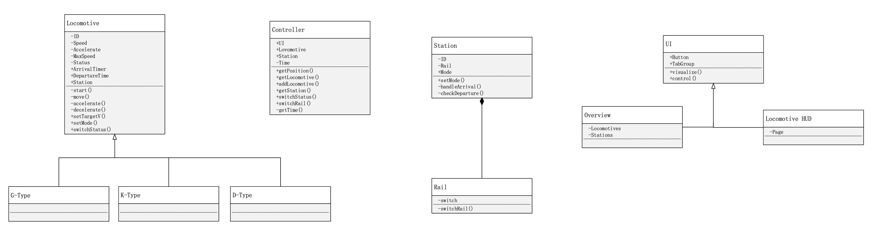
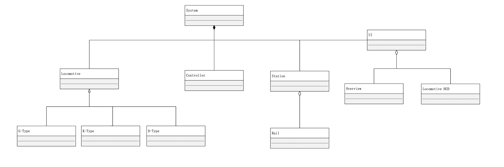
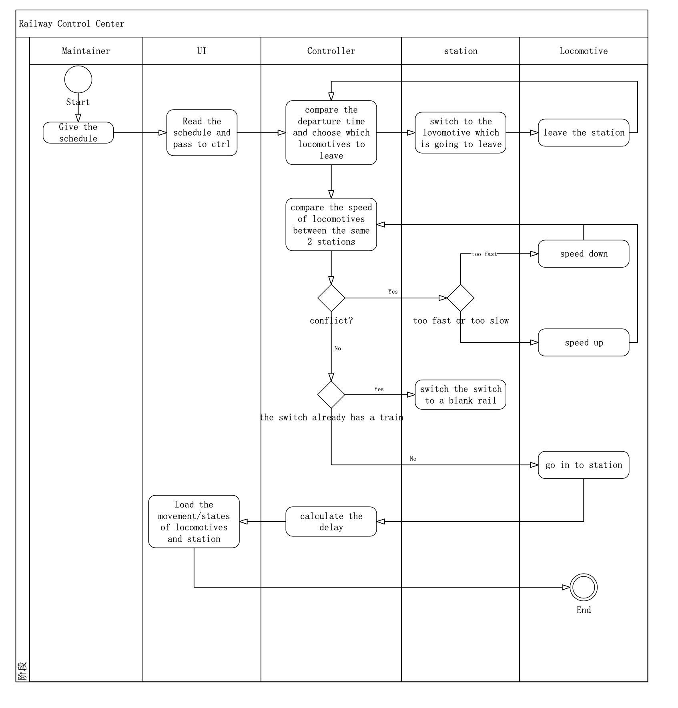
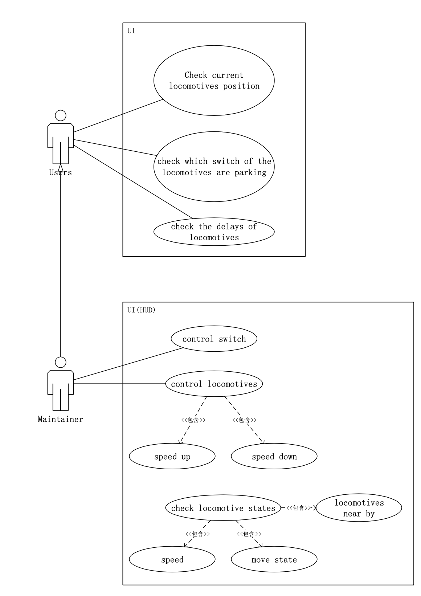

# SOFTWARE REQUIREMENTS

Railway Control System

Author: Group 29  Yang Fuyi

## Table of Contents 

[TOC]

## System Objective
​	In this project, we are going to develop a software(Railway Control  Center) which can show how the locomotives bewtween stations work every moment, and design an automated algorithm to control them according to the train schedule published by maintainer, and we can also control trains by manpower.

​	The software will take care of the graphic interface, display realtime movements of locomotives and determine how locomotive arrive, departure and order of into station and out station, by using switches. Also, there is a HUD provided for staff to control the locomotives speed or some other parameters by manpower. Besides, we will count all delays of locomotives.

## Domain Analysis
​	The participants of activities of the system can be categorized into the 3 types of locomotives(1 direction), a central controller ,7 stations(includes start and end) with 1 rail and n switches , a user interface for customer to see.

​	The relationship among different participants are shown as follows:

​	The activity diagram below shows the critical behaviors of controller controlling locomotices and reactions with stations automatively :

## Use Cases
​	The following use case diagrams show how customers  interact with System user interface at the center and how maintainers can control the locomotives by using UI to pass signals.

##　System Architecture
​	As the class diagram shown below, the whole system architecture is composed of 4 main parts: UI, locomotives, stations and the central controller. 

​	Besides, we have 3 different types of locomotives which have different property(max speed, accelerate,disaccelerate...), and two different function UI, one is for users to check status and the other is for maintainers to obverse and control these locomotives. 

## Software Requirements

### R1: Overview UI
- R1.1: The locomotives should be visualized:
   + R1.1.1: Users should have access to get locomotives position;
   + R1.1.2: Users should have access to know which switch the locomotives are;
   + R1.1.3: The number of locomotives should loaded on UI;
- R1.2: The Stations should be visualized:
   + R1.2.1: The status in the station(is there any locomotives in which switch) should be displayed;
   + R1.2.2: The number of stations should loaded on UI;
- R1.3: Current time should be displayed;
- R1.4: Schedules can be taken into controller;
- R1.5: Delays should be displayed.

### R2: Locomotive HUD UI
- R2.1: Locomotive status should be displayed： 
   + R2.1.1: Locomotives' speed;
   + R2.1.2: Locomotives' max speed;
   + R2.1.3: Locomotives' status(speed up/down, constant...);
- R2.2: Maintainer can send signals to controller to realize controlling.
   - R2.2.1: maintainer can switch locomotive status(set max speed/cruising/stop signals...) manually;
   - R2.2.2: maintainer can switch station rail manually;

### R3: Controller
- R3.1:  Controller should have the ability to get some property:
   - R3.1.1: controller should have access to the time of the system;
   - R3.1.2: controller should have access to the position of locomotives;
   - R3.1.3: controller should have the ability to add locomotives;
   - R3.1.4: controller should have the ability to get stations' situations;
   - R3.1.5: controller should be able to get the nearest locomotives of one another;
- R3.2: Controller should have the ability to control locomotives:
   -  R3.2.1: controller should be able to let train speed up/down;
   -  R3.2.2: controller should calculate the safe speed of locomotives to make sure there won't be conflict;
   -  R3.2.3: controller should let locomotives change their status to make sure there won't be conflict;
   -  R3.2.4: controller should let locomotives speed down if it is arrive to a station;
- R3.3:  Controller should have the ability to control stations:
   - R3.3.1: controller should be able to switch the switches to make sure that the locomotive can arrive in a station and won't hit another locomotive;
   - R3.3.2: controller should make sure if a train is arrived or has departed;
   - R3.3.3: controller should decide how trains depart to find the least delay(or less than certain delay)according to the schedule;
- R3.4: Controller should update the UI to make sure users can get the information.

### R4: Station
- R4.1: A station should have multi-rails and have switches to change rail.
- R4.2: A station can depart a train at a proper departure time to reduce the delay.

### R5: Locomotive
- R5.1: Locomotive should have typical property:
   - R5.1.1: 3 different types of Locomotives have different accelerate,max_speed and curising speed;
   - R5.1.2: locomotives' speed should no larger than their maximum speed;
   - R5.1.3: locomotives' delay should no larger than the certain delay;
- R5.2: Locomotives can be allowed to have some error about arriving stations(position).

