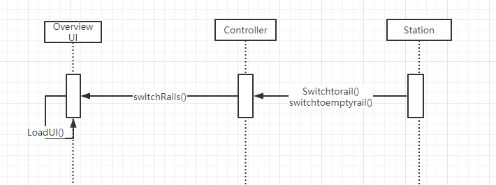

# SOFTWARE SCPECIFICATION

Railway Control Center

Author: Group 29 Geng ZiAng

## Table of Contents

[TOC]

## System Architecture

## Software Specifications

### S1 Overview UI

#### S1.1 Locomotives position real time visualize

To show the position of the locomotive, locomotive will first use the function move to renew its position according to its speed(according to the speed and physics formula). Then controller will receive the data, and use function updateLocomotives() to Overview UI. The Overview UI will use loadUI function(calculating offset to make the train image move on the UI) to renew all locomotives position based on timer. This can have two results: the train image will show the position and the Realtime Locomotive Table will show the position.

#### S1.2 Locomotive switch visualize

When a rail at the station is switched to, the lamp of the previous switched rail will turn dark and that of currently switched one is lit up. If the rail is switched to the main railway, all lamps are lit off. (Please see user manual for detail). Switchtoemptyrail() and switchtorail( )helps stations to find a proper rail for a locomotive; switchrails() helps control which station need to switch rail(whether or not to switch), check for appropriate departure time delay and switch to the corresponding rail.

#### S1.3 The number of locomotives

Once locomotive is added, locomotive() is used to initialize a train. Then the train will be added to an array called locomotivelist. Controller can have access to the locomotivelist by getLocomotives() and LoadUI() shows the array's length, which is the number of locomotives.

#### S1.4 The status in the station

When a rail at the station is switched to, the lamp of the previous switched rail will turn dark and that of currently switched one is lit up. If the rail is switched to the main railway, all lamps are lit off. (Please see user manual for detail). Switchtoemptyrail() and switchtorail( )helps stations to find a proper rail for a locomotive; switchrails() helps control which station need to switch rail(whether or not to switch), check for appropriate departure time delay and switch to the corresponding rail; loadUI() will turn the switch rail needed current to green and others grey.

#### S1.5 The number of stations

Once a station is added, Station() is used to initialize a station. Then the station will be added to an array called stationlist. Controller can have access to the stationlist by getstations() and LoadUI() shows the array's length, which is the number of stations.

#### S1.6 Current time

Controller has a timer, and update will renew loadUI when timer renews. So LoadUI can show current time in message box.

#### S1.7 Schedules input

After the import button pushed, UI will use ImportButtonPushed() to import locomotive information to controller, using array. Then the controller will use addLocomotives() to add locos to the database.

#### S1.8 Delay

Controller can have access to the locomotivelist by getLocomotives(). Then LoadUI calculate the difference between locomotives' predicted arrival time and real time, which is the delay.

### S2 Locomotive HUD UI

#### S2.1 Locomotive status should be displayed

Once locomotive is added, locomotive() is used to initialize a train. Then the train will be added to an array called locomotivelist. Controller can have access to the locomotivelist by getLocomotives(). Then LoadUI load all status, including speed, acceleration, name, position, current status.

### S3 Controller

#### S3.1 Controller access

1. getPosition(): in a for loop, check every locomotive position.(If the locomotive is between two stations, add 0.5 to its pos.)
2. updateLocomotive(): update every trains move in a time cycle.
3. getLocomotives(): have access to locomotivelist
4. addLocomotive(id, name, scheduleArrival, scheduleDeparture): add a new train according to its name, type, arrival time(array) and departure time(array) to the locomotivelist.
5. getStations(): have access to stationlist

#### S3.2 Controller control

##### S3.2.1 Collision avoid

1. findNearest():  By using this function, we can find the nearest obstacle for every locomotive, which means it calculate the nearest distance for the selected locomotive and it will compare this number in function avoidCollision(). The obstacle can be a slower train lays in front of the selected train, or it can be a faster locomotive which is going to departure ahead.
2. avoidCollision(): By using this function, we can avoid collision between loco and the former collision. We firstly use the result of function findNearest() to judge whether there is some other trains lay in front of the selected train. If not so, the train will go straight to the next station, so it will approach the station as soon as possible. If so, firstly judge whether the former locomotive is faster than our locomotive. If so, the train will go straight to the next station, so it will approach the station as soon as possible. If not so, calculate the appropriate speed by using safevcal().
3. safevcal(): By using safevcal(loco1, loco2),  we calculate the safe velocity between loco1 and loco2 or calculate the safe velocity between loco1 and its next station, so that the selected train can treat its velocity properly(no matter it's accelerating or decelerating).

##### S3.2.2 Departure time check

Controller send checkDeparture() to the station, and station use checkDeparture()(which is implemented in station.m) to arrange the departure of trains. 1. Follow the schedule; 2. Check for appropriate departure time delay, including two conditions. One is that train a and b are in the same station, and a is faster than b, but according to the schedule, b should depart first. At this time, checkDeparture() will add a delay to train b and let train a depart first, which is called higher priority. The second condition is that there is a fast train b going through the station and won't stop. According to findNearest(), train a get the result and checkDeparture() will add a delay to a's departure and let the fast train b go first.

##### S3.2.3 Arrival time Check

1. handleArrival(): By using this function, we can find every locomotive the next station to arrive by comparing locomotives' next station id, status, distance between next station and so on. If so, the station will set everything correctly, and add it to one rail of the station, according to S1.4.
2. checkArrival(): By using this function, we check all locomotives status, including it's arrival, impossible to stop at the station so send decelerating command and normally send brake command.

### S4 Manual control

#### S4.1 Manual acc

If TrainClicked() is triggered, users can choose whether to set locomotive to speed up to cruising speed or max speed. Controller get access for UI and UI change the status of the selected locomotive.

#### S4.2 Manual Switch rail

If stationClicked() is triggered, users can choose which rail is available for the selected station. Controller get access for UI and UI change the current rail of the selected station.
