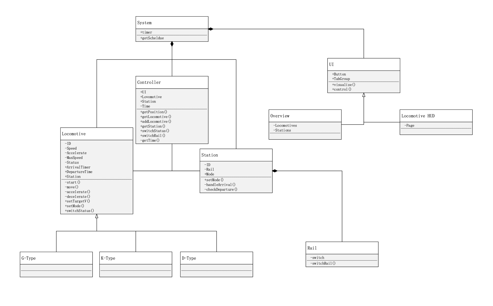

#  TRACEABILITY REPORT

Railway Control System

Author: Group 29  Yang Fuyi

## Table of Contents 

[TOC]

## System Architecture

The system architecture is shown below:

## Software Traceability

| Requirement        | Implemented by | Validated by |
| ------------------ | -------------- | ------------ |
| **R1 Overview UI** |                |              |
| **R1.1**           | S1.1, S1.2, S1.3, S3.2.3 |              |
| R1.1.1             | S1.1 |              |
| R1.1.2             | S1.2, S3.2.3 |              |
| R1.1.3             | S1.3 |              |
| **R1.2**           | S1.4, S1.5 |              |
| R1.2.1             | S1.4 |              |
| R1.2.2             | S1.5 |              |
| **R1.3**           | S1.6 |              |
| **R1.4**           | S1.7 |              |
| **R1.5**           | S1.8 |              |
| **R2 Locomotive HUD UI** | S2.1 |              |
| **R2.1**           | S2.1 |              |
| R2.1.1             | S2.1 |              |
| R2.1.2             | S2.1 |              |
| R2.1.3             | S2.1 |              |
| **R2.2**           | S4.1, S4.2 |              |
| R2.2.1             | S4.1 |              |
| R2.2.2             | S4.2 |              |
| **R3 Controller**  | S3.1, S3.2.1, S3.2.2, S3.2.3 |              |
| **R3.1**           | S3.1 |              |
| R3.1.1             | S3.1 |              |
| R3.1.2             | S3.1 |              |
| R3.1.3             | S3.1 |              |
| R3.1.4             | S3.1 |              |
| R3.1.5             | S3.1 |              |
| **R3.2**           | S3.2.1 |              |
| R3.2.1             | S3.2.1 |              |
| R3.2.2             | S3.2.1 |              |
| R3.2.3             | S3.2.1 |              |
| R3.2.4             | S3.2.1 |              |
| **R3.3**           | S3.2.1, S3.2.2, S3.2.1 | P4.1 P4.2 |
| R3.3.1             | S3.2.3 | P4.1.1 P4.1.2 P4.2.1 P4.2.2 |
| R3.3.2             | S3.2.2, S3.2.3 |  |
| R3.3.3             | S3.2.2, S3.2.1 |              |
| **R3.4**           | S1.1, S1.2, S1.3, S1.4, S1.5, S1.6, S1.7, S1.8 |              |
| **R4 Station**     | S1.4, S1.5, S3.2.3 | P4.2 |
| **R4.1**           | S1.4, S1.5, S3.2.3 | P4.2.3 P4.2.6 |
| **R4.2** | S3.2.2 | P4.2.1 P4.2.2 P4.2.4 |
| **R5 Locomotive**  | S1, S2, S3 | P4.1 |
| **R5.1**           | S1, S2, S3 | P4.1 |
| R5.1.1             | S1.1, S1.2, S1.3, S1.4, S1.5, S1.6 | P4.1.1 P4.1.2 |
| R5.1.2             | S1.1, S1.2, S1.3 | P4.1.4 |
| R5.1.3             | S2, S3 | P4.1.3 |
| **R5.2**           | S3.2.3 |              |

