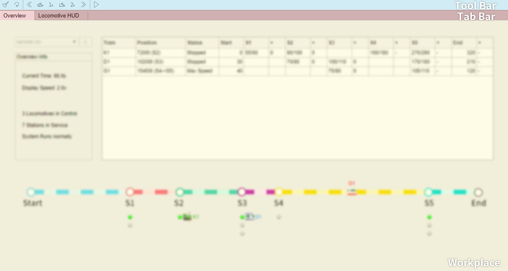
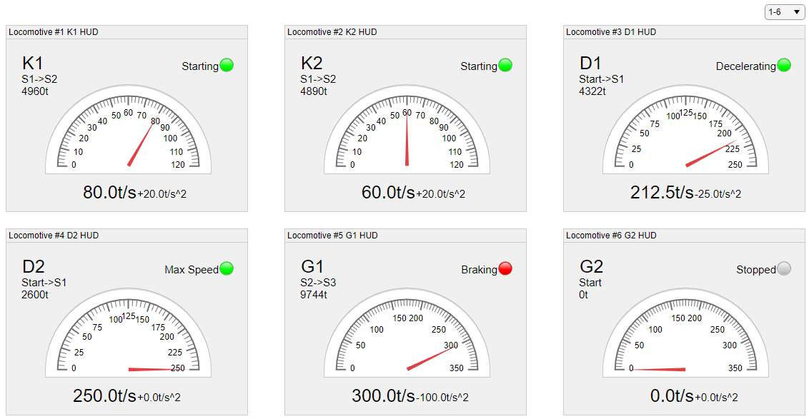

# USER MANUAL

Railway Control System

Author: Group 29 Lian Yihang & Yang Fuyi


## Table of Contents 

[TOC]

## System Architecture

​	The system architecture is shown below:


## Getting Started

​	We have provided a sample [shedule](#schedule) input file  `sample.csv`  for you to quickstart. Now you can run the software and see the graphic user interface as the screenshot shown below. You can see our layout has 7 stations (start+5 middle stations+end) along the colorful railway and each **station** has corresponding number of **branch railways** (for currently switched rail,for rails not switched to) below it for locomotives to park in. 


​	Select the sample schedule file and press the **Import** button on the left top, you will see the shcedule data in the input file, which contatins schedule arrival or departure time for every **locomotive** (for K-type, for D-type, for G-type) at every station,  are imported into the table on the right and locomotives are displayed as icons on the colorful main railway below.


​	As the schedule are imported, the locomotives will be automatically started according to the schedule departure time, and then our automated control are performed to the locomotives. The status of locomotives, for example, realtime positions, states and delays will be updated in the table and displayed on the colorful railway at the same time.

​	Now you can wait and see how these locomotives to run automatically. If you would like to check more detailed realtime status of locomotives, switch the top tab bar to [Locomotive HUD](#HUD) Tab. You can still return by switching back to [Overview](#overview) Tab.


​	To [manually control](#manual_control) the locomotive movement, you can click the corresponding **locomotive icon**and cruise it at a constant speed or force it to stop at the next station ignoring the original schedule. Similarly, you are allowed to manually switch rails at a selected station by clicking the **station icon**. Unchek the checked menu item to release the manual control. However, your manual commands may interrupt the automated control performed before and cause several [exceptions](#exception).


​	For quickstart, it is enough for you to run the system and check realtime status without any helper function in the [Toolbar](#toolbar) now. But for getting much more familiar with the system, we strongly recommend you to have a further look at the complete [User Manual](#user_manual) as follows. 


## <span id="user_manual">User Manual</span>

### <span id="schedule">Import Schedule</span>

#### Write your shcedule in `.csv`

​	`.csv` or Comma-Separated Values, is a widely used plain text file that contains a set of data in table form. You can open and edit files easily in this format with Excel or text editors. Take the sample input file `./schedules/sample.csv` we offer as a a template and rewrite your schedule into csv form.

```schedules/sample.csv
K1,0,55/60,90/100,,160/180,270/290,320 
D1,30,,70/80,100/110,,170/180,210 
G1,40,,,75/80,,105/110,120 
```

​	The input csv file above is equivalent to the schedule table as follow:

| Name | Schedule Departure Time at Start | S1 Arr/Dep | S1 Arr/Dep | S3 Arr/Dep | S4 Arr/Dep | S5 Arr/Dep | Schedule Arrival Time at End |
| ---- | -------------------------------- | ---------- | ---------- | ---------- | ---------- | ---------- | ---------------------------- |
| K1   | 0                                | 55/60      | 90/100     |            | 160/180    | 270/290    | 320                          |
| D1   | 30                               |            | 70/80      | 100/110    |            | 170/180    | 210                          |
| G1   | 40                               |            |            | 75/80      |            | 105/110    | 120                          |

​	Notice: if you want to import a K-type locomotive, then its name must be leading with character K.


#### Place `.csv` schedule under `./schedules` folder

As your shcedule in `.csv`  format written, put it under `./shedules` folder.  You will see `sample.csv` is also under this folder. Restart the software if it is running to ensure files to be imported normally. The folder structure should be like:

```
├─Deployment
│  └─schedules
│      └─sample.csv
│      └─my_schedule.csv
│      └─...
│  └─main.m
└  └─...
```


#### Import and run

Once you finish the above steps, run the software and be prepare to import your schedule. You will find it in the dropdown menu on the up left of GUI. Select it and press the **import** button.


### GUI Layout Introduction



​	From the top to the bottom of GUI, there are 3 areas - tool bar, tab bar and workplace respectively. [Toolbar](#toolbar) provides several useful display functions, which is going to be introduced later. Through switching tabs in Tab bar, you can visit 2 different kinds of workplace - [Overview](#overview) and [Locomotive HUD](#HUD), which will be also covered in detail.


### <span id="toolbar">Toolbar</span>

#### Clear tool

​	Pressing clear tool button in the tool bar will clear the shedule which is already imported to the workplace, so that you can reimport a new schedule from another `.csv`  schedule file.


#### Reset tool

​	Pressing rest tool button in the tool bar will reload the input schedule and reset time  to t=0. All locomotives and stations will also be reset to the initial state.


#### Display speed tools

Here is the table of tools which adjust display speed at workplace :

| Icon                                              | Tool          | Description                                          |
| ------------------------------------------------- | ------------- | ---------------------------------------------------- |
|  | Backward tool | Decelerate the current display speed by 0.1x (≥0.1x) |
|    | Forward tool  | Accelerate the current display speed by 0.1x (≤3.0x) |
|            | 0.5x tool     | Set the current display speed to 0.5x immediately    |
|              | 1x tool       | Reset the current display speed to 1.0x              |
|            | 1.5x tool     | Set the current display speed to 1.5x immediately    |
|              | 2x tool       | Set the current display speed to 2.5x immediately    |


#### Pause/Continue tool

- Press **Pause**  button to pause the system while it is running. 
- At the immediate you pause the system, all locomotive movement will not be updated and auto controls are suspended. 
- In pause state, you can check the locomotive or station status at this moment in detail.  Also it would offer convenience if you hope to think twice before sending some manual commands. 
- Press **Display** button if you want to recover from this state and continue running the system .


### <span id="overview">Overview Workplace</span>

####　Import dropdown menu  & button


- Select your target `.csv` schedule file in the dropdown menu on the up left of GUI.
- Then press the **Import** button to import data from the selected file.
- As the schedule are imported, the system will be automatically started.
- On how to import schedules in correct format, please refer to [Import Schedule](#schedule) for details. 


#### Information panel


​	The information panel will provide you with overview status of the current system, including current time, current display speed, number of imported locomotives and number of stations working. If there is any [exception](#exception), the system status text 'System Runs normally' will be replaced by a warning message colored red to alert you.


#### Realtime Locomotives Table


​	The table shows the shedule imported and real time status of locomotives in the system, including current position, status and delay at each station, which provides a sketchy overview of locomotives for you to check if the system is running as expected. For more detailed parameters, please refer to [Locomotive HUD](#HUD).


#### Realtime Railway Display


##### Locomotives

​	The locomotives are displayed as icons along the railway with their names labeled aside. The distance of an icon to its initial position displayed in GUI is proportional to the simulated realtime situation. Here is the table of information about locomotives of 3 different types and how they are displayed:

| Icon                                                      | Type | t~maxDelay~ | v~Cruise~ | v~Max~   | a~Start~ | a~Acce~  | a~Dece~   | a~Brake~   |
| --------------------------------------------------------- | ---- | ----------- | --------- | -------- | -------- | -------- | --------- | ---------- |
|  | G    | 10s         | 300t~/s~  | 350t~/s~ | 60t/s^2^ | 25t/s^2^ | -25t/s^2^ | -100t/s^2^ |
|  | D    | 15s         | 200t~/s~  | 250t~/s~ | 50t/s^2^ | 25t/s^2^ | -25t/s^2^ | -100t/s^2^ |
|  | K    | 30s         | 100t~/s~  | 120t~/s~ | 20t/s^2^ | 10t/s^2^ | -20t/s^2^ | -50t/s^2^  |

​	By clicking the locomotive icon, you can send manual command to the selected locomotive (Please refer to [Manual Control](#manual_control)).

##### Stations

​	Each station icon tands for a station along the railway. Here is the table of the information about the layout composed of all 7 stations:

|                                     | Start                                                 | S1                                                 | S2                                                 | S3                                                 | S4                                                 | S5                                                 | End                                             |
| ----------------------------------- | ----------------------------------------------------- | -------------------------------------------------- | -------------------------------------------------- | -------------------------------------------------- | -------------------------------------------------- | -------------------------------------------------- | ----------------------------------------------- |
| Icon                                |  |  |  |  |  |  |  |
| Distance (from the start)           | 0                                                     | 4800                                               | 7200                                               | 10200                                              | 12000                                              | 19200                                              | 21600                                           |
| Number of rails (besides main rail) | -                                                     | 2                                                  | 1                                                  | 3                                                  | 1                                                  | 3                                                  | -                                               |

​	  When a rail at the station is switched to, the lamp of the previous switched rail will turn dark and that of currently switched one is lit up. If the rail is switched to the main railway, all lamps are lit off. Here is the table of information about how the rail status is displayed by lamps:

| Lamp                                            | Status       | Description                                             |
| ----------------------------------------------- | ------------ | ------------------------------------------------------- |
|    | Switched     | The rail is the currently switched rail at the station. |
|  | Not Switched | The rail is NOT switched to at the staion.              |

​	By clicking the station icon, you can manually control the rail switch of the selected station (Please refer to [Manual Control](#manual_control)).


### <span id="HUD">Locomotive HUD</span>

#### 

#### Locomotive Status Information

​	A page in HUD Tab can contain information of at most 6 locomotives at a time. You can use the page dropdown menu on the top right to flip between pages to have a detailed overview of locomotive status. Detailed realtime parameters of each locomotive are displayed, including name, position (with nearest stations), velocity (with a visualized gauge), acceleration and status (with lamp in different colors).

#### Locomotive Status Lamp

​	Here is the table of information about how the locomotive status is displayed by lamps:

| Lamp                                            | Status  | Description                                      |
| ----------------------------------------------- | ------- | ------------------------------------------------ |
|  | Stopped | The locomotive is stopped currently.             |
|  | Braking | The locomotive is braking currently.             |
|    | Running | Otherwise, the locomotive is running regularly . |


### <span id="manual_control">Manual Control</span>


#### Switch locomotive status manually

- **Click** any **locomotive icon** on the railway.
- Select a manual command to send to the target locomotive by pressing corresponding menu item in the context menu.
	- **Set Max Speed** : accelerate the target locomotive to its maximum speed and keep this speed ignoring the original schedule until the manual control is released.
	- **Set Cruising** : set the target  locomotive to its cruising speed and cruise the locomotive ignoring the original schedule until the manual control is released.
	- **Stop at next station**: command the target locomotive to stop at the nearest station. If the next station is not in schedule, the locomotive will depart only if you send this manual command again.
- If you hope to **release** manual control that keeps constant speed and return to automated control mode, click the locomotive again and uncheck the menu item.
- Notice: Your manual switch command has a higher priority than any automated controls, so unexpected [exception](#exception)s may occur due to your operation. 


#### Switch station rail manually

- **Click** any **station icon or label** along the railway.
- **Select a rail** to manually switch to by pressing corresponding menu item in the context menu.
- If you hope to **release** manual control and return to automated control mode, click the station again and uncheck the menu item.
- Notice: Your manual switch command has a higher priority than any automated controls, so unexpected [exception](#exception)s may occur due to your operation. 


#### <span id="exception">Manual Control Exceptions</span>

​	Here is the table of types of exception that manual controls may lead to:

| Exception    | Description                                          | Potential Cause                                              | System Reaction |
| ------------ | ---------------------------------------------------- | ------------------------------------------------------------ | --------------- |
| Collision    | Two locomotives crash                                | Too high speed is manually set; Rail is manually set at a sudden | alert and halt  |
| Out of rail  | The locomotive cannot stop at end                    | Set speed without releasing control or manually stopping the locomotive | alert and halt  |
| Station Miss | The locomotive cannot stop at the next target staion | Fixed speed is manually set; Stop command is sent at a sudden; Rail is manually switched at a sudden | alert only      |

​	All exception mentioned will be reported on the information panel as it occurs as the figure below shown. To handle an exception that leads to system halt, press the **Reset**  button in the toolbar and try more appropriate manual control or keep in automated control mode.


