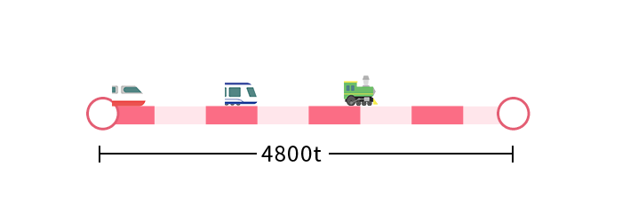
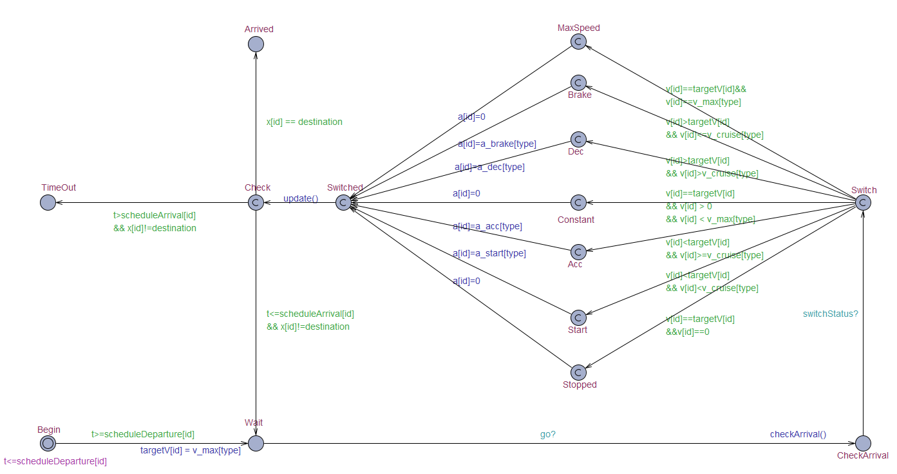
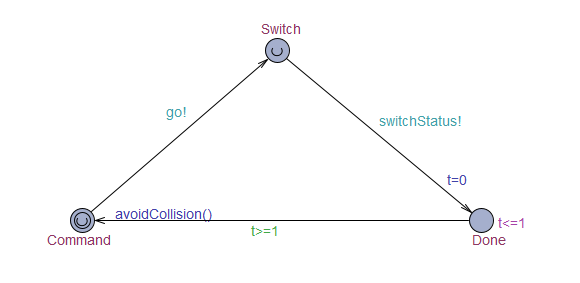
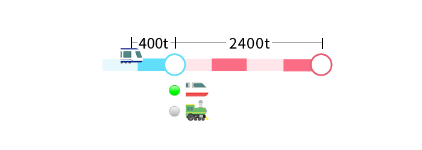
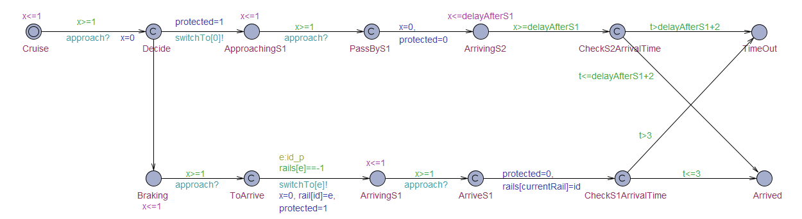
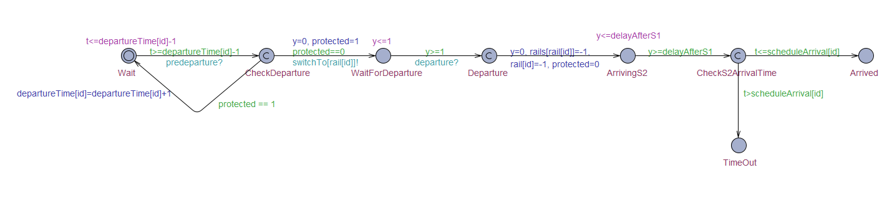
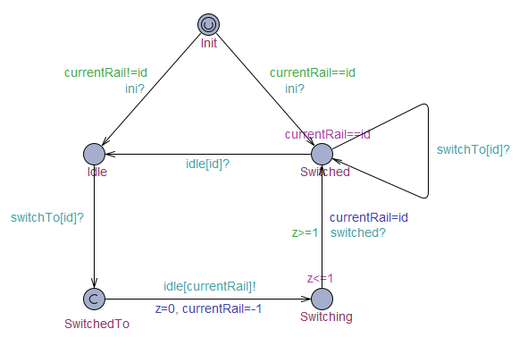
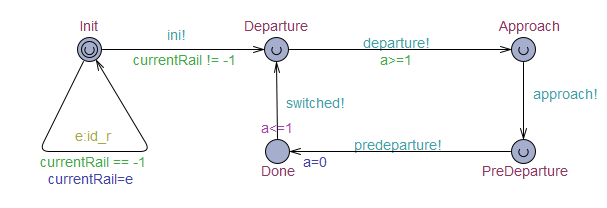

# VALIDATION REPORT

Railway Control System

Author: Group 29  Lian Yihang


## Table of Contents 

[TOC]

## System Architecture

The system architecture is shown below:


## T1: Unit Test

### T1.1: Locomotive Unit Test


### T1.2: Station Unit Test


### T1.3: Controller Unit Test


###  T1.4: UI Test


## T2: Integration Test


## T3: Functional Test


## Model Checking

### Locomotive Collision-avoidance Model

#### Assumption



​	For the purpose of simplicity and clearity without loss of generality, we pick the first section out  of orginal railway to construct the validation model to check the accuracy of automated control collision-avoidance algorithm. Furthermore, we use the testcase shown above to check the model, where faster locomotives should avoid collision from slower locomotives. We have prepared you  `validation.csv`  to simulate this simplified case in our complete version software as a reference.

|      | Schedule Departure Time | Schedule Arrival Time |
| ---- | ----------------------- | --------------------- |
| K1   | 0s                      | 45s                   |
| D1   | 15s                     | 47s                   |
| G1   | 30s                     | 50s                   |


#### Locomotive



​	Each locomotive, with a distinct id, will depart at the sheduled departure time. It will wait for controller's command and check whether it should brake to arrive at the destination promptly and accurately. Then the locomotive will automatically switch acceleration status according to target velocity and current velocity, and update velocity and position by 1 second forward . The `checkArrival()` function determines when to brake the locomotive so that it can arrive at the station properly and  `update()` function below is based on physical simulation. Their implementation is similar to MATLAB code but  we have to do some adjustment to handle numeric precision problem using UPPAAL.

```c
void update()
{
	int v_pre = v[id];
	v[id] = v[id] + a[id];	// v = v + a·dt
	if (v[id] <= 0) // Adjust v
	{
		v[id] = 0;
        a[id] = 0;
	}
	if (v[id] >= v_max[type]) // Adjust v
	{
		v[id] = v_max[type];
        a[id] = 0;
	}
	x_pre[id] = x[id];
	x[id] = x[id] + (v_pre + v[id])/2; // x = x + (v0+vt)/2·dt
    if (x[id] >= destination || (x[id] >= 4500 && v[id] == 0)) // Adjust x
	{
		x[id] = destination;
        v[id] = 0;
        targetV[id] = 0;
	}
}
```


#### Controller



​	Beacause UPPAAL cannot check properties if continuous or double type data are used, we develop a discrete approximation which is similar to a timer of 1 second period. According to the implementation specification, the controller send commands to locomotives to avoid collision and locomotives automatically switch their status according to target velocity command each time the timer is triggered.

​	The the `avoidCollision()` function below to avoid collision between locomotives  is simlified from the matlab code , which is to be tested and checked. Similarly we have to do some adjustment by adding 1 to time calculation because in UPPAL if  $0<t=v/a<1$, the calculated  time $t$ will be floored to 0 which causes zero division problem.

```c
void avoidCollision()
{
	int i = 0;
	while (i < N)
	{
		if (x[i] > 0 && x[i] < destination)
		{
			int j = 0, nearestDis = 9999, nearestID = -1, safeV = v_max[type[i]];
			while (j < N) // Find nearest obstacle ahead
			{
				int dis = x[j] - x[i];
				if (dis > 0 && dis < nearestDis && x[j] < destination)
				{
					nearestDis = dis;
					nearestID = j;
				}
				j++;
			}
			if (nearestID != -1) // Calculate safeV and set targetV
			{
				 if (v[i] > v[nearestID] && v[nearestID] > 0)
				{
                    if (a[nearestID] > 0)
					{
						safeV = v[nearestID] + fint(sqrt(2*a[nearestID]*nearestDis));
					} else if (a[nearestID] < 0) {
						safeV = (v[nearestID] * v[nearestID]/ (-2 * a[nearestID]) +  nearestDis) / (1 + v[nearestID] / -a[nearestID]); // adjust V
					} else {
						safeV = (destination - x[nearestID] + nearestDis)/(1 + v[nearestID]/-a_brake[type[nearestID]]+(destination - x[nearestID]-v[nearestID]*v[nearestID]/(-2 * a_brake[type[nearestID]]))/v[nearestID]); // adjust V
					}
				}
			}
			targetV[i] = safeV;
		}
		i++;
	}
}
```


#### Check properties

- P4.1.1

  | Property                                      | Decription                                              | Result |
  | :-------------------------------------------- | ------------------------------------------------------- | ------ |
  | A<>  K1.Arrived and D1.Arrived and G1.Arrived | All locomotives can always eventually reach destination | Passed |


- P4.1.2

  | Property                                                 | Decription                                          | Result |
  | :------------------------------------------------------- | --------------------------------------------------- | ------ |
  | A[] not K1.TimeOut and not D1.TimeOut and not G1.TimeOut | Cumulated delay of all locomotives  within deadline | Passed |

  
  
- P4.1.3

	| Property                                                     | Decription   | Result |
	| :----------------------------------------------------------- | ------------ | ------ |
	| A[] forall(i:id_t) forall(j:id_t) x_pre[i]<x_pre[j] imply x[i]<=x[j] | No collision | Passed |


- P4.1.4

	| Property                                      | Decription                 | Result |
	| :-------------------------------------------- | -------------------------- | ------ |
	| A[] forall(i:id_t) v[i]>=0 and v[i]<=v_max[i] | Obeys physical constraints | Passed |


​	

### Station Rail-switch Model

#### Assumption



​	For the purpose of simplicity and clearity without loss of generality, we pick the railway section from near the first station S1 to S2 out of orginal railway to construct the validation model to check the accuracy of automated control rail-switch algorithm. Furthermore, we use the testcase shown as the figure above to check the model, where D1 is approaching S1 at its cruising speed at a distance of 400t, G1 is going to depart at t=1s and K1 is going to depart at t=3s. In this case, collision between locomotive will not happen and our sation rail-switch algorithm can be validated independent of the collision-avoidance algorithm. 

|      | Schedule Departure Time | Schedule Arrival Time           |
| ---- | ----------------------- | ------------------------------- |
| D1   | -                       | 3s at S1 (D1A) / 17s at S2(D1P) |
| K1   | 3s                      | 30s                             |
| G1   | 1s                      | 13s                             |

​	By calculation in advance, it takes K1 26s, D1 15s and G1 12s to arrive at the destination after departure. The currently switched rail at S1 is generated at random in the initial state. For the approaching locomotive D1, it has two possible types of behavior:

- Arriving: D1 is arriving at the station, so it takes D1 3s to brake and arrive.
- Passing-by: D1 will not arrive at the station, so it takes D1 2s to pass by.


#### Approaching locomotive (D1)



​	According to our automated rail-switch algorithm where approaching locomotives are of higher priority, when a locomotive is approaching the station and arriving at or passing by the station within 1 second, the rail switch will be protected for 1 second and locked to the main rail. After its arrival at the destination, a time-out check will be carried out.


#### Departuring locomotive (K1/G1)



​	According to our automated rail-switch algorithm where departuring locomotives are of lower priority than approaching locomotives, when a locomotive is approaching within 1 second and the switch is protected, the rail cannot be switched to the target rail for departure and departure time will be delayed by 1 second. After its arrival at the destination, a time-out check will be carried out.


#### Station Rail 



​	A rail has three possible states: idle, being switched to and switched. First initial states will be set according the initial current rail at the station. If a switched rail receives switch-to command, it will do nothing; Otherwise,  the target rail is switching to while the previously switched rail will be reset to idle, and after 1 second the target rail will be switched to.


#### Controller



​	Similar to the design of collision-avoidance controller model, we develop a model with a timer of 1 second period. Initially the current rail will be randomly assigned and initial state of corresponding rails will be set. The locomotive to departure will be departed first before automated commands each time the timer is triggered. According to the implementation specification, the controller switch to main rail and protect the switch for 1 second for those approaching locomotives . If there is no lock on rail switch, it will handle the locomotives to be departured 1 second ahead of the scheduleand then protect the switch too .

​	

#### Check properties

- P4.2.1

| Property                                     | Description                                             | Result |
| -------------------------------------------- | ------------------------------------------------------- | ------ |
| A<> D1.Arrived and K1.Arrived and G1.Arrived | All locomotives can always eventually reach destination | Passed |


- P4.2.2

| Property                                                 | Description                                         | Result |
| -------------------------------------------------------- | --------------------------------------------------- | ------ |
| A[] not D1.TimeOut and not K1.TimeOut and not G1.TimeOut | Cumulated delay of all locomotives  within deadline | Passed |


- P4.2.3

| Property                                                     | Description                                                  | Result |
| ------------------------------------------------------------ | ------------------------------------------------------------ | ------ |
| A[] not ctrl.Init imply Rail0.Switched + Rail0.Switching + Rail1.Switched + Rail1.Switching + Rail2.Switched + Rail2.Switching == 1 | Exactly one rail is switched or switching to at the same time | Passed |


- P4.2.4

| Property                                                     | Description                                                  | Result |
| ------------------------------------------------------------ | ------------------------------------------------------------ | ------ |
| A[] (K1.Departure imply currentRail==rail[1]) and (G1.Departure imply currentRail==rail[2]) | Departuring locomotives can always eventually depart as scheduled and the rail is switched to where it parks | Passed |


- P4.2.5

| Property                             | Description                                                  | Result |
| ------------------------------------ | ------------------------------------------------------------ | ------ |
| A[] D1.PassByS1 imply currentRail==0 | The passing-by locomotive can always eventually cross S1 through the main rail | Passed |


- P4.2.6

| Property                                                     | Description                                                  | Result |
| ------------------------------------------------------------ | ------------------------------------------------------------ | ------ |
| A[] D1.ArriveS1 imply (currentRail==rail[0] and rails[currentRail]==-1) | The arriving locmootive can always eventually arrive at S1 and the rail is witched to an empty rail | Passed |

